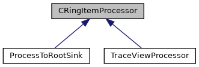

do not remove this div, it is closed by doxygen! 
|  |
| --- |
| DDASToys for NSCLDAQ6.2-000 |

 end header part 
 Generated by Doxygen 1.9.1 

 window showing the filter options 

 iframe showing the search results (closed by default)

 top 
[Public Member Functions](#pub-methods) |
[[List of all members|https://github.com/FRIBDAQ/docs/tree/main/ddastoys-6.2-000/classCRingItemProcessor-members.md]]

CRingItemProcessor Class Reference

header
Abstract base class to support type-independent ring-item processing.  
 [[More...|https://github.com/FRIBDAQ/docs/tree/main/ddastoys-6.2-000/classCRingItemProcessor.md#details]]

`#include <CRingItemProcessor.h>`

Inheritance diagram for CRingItemProcessor:

[[[legend|https://github.com/FRIBDAQ/docs/tree/main/ddastoys-6.2-000/graph_legend.md]]]

|  |  |
| --- | --- |
| Public Member Functions |
|  | CRingItemProcessor() |
|  | Constructor. |
|  |
| virtual | ~CRingItemProcessor() |
|  | Destructor. |
|  |
| virtual void | processScalerItem(CRingScalerItem &item) |
|  | Output an abbreviated scaler dump to stdout.More... |
|  |
| virtual void | processStateChangeItem(CRingStateChangeItem &item) |
|  | Output a state change item to stdout.More... |
|  |
| virtual void | processTextItem(CRingTextItem &item) |
|  | Output a text item to stdout.More... |
|  |
| virtual void | processEvent(CPhysicsEventItem &item) |
|  | Output a physics event item to stdout.More... |
|  |
| virtual void | processEventCount(CRingPhysicsEventCountItem &item) |
|  | Output an event count item to stdout.More... |
|  |
| virtual void | processFormat(CDataFormatItem &item) |
|  | Output the ring item format to stdout.More... |
|  |
| virtual void | processGlomParams(CGlomParameters &item) |
|  | Output a glom parameters item to stdout.More... |
|  |
| virtual void | processUnknownItemType(CRingItem &item) |
|  | Output a ring item with unknown type to stdout.More... |
|  |

## Detailed Description

Abstract base class to support type-independent ring-item processing.

The concept of this class is really simple. A virtual method for each ring-item type that we differentiate between. Similarly a virtual method for ring-item types that we don't break out. The default behavior for each type is to do a formatted dump to stdout.

## Member Function Documentation

## [◆](#aa7d9e38db85c6914baf0ea2b6862876f)processEvent()

|  |  |  |  |  |  |  |  |
| --- | --- | --- | --- | --- | --- | --- | --- |
| void CRingItemProcessor::processEvent(CPhysicsEventItem &item) | void CRingItemProcessor::processEvent | ( | CPhysicsEventItem & | item | ) |  | virtual |
| void CRingItemProcessor::processEvent | ( | CPhysicsEventItem & | item | ) |  |

Output a physics event item to stdout.

- Parameters
  |  |  |
  | --- | --- |
  | item | Reference the physics event item. |

Here we "analyze" a physics event by dumping it to stdout. Derived classes can implement their own event processing using this function.

Reimplemented in [[TraceViewProcessor|https://github.com/FRIBDAQ/docs/tree/main/ddastoys-6.2-000/classTraceViewProcessor.md#a9258fb90d1e63d1efebf842f57c868dc]], and [[ProcessToRootSink|https://github.com/FRIBDAQ/docs/tree/main/ddastoys-6.2-000/classProcessToRootSink.md#acab9912362d68ca3e291e13e91828b21]].

## [◆](#ad40e90e2379274cdeba3b6e3684ea2cd)processEventCount()

|  |  |  |  |  |  |  |  |
| --- | --- | --- | --- | --- | --- | --- | --- |
| void CRingItemProcessor::processEventCount(CRingPhysicsEventCountItem &item) | void CRingItemProcessor::processEventCount | ( | CRingPhysicsEventCountItem & | item | ) |  | virtual |
| void CRingItemProcessor::processEventCount | ( | CRingPhysicsEventCountItem & | item | ) |  |

Output an event count item to stdout.

- Parameters
  |  |  |
  | --- | --- |
  | item | References the CPhysicsEventCountItem being dumped. |

Event count items are used to describe, for a given data source, the number of triggers that occured since the last instance of that item. This can be used both to determine the rough event rate as well as the fraction of data analyzed (more complicated for built events) in a program sampling physics events. We'll dump out information about the item.

Reimplemented in [[TraceViewProcessor|https://github.com/FRIBDAQ/docs/tree/main/ddastoys-6.2-000/classTraceViewProcessor.md#abe06f276641d6aa2245e462d50634f1c]].

## [◆](#a9b2d8e6e3cfd1eeb34f92f168ecc4e37)processFormat()

|  |  |  |  |  |  |  |  |
| --- | --- | --- | --- | --- | --- | --- | --- |
| void CRingItemProcessor::processFormat(CDataFormatItem &item) | void CRingItemProcessor::processFormat | ( | CDataFormatItem & | item | ) |  | virtual |
| void CRingItemProcessor::processFormat | ( | CDataFormatItem & | item | ) |  |

Output the ring item format to stdout.

- Parameters
  |  |  |
  | --- | --- |
  | item | References the format item. |

FRIBDAQ runs have, as their first record an event format record that indicates hat the data format (11.0, 12.0, etc.)

## [◆](#a4fe9f6a8d52479dffbfd386b2eddd549)processGlomParams()

|  |  |  |  |  |  |  |  |
| --- | --- | --- | --- | --- | --- | --- | --- |
| void CRingItemProcessor::processGlomParams(CGlomParameters &item) | void CRingItemProcessor::processGlomParams | ( | CGlomParameters & | item | ) |  | virtual |
| void CRingItemProcessor::processGlomParams | ( | CGlomParameters & | item | ) |  |

Output a glom parameters item to stdout.

- Parameters
  |  |  |
  | --- | --- |
  | item | References the glom parameter record. |

When the data source is the output of an event building pipeline, the glom stage of that pipeline will insert a glom parameters record into the output data. This record type will indicate whether or not glom is building events (or acting in passthrough mode) and the coincidence interval in clock ticks used when in build mode, as well as how the timestamp is computed from the fragments that make up each event.

Reimplemented in [[TraceViewProcessor|https://github.com/FRIBDAQ/docs/tree/main/ddastoys-6.2-000/classTraceViewProcessor.md#a8c2a0744afcfe95457cd1b26b84e5e48]].

## [◆](#a6effcf50a659f796abde459f4f9e741c)processScalerItem()

|  |  |  |  |  |  |  |  |
| --- | --- | --- | --- | --- | --- | --- | --- |
| void CRingItemProcessor::processScalerItem(CRingScalerItem &item) | void CRingItemProcessor::processScalerItem | ( | CRingScalerItem & | item | ) |  | virtual |
| void CRingItemProcessor::processScalerItem | ( | CRingScalerItem & | item | ) |  |

Output an abbreviated scaler dump to stdout.

- Parameters
  |  |  |
  | --- | --- |
  | item | Reference to the scaler ring item to process. |

Your own processing should create a new class and override this if you want to process scalers. Note that this and all ring item types have a toString() method that returns the string the NSCLDAQ dumper outputs for each item type.

Reimplemented in [[TraceViewProcessor|https://github.com/FRIBDAQ/docs/tree/main/ddastoys-6.2-000/classTraceViewProcessor.md#ad1ed7b77567e835c025d075127cbc5bc]].

## [◆](#afeae63a1f87299dbd7f7d36d49b4f375)processStateChangeItem()

|  |  |  |  |  |  |  |  |
| --- | --- | --- | --- | --- | --- | --- | --- |
| void CRingItemProcessor::processStateChangeItem(CRingStateChangeItem &item) | void CRingItemProcessor::processStateChangeItem | ( | CRingStateChangeItem & | item | ) |  | virtual |
| void CRingItemProcessor::processStateChangeItem | ( | CRingStateChangeItem & | item | ) |  |

Output a state change item to stdout.

- Parameters
  |  |  |
  | --- | --- |
  | item | Reference to the state change item. |

Again we're just going to do a partial dump:

- BEGIN/END run we'll give the timestamp, run number and title, and time offset into the run.
- PAUSE_RESUME we'll just give the time and time into the run.

## [◆](#aae9b288e73a47f55fb84b183568c3c10)processTextItem()

|  |  |  |  |  |  |  |  |
| --- | --- | --- | --- | --- | --- | --- | --- |
| void CRingItemProcessor::processTextItem(CRingTextItem &item) | void CRingItemProcessor::processTextItem | ( | CRingTextItem & | item | ) |  | virtual |
| void CRingItemProcessor::processTextItem | ( | CRingTextItem & | item | ) |  |

Output a text item to stdout.

- Parameters
  |  |  |
  | --- | --- |
  | item | Refereinces the CRingTextItem we got. |

Text items are items that contain documentation information in the form of strings. The currently defined text items are:

- PACKET_TYPE - which contain documentation of any data packets that might be present. This is used by the SBS readout framework.
- MONITORED_VARIABLES - used by all frameworks to give the values of tcl variables that are being injected during the run or are constant throughout the run. Again we format a dump of the item.

Reimplemented in [[TraceViewProcessor|https://github.com/FRIBDAQ/docs/tree/main/ddastoys-6.2-000/classTraceViewProcessor.md#a6bf4c66f539bbf3db00e7e041f92fa44]].

## [◆](#af6296575a22ec026da72c9571b88f8b7)processUnknownItemType()

|  |  |  |  |  |  |  |  |
| --- | --- | --- | --- | --- | --- | --- | --- |
| void CRingItemProcessor::processUnknownItemType(CRingItem &item) | void CRingItemProcessor::processUnknownItemType | ( | CRingItem & | item | ) |  | virtual |
| void CRingItemProcessor::processUnknownItemType | ( | CRingItem & | item | ) |  |

Output a ring item with unknown type to stdout.

- Parameters
  |  |  |
  | --- | --- |
  | item | References the ring item for the event. |

Process a ring item with an unknown item type. This can happen if we're seeing a ring item that we've not specified a handler for (unlikely) or the item types have expanded but the data format is the same (possible) or the user has defined and is using their own ring item type. We'll just dump the item.

---

The documentation for this class was generated from the following files:- [[CRingItemProcessor.h|https://github.com/FRIBDAQ/docs/tree/main/ddastoys-6.2-000/CRingItemProcessor_8h_source.md]]
- [[CRingItemProcessor.cpp|https://github.com/FRIBDAQ/docs/tree/main/ddastoys-6.2-000/CRingItemProcessor_8cpp.md]]

 contents 
 start footer part 

---

Generated by  1.9.1
