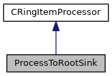

do not remove this div, it is closed by doxygen! 
|  |
| --- |
| DDASToys for NSCLDAQ6.2-000 |

 end header part 
 Generated by Doxygen 1.9.1 

 window showing the filter options 

 iframe showing the search results (closed by default)

 top 
[Public Member Functions](#pub-methods) |
[[List of all members|https://github.com/FRIBDAQ/docs/tree/main/ddastoys-6.2-000/classProcessToRootSink-members.md]]

ProcessToRootSink Class Reference

header
A ring item processeor concrete class that overrides the [[CRingItemProcessor|https://github.com/FRIBDAQ/docs/tree/main/ddastoys-6.2-000/classCRingItemProcessor.md]] base class method to put PHYSICS_EVENTs into a ROOT file data sink.  
 [[More...|https://github.com/FRIBDAQ/docs/tree/main/ddastoys-6.2-000/classProcessToRootSink.md#details]]

`#include <ProcessToRootSink.h>`

Inheritance diagram for ProcessToRootSink:

[[[legend|https://github.com/FRIBDAQ/docs/tree/main/ddastoys-6.2-000/graph_legend.md]]]

Collaboration diagram for ProcessToRootSink:

[[[legend|https://github.com/FRIBDAQ/docs/tree/main/ddastoys-6.2-000/graph_legend.md]]]

|  |  |
| --- | --- |
| Public Member Functions |
|  | ProcessToRootSink(std::string sink) |
|  | Constructor. |
|  |
| virtual | ~ProcessToRootSink() |
|  | Destructor. |
|  |
| virtual void | processEvent(CPhysicsEventItem &item) |
|  | Process physics events.More... |
|  |
| Public Member Functions inherited fromCRingItemProcessor |
|  | CRingItemProcessor() |
|  | Constructor. |
|  |
| virtual | ~CRingItemProcessor() |
|  | Destructor. |
|  |
| virtual void | processScalerItem(CRingScalerItem &item) |
|  | Output an abbreviated scaler dump to stdout.More... |
|  |
| virtual void | processStateChangeItem(CRingStateChangeItem &item) |
|  | Output a state change item to stdout.More... |
|  |
| virtual void | processTextItem(CRingTextItem &item) |
|  | Output a text item to stdout.More... |
|  |
| virtual void | processEventCount(CRingPhysicsEventCountItem &item) |
|  | Output an event count item to stdout.More... |
|  |
| virtual void | processFormat(CDataFormatItem &item) |
|  | Output the ring item format to stdout.More... |
|  |
| virtual void | processGlomParams(CGlomParameters &item) |
|  | Output a glom parameters item to stdout.More... |
|  |
| virtual void | processUnknownItemType(CRingItem &item) |
|  | Output a ring item with unknown type to stdout.More... |
|  |

## Detailed Description

A ring item processeor concrete class that overrides the [[CRingItemProcessor|https://github.com/FRIBDAQ/docs/tree/main/ddastoys-6.2-000/classCRingItemProcessor.md]] base class method to put PHYSICS_EVENTs into a ROOT file data sink.

## Member Function Documentation

## [◆](#acab9912362d68ca3e291e13e91828b21)processEvent()

|  |  |  |  |  |  |  |  |
| --- | --- | --- | --- | --- | --- | --- | --- |
| void ProcessToRootSink::processEvent(CPhysicsEventItem &item) | void ProcessToRootSink::processEvent | ( | CPhysicsEventItem & | item | ) |  | virtual |
| void ProcessToRootSink::processEvent | ( | CPhysicsEventItem & | item | ) |  |

Process physics events.

- Parameters
  |  |  |
  | --- | --- |
  | item | References the physics event item that we are 'analyzing'. |

Derived class decides what to do with PHYSICS_EVENT ring items. In this case, we just pass the data to the ROOT file sink and let it handle the rest.

Reimplemented from [[CRingItemProcessor|https://github.com/FRIBDAQ/docs/tree/main/ddastoys-6.2-000/classCRingItemProcessor.md#aa7d9e38db85c6914baf0ea2b6862876f]].

---

The documentation for this class was generated from the following files:- [[ProcessToRootSink.h|https://github.com/FRIBDAQ/docs/tree/main/ddastoys-6.2-000/ProcessToRootSink_8h_source.md]]
- [[ProcessToRootSink.cpp|https://github.com/FRIBDAQ/docs/tree/main/ddastoys-6.2-000/ProcessToRootSink_8cpp.md]]

 contents 
 start footer part 

---

Generated by  1.9.1
