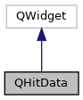

do not remove this div, it is closed by doxygen! 
|  |
| --- |
| DDASToys for NSCLDAQ6.2-000 |

 end header part 
 Generated by Doxygen 1.9.1 

 window showing the filter options 

 iframe showing the search results (closed by default)

 top 
[Public Member Functions](#pub-methods) |
[[List of all members|classQHitData-members]]

QHitData Class Reference

header
Widget for managing hit information when interating with the GUI.  
 [[More...|classQHitData#details]]

`#include <QHitData.h>`

Inheritance diagram for QHitData:

[[[legend|graph_legend]]]

Collaboration diagram for QHitData:

[[[legend|graph_legend]]]

|  |  |
| --- | --- |
| Public Member Functions |
|  | QHitData(FitManager*pFitMgr, QWidget *parent=nullptr) |
|  | Constructor.More... |
|  |
|  | ~QHitData() |
|  | Destructor.More... |
|  |
| void | update(constddastoys::DDASFitHit&hit) |
|  | Update hit data and enable printing of fit information to stdout if the hit has an extension.More... |
|  |
| void | setFitMethod(QString method) |
|  | Set the fit method.More... |
|  |

## Detailed Description

Widget for managing hit information when interating with the GUI.

Widget class for managing UI related to the hit data. Displays relavent infomration for the currently displayed hit with optional UI elements to see more information e.g. a button to print the fit results to stdout.

## Constructor & Destructor Documentation

## [◆](#a65c4dfc15cd4a67f832d493e51a8347b)QHitData()

|  |  |  |  |
| --- | --- | --- | --- |
| QHitData::QHitData | ( | FitManager* | pFitMgr, |
|  |  | QWidget * | parent=nullptr |
|  | ) |  |  |

Constructor.

Parameters
|  |  |
| --- | --- |
| pFitMgr | Pointer toFitManagerobject used by this class, managed by caller. |
| parent | Pointer to QWidget parent object (optional). |

Constructs [[QHitData|classQHitData]] widgets and defines their layout. This class does not manage the [[FitManager|classFitManager]] object.

## [◆](#af3b2f2bde9994ea22ee2d0ac9477f493)~QHitData()

|  |  |  |  |  |
| --- | --- | --- | --- | --- |
| QHitData::~QHitData | ( |  | ) |  |

Destructor.

Destruction of [[FitManager|classFitManager]] is left to the caller which owns it.

## Member Function Documentation

## [◆](#a0b920a0b541e39ea7d2c6ad1b4dda3d5)setFitMethod()

|  |  |  |  |  |  |
| --- | --- | --- | --- | --- | --- |
| void QHitData::setFitMethod | ( | QString | method | ) |  |

Set the fit method.

Parameters
|  |  |
| --- | --- |
| method | The name of the fitting method. |

Exceptions
|  |  |
| --- | --- |
| std::invalid_argument | If the method parameter does not match a known fitting method. |

Set the fit method from a QString if a method parameter is supplied on the command line. Throw an exception if the fit method is not recognized.

## [◆](#ac5d326f7f77d3b8888ce275ead700307)update()

|  |  |  |  |  |  |
| --- | --- | --- | --- | --- | --- |
| void QHitData::update | ( | constddastoys::DDASFitHit& | hit | ) |  |

Update hit data and enable printing of fit information to stdout if the hit has an extension.

Parameters
|  |  |
| --- | --- |
| hit | References the hit we are processing |

---

The documentation for this class was generated from the following files:- [[QHitData.h|QHitData_8h_source]]
- [[QHitData.cpp|QHitData_8cpp]]

 contents 
 start footer part 

---

Generated by  1.9.1
