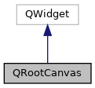

do not remove this div, it is closed by doxygen! 
|  |
| --- |
| DDASToys for NSCLDAQ6.2-000 |

 end header part 
 Generated by Doxygen 1.9.1 

 window showing the filter options 

 iframe showing the search results (closed by default)

 top 
[Public Member Functions](#pub-methods) |
[Protected Member Functions](#pro-methods) |
[[List of all members|classQRootCanvas-members]]

QRootCanvas Class Reference

header
A ROOT canvas embedded in a Qt application.  
 [[More...|classQRootCanvas#details]]

Inheritance diagram for QRootCanvas:

[[[legend|graph_legend]]]

Collaboration diagram for QRootCanvas:

[[[legend|graph_legend]]]

|  |  |
| --- | --- |
| Public Member Functions |
|  | QRootCanvas(FitManager*pFitMgr, QWidget *parent=nullptr) |
|  | Constructor.More... |
|  |
| virtual | ~QRootCanvas() |
|  | Destructor. |
|  |
| TCanvas * | getCanvas() |
|  | Return a pointer to the ROOT canvas.More... |
|  |
| void | drawHit(constddastoys::DDASFitHit&hit) |
|  | Draw hit data on the canvas.More... |
|  |
| void | clear() |
|  | Clear and update the ROOT canvas. |
|  |

|  |  |
| --- | --- |
| Protected Member Functions |
| virtual void | mouseMoveEvent(QMouseEvent *e) |
|  | Handle Qt mouse move events on the ROOT canvas.More... |
|  |
| virtual void | mousePressEvent(QMouseEvent *e) |
|  | Handle Qt mouse press events on the ROOT canvas.More... |
|  |
| virtual void | mouseReleaseEvent(QMouseEvent *e) |
|  | Handle Qt mouse release events on the ROOT canvas.More... |
|  |
| virtual void | paintEvent(QPaintEvent *) |
|  | Handle resize events in ROOT. |
|  |
| virtual void | resizeEvent(QResizeEvent *) |
|  | Handle paint events in ROOT. |
|  |

## Detailed Description

A ROOT canvas embedded in a Qt application.

Embedded ROOT canvas in a Qt application. Overrides Qt event handling for resize and paint events (e.g. re-draw after the canvas is hidden behind another window) as well as mouse events. This allows us to manipulate the ROOT canvas as expected: zooming on axes, right click actions, etc. Drawing on the canvas is bog-standard ROOT.

## Constructor & Destructor Documentation

## [◆](#a6a9e917186adecfde4dc743cf386049f)QRootCanvas()

|  |  |  |  |
| --- | --- | --- | --- |
| QRootCanvas::QRootCanvas | ( | FitManager* | pFitMgr, |
|  |  | QWidget * | parent=nullptr |
|  | ) |  |  |

Constructor.

Parameters
|  |  |
| --- | --- |
| pFitMgr | Pointer to aFitManagerfor plotting fit data. TheFitManagerobject is handled by the caller. |
| parent | Pointer to QWidget parent object (optional, default=nullptr). |

Construct a QWidget and register it with the ROOT graphics backend. The canvas does not own the [[FitManager|classFitManager]] object.

## Member Function Documentation

## [◆](#a1455dcb6a5846c46b354f24e40933aa0)drawHit()

|  |  |  |  |  |  |
| --- | --- | --- | --- | --- | --- |
| void QRootCanvas::drawHit | ( | constddastoys::DDASFitHit& | hit | ) |  |

Draw hit data on the canvas.

Parameters
|  |  |
| --- | --- |
| hit | References the hit we're plotting data from |

## [◆](#aedef0de1cb7808ce90b37dd833b0c4f3)getCanvas()

|  |  |  |  |  |  |  |
| --- | --- | --- | --- | --- | --- | --- |
| TCanvas* QRootCanvas::getCanvas() | TCanvas* QRootCanvas::getCanvas | ( |  | ) |  | inline |
| TCanvas* QRootCanvas::getCanvas | ( |  | ) |  |

Return a pointer to the ROOT canvas.

ReturnsPointer to the ROOT canvas object.

## [◆](#a3f1392564efd97cf935295f1fdef56fe)mouseMoveEvent()

|  |  |  |  |  |  |  |  |
| --- | --- | --- | --- | --- | --- | --- | --- |
| void QRootCanvas::mouseMoveEvent(QMouseEvent *e) | void QRootCanvas::mouseMoveEvent | ( | QMouseEvent * | e | ) |  | protectedvirtual |
| void QRootCanvas::mouseMoveEvent | ( | QMouseEvent * | e | ) |  |

Handle Qt mouse move events on the ROOT canvas.

Parameters
|  |  |
| --- | --- |
| e | Pointer to the QMouseEvent to handle |

## [◆](#a8bd59138c80ffa28a1a06f8eb4200d56)mousePressEvent()

|  |  |  |  |  |  |  |  |
| --- | --- | --- | --- | --- | --- | --- | --- |
| void QRootCanvas::mousePressEvent(QMouseEvent *e) | void QRootCanvas::mousePressEvent | ( | QMouseEvent * | e | ) |  | protectedvirtual |
| void QRootCanvas::mousePressEvent | ( | QMouseEvent * | e | ) |  |

Handle Qt mouse press events on the ROOT canvas.

Parameters
|  |  |
| --- | --- |
| e | Pointer to the QMouseEvent to handle |

## [◆](#a5921076f00c65a1b1d8b84231b24dab3)mouseReleaseEvent()

|  |  |  |  |  |  |  |  |
| --- | --- | --- | --- | --- | --- | --- | --- |
| void QRootCanvas::mouseReleaseEvent(QMouseEvent *e) | void QRootCanvas::mouseReleaseEvent | ( | QMouseEvent * | e | ) |  | protectedvirtual |
| void QRootCanvas::mouseReleaseEvent | ( | QMouseEvent * | e | ) |  |

Handle Qt mouse release events on the ROOT canvas.

Parameters
|  |  |
| --- | --- |
| e | Pointer to the QMouseEvent to handle |

---

The documentation for this class was generated from the following files:- [[QRootCanvas.h|QRootCanvas_8h_source]]
- [[QRootCanvas.cpp|QRootCanvas_8cpp]]

 contents 
 start footer part 

---

Generated by  1.9.1
