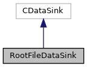

do not remove this div, it is closed by doxygen! 
|  |
| --- |
| DDASToys for NSCLDAQ6.2-000 |

 end header part 
 Generated by Doxygen 1.9.1 

 window showing the filter options 

 iframe showing the search results (closed by default)

 top 
[Public Member Functions](#pub-methods) |
[List of all members](https://github.com/FRIBDAQ/docs/tree/main/ddastoys-6.2-000/classRootFileDataSink-members.md)

RootFileDataSink Class Reference

header
This class knows how to write ROOT files from the ring items created by the fitting program.  
 [More...](https://github.com/FRIBDAQ/docs/tree/main/ddastoys-6.2-000/classRootFileDataSink.md#details)

`#include <RootFileDataSink.h>`

Inheritance diagram for RootFileDataSink:

[[legend](https://github.com/FRIBDAQ/docs/tree/main/ddastoys-6.2-000/graph_legend.md)]

Collaboration diagram for RootFileDataSink:

[[legend](https://github.com/FRIBDAQ/docs/tree/main/ddastoys-6.2-000/graph_legend.md)]

|  |  |
| --- | --- |
| Public Member Functions |
|  | RootFileDataSink(const char *filename, const char *treename="DDASFit") |
|  | Constructor.More... |
|  |
| virtual | ~RootFileDataSink() |
|  | Destructor.More... |
|  |
| virtual void | putItem(const CRingItem &item) |
|  | Put a ring item to file.More... |
|  |
| virtual void | put(const void *pData, size_t nBytes) |
|  | Called to put arbitrary data to the file.More... |
|  |

## Detailed Description

This class knows how to write ROOT files from the ring items created by the fitting program.

- Note
  Put is not intended to be used by this file. If it's used, a warning will be output to stderr. pData will then be treated as a raw ring item, turned into a CRingItem and putItem will be called from then on.

## Constructor & Destructor Documentation

## [◆](#a2d1b4e6bdf14b8533520409c9dc6631c)RootFileDataSink()

|  |  |  |  |
| --- | --- | --- | --- |
| RootFileDataSink::RootFileDataSink | ( | const char * | filename, |
|  |  | const char * | treename="DDASFit" |
|  | ) |  |  |

Constructor.

- Parameters
  |  |  |
  | --- | --- |
  | filename | ROOT file to open. |
  | treename | Name of the tree to create in the root file. The tree name defaults to "DDASFit" if not provided. |

- Exceptions
  |  |  |
  | --- | --- |
  | ... | All exceptions back to the caller. |

We're going to make this sink so it can be used in other programs. That implies presrving ROOT's concept of a current working directory across our operation.

## [◆](#a3f326bab62a24915d799c663a51ea713)~RootFileDataSink()

|  |  |  |  |  |  |  |
| --- | --- | --- | --- | --- | --- | --- |
| RootFileDataSink::~RootFileDataSink() | RootFileDataSink::~RootFileDataSink | ( |  | ) |  | virtual |
| RootFileDataSink::~RootFileDataSink | ( |  | ) |  |

Destructor.

Flush the stuff to file and delete all the dynamic components.

## Member Function Documentation

## [◆](#a227d894ea1dbccad820d4520918e3703)put()

|  |  |  |  |  |  |  |  |  |  |  |  |  |  |
| --- | --- | --- | --- | --- | --- | --- | --- | --- | --- | --- | --- | --- | --- |
| void RootFileDataSink::put(const void *pData,size_tnBytes) | void RootFileDataSink::put | ( | const void * | pData, |  |  | size_t | nBytes |  | ) |  |  | virtual |
| void RootFileDataSink::put | ( | const void * | pData, |
|  |  | size_t | nBytes |
|  | ) |  |  |

Called to put arbitrary data to the file.

- Parameters
  |  |  |
  | --- | --- |
  | pData | Pointer to the data. |
  | nBytes | Number of bytes of data to put; actually ignored. |

We really don't know how to do this so:

- First time we're called we'll emit a warning that users shouldn't really do this.
- We'll treat the data pointer as a pointer to a raw ring item, turn it into a CRingItem and call putItem.

## [◆](#abb0d33280ddd69f3cc095c3cba92492b)putItem()

|  |  |  |  |  |  |  |  |
| --- | --- | --- | --- | --- | --- | --- | --- |
| void RootFileDataSink::putItem(const CRingItem &item) | void RootFileDataSink::putItem | ( | const CRingItem & | item | ) |  | virtual |
| void RootFileDataSink::putItem | ( | const CRingItem & | item | ) |  |

Put a ring item to file.

- Parameters
  |  |  |
  | --- | --- |
  | item | Reference to a ring item object. |

The ring item is assumed to consist of a set of fragments. Each fragment contains a hit. The hits are decoded and added to the tree event. Once that's done we can fill the tree and delete any dynamic storage we got.

---

The documentation for this class was generated from the following files:- [RootFileDataSink.h](https://github.com/FRIBDAQ/docs/tree/main/ddastoys-6.2-000/RootFileDataSink_8h_source.md)
- [RootFileDataSink.cpp](https://github.com/FRIBDAQ/docs/tree/main/ddastoys-6.2-000/RootFileDataSink_8cpp.md)

 contents 
 start footer part 

---

Generated by  1.9.1
