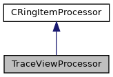

do not remove this div, it is closed by doxygen! 
|  |
| --- |
| DDASToys for NSCLDAQ6.2-000 |

 end header part 
 Generated by Doxygen 1.9.1 

 window showing the filter options 

 iframe showing the search results (closed by default)

 top 
[Public Member Functions](#pub-methods) |
[[List of all members|https://github.com/FRIBDAQ/docs/tree/main/ddastoys-6.2-000/classTraceViewProcessor-members.md]]

TraceViewProcessor Class Reference

header
A basic ring item processor.  
 [[More...|https://github.com/FRIBDAQ/docs/tree/main/ddastoys-6.2-000/classTraceViewProcessor.md#details]]

`#include <TraceViewProcessor.h>`

Inheritance diagram for TraceViewProcessor:

[[[legend|https://github.com/FRIBDAQ/docs/tree/main/ddastoys-6.2-000/graph_legend.md]]]

Collaboration diagram for TraceViewProcessor:

[[[legend|https://github.com/FRIBDAQ/docs/tree/main/ddastoys-6.2-000/graph_legend.md]]]

|  |  |
| --- | --- |
| Public Member Functions |
|  | TraceViewProcessor() |
|  | Constructor.More... |
|  |
| virtual | ~TraceViewProcessor() |
|  | Destructor.More... |
|  |
| virtual void | processEvent(CPhysicsEventItem &item) |
|  | Process physics events.More... |
|  |
| virtual void | processScalerItem(CRingScalerItem &) |
|  | Scaler ring items are ignored. |
|  |
| virtual void | processTextItem(CRingTextItem &) |
|  | Text ring items are ignored. |
|  |
| virtual void | processEventCount(CRingPhysicsEventCountItem &) |
|  | PhysicsEventCount ring items are ignored. |
|  |
| virtual void | processGlomParams(CGlomParameters &) |
|  | GlomParameters ring items are ignored. |
|  |
| std::vector<ddastoys::DDASFitHit> | getUnpackedHits() |
|  | Return the unpacked event data.More... |
|  |
| Public Member Functions inherited fromCRingItemProcessor |
|  | CRingItemProcessor() |
|  | Constructor. |
|  |
| virtual | ~CRingItemProcessor() |
|  | Destructor. |
|  |
| virtual void | processStateChangeItem(CRingStateChangeItem &item) |
|  | Output a state change item to stdout.More... |
|  |
| virtual void | processFormat(CDataFormatItem &item) |
|  | Output the ring item format to stdout.More... |
|  |
| virtual void | processUnknownItemType(CRingItem &item) |
|  | Output a ring item with unknown type to stdout.More... |
|  |

## Detailed Description

A basic ring item processor.

A ring item processor class for a small subset of relavent ring items. See latest $DAQROOT/share/recipes/process/processor.h/cpp for a more general example. This processer:

- implements mandatory interface to process events,
- ignores scalers, text items, event counts and glom params,
- inherits the rest of its behavior from the base class.

## Constructor & Destructor Documentation

## [◆](#a05cfc0bbc640942445352d0ded2b5420)TraceViewProcessor()

|  |  |  |  |  |
| --- | --- | --- | --- | --- |
| TraceViewProcessor::TraceViewProcessor | ( |  | ) |  |

Constructor.

Also constructs a DDASFitHitUnpacker object.

## [◆](#a67e2cd54a75e28537b036aefffcf6a2b)~TraceViewProcessor()

|  |  |  |  |  |  |  |
| --- | --- | --- | --- | --- | --- | --- |
| TraceViewProcessor::~TraceViewProcessor() | TraceViewProcessor::~TraceViewProcessor | ( |  | ) |  | virtual |
| TraceViewProcessor::~TraceViewProcessor | ( |  | ) |  |

Destructor.

Processor owns the unpacker, so delete on destruction.

## Member Function Documentation

## [◆](#a49595ce4677548698bf603e8ce04f862)getUnpackedHits()

|  |  |  |  |  |  |  |
| --- | --- | --- | --- | --- | --- | --- |
| std::vector<ddastoys::DDASFitHit> TraceViewProcessor::getUnpackedHits() | std::vector<ddastoys::DDASFitHit> TraceViewProcessor::getUnpackedHits | ( |  | ) |  | inline |
| std::vector<ddastoys::DDASFitHit> TraceViewProcessor::getUnpackedHits | ( |  | ) |  |

Return the unpacked event data.

- Returns
  Vector containing the event data.

## [◆](#a9258fb90d1e63d1efebf842f57c868dc)processEvent()

|  |  |  |  |  |  |  |  |
| --- | --- | --- | --- | --- | --- | --- | --- |
| void TraceViewProcessor::processEvent(CPhysicsEventItem &item) | void TraceViewProcessor::processEvent | ( | CPhysicsEventItem & | item | ) |  | virtual |
| void TraceViewProcessor::processEvent | ( | CPhysicsEventItem & | item | ) |  |

Process physics events.

- Parameters
  |  |  |
  | --- | --- |
  | item | Reference to the physics event item. |

Break PHYSICS_EVENTs into fragments, convert the fragments into DDASFitHits and append them to the event (just a vector of DDASFitHits).

Reimplemented from [[CRingItemProcessor|https://github.com/FRIBDAQ/docs/tree/main/ddastoys-6.2-000/classCRingItemProcessor.md#aa7d9e38db85c6914baf0ea2b6862876f]].

---

The documentation for this class was generated from the following files:- [[TraceViewProcessor.h|https://github.com/FRIBDAQ/docs/tree/main/ddastoys-6.2-000/TraceViewProcessor_8h_source.md]]
- [[TraceViewProcessor.cpp|https://github.com/FRIBDAQ/docs/tree/main/ddastoys-6.2-000/TraceViewProcessor_8cpp.md]]

 contents 
 start footer part 

---

Generated by  1.9.1
