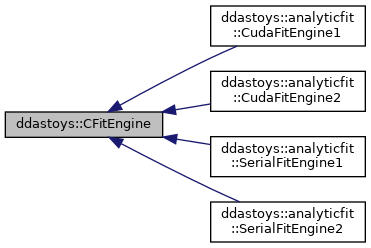

do not remove this div, it is closed by doxygen! 
|  |
| --- |
| DDASToys for NSCLDAQ6.2-000 |

 end header part 
 Generated by Doxygen 1.9.1 

 window showing the filter options 

 iframe showing the search results (closed by default) 

- **ddastoys**
- [[CFitEngine|classddastoys_1_1CFitEngine]]

 top 
[Public Member Functions](#pub-methods) |
[Protected Attributes](#pro-attribs) |
[[List of all members|classddastoys_1_1CFitEngine-members]]

ddastoys::CFitEngine Class Referenceabstract

header
Abstract base class for marshalling data to the fitting subsystems to calculate Jacobian elements and residuals.  
 [[More...|classddastoys_1_1CFitEngine#details]]

`#include <CFitEngine.h>`

Inheritance diagram for ddastoys::CFitEngine:

[[[legend|graph_legend]]]

|  |  |
| --- | --- |
| Public Member Functions |
|  | CFitEngine(std::vector< std::pair< uint16_t, uint16_t >> &data) |
|  | Constructor.More... |
|  |
| virtual | ~CFitEngine() |
|  | Destructor. |
|  |
| virtual void | jacobian(const gsl_vector *p, gsl_matrix *J)=0 |
|  | Virtual method for calculating the Jacobian matrix. |
|  |
| virtual void | residuals(const gsl_vector *p, gsl_vector *r)=0 |
|  | Virtual method to calculating the residual. |
|  |

|  |  |
| --- | --- |
| Protected Attributes |
| std::vector< uint16_t > | x |
|  | Trace x coordinate vector. |
|  |
| std::vector< uint16_t > | y |
|  | Trace y coordinate vector. |
|  |

## Detailed Description

Abstract base class for marshalling data to the fitting subsystems to calculate Jacobian elements and residuals.

## Constructor & Destructor Documentation

## [◆](#a02450a79fd6e17ac2f52ddfa9ee07985)CFitEngine()

|  |  |  |  |  |  |
| --- | --- | --- | --- | --- | --- |
| ddastoys::CFitEngine::CFitEngine | ( | std::vector< std::pair< uint16_t, uint16_t >> & | data | ) |  |

Constructor.

Parameters
|  |  |
| --- | --- |
| data | (x, y) data to store in the coordinate vectors. |

Marshall the (x, y) points into the coordinate vectors.

---

The documentation for this class was generated from the following files:- [[CFitEngine.h|CFitEngine_8h_source]]
- [[CFitEngine.cpp|CFitEngine_8cpp]]

 contents 
 start footer part 

---

Generated by  1.9.1
