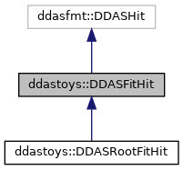
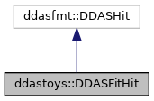

do not remove this div, it is closed by doxygen! 
|  |
| --- |
| DDASToys for NSCLDAQ6.2-000 |

 end header part 
 Generated by Doxygen 1.9.1 

 window showing the filter options 

 iframe showing the search results (closed by default) 

- **ddastoys**
- [[DDASFitHit|classddastoys_1_1DDASFitHit]]

 top 
[Public Member Functions](#pub-methods) |
[[List of all members|classddastoys_1_1DDASFitHit-members]]

ddastoys::DDASFitHit Class Reference

header
Encapsulates data for DDAS hits that may have fitted traces.  
 [[More...|classddastoys_1_1DDASFitHit#details]]

`#include <DDASFitHit.h>`

Inheritance diagram for ddastoys::DDASFitHit:

[[[legend|graph_legend]]]

Collaboration diagram for ddastoys::DDASFitHit:

[[[legend|graph_legend]]]

|  |  |
| --- | --- |
| Public Member Functions |
|  | DDASFitHit() |
|  | Constructor. |
|  |
| virtual | ~DDASFitHit() |
|  | Destructor. |
|  |
| DDASFitHit& | operator=(constDDASFitHit&rhs) |
|  | Assignment operator.More... |
|  |
| void | Reset() |
|  | Reset the hit information. |
|  |
| void | setExtension(constHitExtension&extension) |
|  | Set the hit extension information for this hit.More... |
|  |
| bool | hasExtension() const |
|  | Check whether hit has a fit extension.More... |
|  |
| constHitExtension& | getExtension() const |
|  | Get the extension data from the current hit.More... |
|  |

## Detailed Description

Encapsulates data for DDAS hits that may have fitted traces.

These objects are produced by `DDASFitHitUnpacker::decode()`. They are basically just ddasfmt::DDASHits with some extra fields.

## Member Function Documentation

## [◆](#a365128a35aff0d4f0dcec79c39083268)getExtension()

|  |  |  |  |  |  |  |
| --- | --- | --- | --- | --- | --- | --- |
| constHitExtension& ddastoys::DDASFitHit::getExtension()const | constHitExtension& ddastoys::DDASFitHit::getExtension | ( |  | ) | const | inline |
| constHitExtension& ddastoys::DDASFitHit::getExtension | ( |  | ) | const |

Get the extension data from the current hit.

- Exceptions
  |  |  |
  | --- | --- |
  | std::logic_error | If the hit does not contain an extension. |

- Returns
  Reference to the extension of the current hit.

## [◆](#acf05ecde500b65de5759725c72f1c97c)hasExtension()

|  |  |  |  |  |  |  |
| --- | --- | --- | --- | --- | --- | --- |
| bool ddastoys::DDASFitHit::hasExtension()const | bool ddastoys::DDASFitHit::hasExtension | ( |  | ) | const | inline |
| bool ddastoys::DDASFitHit::hasExtension | ( |  | ) | const |

Check whether hit has a fit extension.

- Returns
  True if the hit contains an extension, false otherwise.

## [◆](#a240de08cae824ee0edeeb0f4e3c393fe)operator=()

|  |  |  |  |  |  |  |  |
| --- | --- | --- | --- | --- | --- | --- | --- |
| DDASFitHit& ddastoys::DDASFitHit::operator=(constDDASFitHit&rhs) | DDASFitHit& ddastoys::DDASFitHit::operator= | ( | constDDASFitHit& | rhs | ) |  | inline |
| DDASFitHit& ddastoys::DDASFitHit::operator= | ( | constDDASFitHit& | rhs | ) |  |

Assignment operator.

- Parameters
  |  |  |
  | --- | --- |
  | rhs | Reference toDDASFitHitfor assignment. |

- Returns
  Reference to lhs.

Calls base class operator= and sets the hit extension (if present).

## [◆](#a8c7124dcc6f40c2f438b6bad05349bb8)setExtension()

|  |  |  |  |  |  |  |  |
| --- | --- | --- | --- | --- | --- | --- | --- |
| void ddastoys::DDASFitHit::setExtension(constHitExtension&extension) | void ddastoys::DDASFitHit::setExtension | ( | constHitExtension& | extension | ) |  | inline |
| void ddastoys::DDASFitHit::setExtension | ( | constHitExtension& | extension | ) |  |

Set the hit extension information for this hit.

- Parameters
  |  |  |
  | --- | --- |
  | extension | Reference to the extension for this hit. |

---

The documentation for this class was generated from the following file:- [[DDASFitHit.h|DDASFitHit_8h_source]]

 contents 
 start footer part 

---

Generated by  1.9.1
