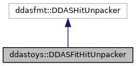

do not remove this div, it is closed by doxygen! 
|  |
| --- |
| DDASToys for NSCLDAQ6.2-000 |

 end header part 
 Generated by Doxygen 1.9.1 

 window showing the filter options 

 iframe showing the search results (closed by default) 

- **ddastoys**
- [[DDASFitHitUnpacker|https://github.com/FRIBDAQ/docs/tree/main/ddastoys-6.2-000/classddastoys_1_1DDASFitHitUnpacker.md]]

 top 
[Public Member Functions](#pub-methods) |
[[List of all members|https://github.com/FRIBDAQ/docs/tree/main/ddastoys-6.2-000/classddastoys_1_1DDASFitHitUnpacker-members.md]]

ddastoys::DDASFitHitUnpacker Class Reference[[libDDASFitHitUnpacker.so|https://github.com/FRIBDAQ/docs/tree/main/ddastoys-6.2-000/group__unpacker.md]]

header
Unpack raw hit data from DDAS event files.  
 [[More...|https://github.com/FRIBDAQ/docs/tree/main/ddastoys-6.2-000/classddastoys_1_1DDASFitHitUnpacker.md#details]]

`#include <DDASFitHitUnpacker.h>`

Inheritance diagram for ddastoys::DDASFitHitUnpacker:

[[[legend|https://github.com/FRIBDAQ/docs/tree/main/ddastoys-6.2-000/graph_legend.md]]]

Collaboration diagram for ddastoys::DDASFitHitUnpacker:

[[[legend|https://github.com/FRIBDAQ/docs/tree/main/ddastoys-6.2-000/graph_legend.md]]]

|  |  |
| --- | --- |
| Public Member Functions |
| const void * | decode(const void *p,DDASFitHit&hit) |
|  | Decode the current event and unpack it into aDDASFitHit.More... |
|  |

## Detailed Description

Unpack raw hit data from DDAS event files.

The DDASHitUnpacker is capable of unpacking raw hits from NSCLDAQ event data which include hit extension data. Hit extensions are data structures which contain additional information appended to each hit which cannot be obtained from the digitizer module, for example from post-processing traces. A typical trace analysis may involve fitting traces and performing further analysis with the fit output (event classification, measuring physics observables, etc.). This class is an extension of ddasfmt::DDASHitUnpacker and retains all the funcitonality of the base class.

## Member Function Documentation

## [◆](#a79a9e2d9267c8036fef746f45ef4c4d7)decode()

|  |  |  |  |
| --- | --- | --- | --- |
| const void * ddastoys::DDASFitHitUnpacker::decode | ( | const void * | p, |
|  |  | DDASFitHit& | hit |
|  | ) |  |  |

Decode the current event and unpack it into a [[DDASFitHit|https://github.com/FRIBDAQ/docs/tree/main/ddastoys-6.2-000/classddastoys_1_1DDASFitHit.md]].

- Parameters
  |  |  |
  | --- | --- |
  | p | Pointer to the ring item to decode. For an event built fragment, this is normally the FragmentInfo's s_itemhdr pointer. Note the difference from DDASHitUnpacker which expects a pointer to the body. |
  | hit | Hit item that we will unpack data into. |

- Exceptions
  |  |  |
  | --- | --- |
  | std::length_error | An unexpected hit or extension size is encountered. |

- Returns
  A pointer just after the ring item.

The decode function:

- Determines the limits of the hit.
- Determines where, or if, there's an extension block.
- Unpacks the original hit using `DAQ::DDAS::DDASHitUnpacker::unpack()`.
- Sets the extension if there is one.

The first 32 bits of the body contain the number of 16-bit words in the hit data.

- If this works out equivalent to bodySize - there's no extension.
- If this is larger, to accommodate data from ringblockdealer or the editor fitting framework, we have the following cases: 1) The extra data is the size of [[HitExtensionLegacy|https://github.com/FRIBDAQ/docs/tree/main/ddastoys-6.2-000/structddastoys_1_1HitExtensionLegacy.md]] - the extra data is an old-style hit extension e.g., from ringblockdealer. 2) The extra data is sizeof(uint32_t) - the extra data is a null extension from the editor fitting framework. 3) The extra data is sizeof(FitInfo) from [[fit_extensions.h|https://github.com/FRIBDAQ/docs/tree/main/ddastoys-6.2-000/fit__extensions_8h.md]] - the extra data is a hit extension from the editor fitting framework. 4) Anything else - we don't know how to do with and fail with an error message.

---

The documentation for this class was generated from the following files:- [[DDASFitHitUnpacker.h|https://github.com/FRIBDAQ/docs/tree/main/ddastoys-6.2-000/DDASFitHitUnpacker_8h_source.md]]
- [[DDASFitHitUnpacker.cpp|https://github.com/FRIBDAQ/docs/tree/main/ddastoys-6.2-000/DDASFitHitUnpacker_8cpp.md]]

 contents 
 start footer part 

---

Generated by  1.9.1
