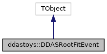

do not remove this div, it is closed by doxygen! 
|  |
| --- |
| DDASToys for NSCLDAQ6.2-000 |

 end header part 
 Generated by Doxygen 1.9.1 

 window showing the filter options 

 iframe showing the search results (closed by default) 

- **ddastoys**
- [[DDASRootFitEvent|classddastoys_1_1DDASRootFitEvent]]

 top 
[Public Member Functions](#pub-methods) |
[Public Attributes](#pub-attribs) |
[[List of all members|classddastoys_1_1DDASRootFitEvent-members]]

ddastoys::DDASRootFitEvent Class Reference[[libDDASRootFitFormat.so|group__ddasrootfitformat]]

header
Defines the object that's put in a ROOT TTree for each event.  
 [[More...|classddastoys_1_1DDASRootFitEvent#details]]

`#include <DDASRootFitEvent.h>`

Inheritance diagram for ddastoys::DDASRootFitEvent:

[[[legend|graph_legend]]]

Collaboration diagram for ddastoys::DDASRootFitEvent:

[[[legend|graph_legend]]]

|  |  |
| --- | --- |
| Public Member Functions |
|  | DDASRootFitEvent() |
|  | Constructor.More... |
|  |
|  | DDASRootFitEvent(constDDASRootFitEvent&rhs) |
|  | Copy constructor.More... |
|  |
|  | ~DDASRootFitEvent() |
|  | Destructor.More... |
|  |
| DDASRootFitEvent& | operator=(constDDASRootFitEvent&rhs) |
|  | Assignment operator.More... |
|  |
| std::vector<DDASRootFitHit* > | GetData() |
|  | Return the event vector.More... |
|  |
| Double_t | GetFirstTime() const |
|  | Get the time from the first hit in the event.More... |
|  |
| Double_t | GetLastTime() const |
|  | Get the time from the last hit in the event.More... |
|  |
| Double_t | GetTimeWidth() const |
|  | Get the time from the last hit in the event.More... |
|  |
| void | AddHit(constDDASRootFitHit&hit) |
|  | Add a hit to the event.More... |
|  |
| void | Reset() |
|  | Delete the hits and empty the array of hits. |
|  |

|  |  |
| --- | --- |
| Public Attributes |
| std::vector<DDASRootFitHit* > | m_hits |
|  | An event is a vector of hits. |
|  |

## Detailed Description

Defines the object that's put in a ROOT TTree for each event.

An event is just a sequence (vector) of hits. Hits are stored here as pointers to [[DDASRootFitHit|classddastoys_1_1DDASRootFitHit]] objects which are hits that are also derived from TObject.

- Note
  The code assumes that the pointers in m_hits point to dynamically allocated data. Thus the destructor will destroy the hits as well.

  Copy construction and assignment are implemented as deep operations as demanded by ROOT.

## Constructor & Destructor Documentation

## [◆](#a299d029969c6ed8487f82ae695efaddb)DDASRootFitEvent() [1/2]

|  |  |  |  |  |
| --- | --- | --- | --- | --- |
| ddastoys::DDASRootFitEvent::DDASRootFitEvent | ( |  | ) |  |

Constructor.

Pretty much null but ROOT requires an implementation.

## [◆](#a5bb56a99c9783100861f0c8929460dc1)DDASRootFitEvent() [2/2]

|  |  |  |  |  |  |
| --- | --- | --- | --- | --- | --- |
| ddastoys::DDASRootFitEvent::DDASRootFitEvent | ( | constDDASRootFitEvent& | rhs | ) |  |

Copy constructor.

- Parameters
  |  |  |
  | --- | --- |
  | rhs | The object we're being copied from. |

## [◆](#aa7b7813e28483a65926111849bfa2454)~DDASRootFitEvent()

|  |  |  |  |  |
| --- | --- | --- | --- | --- |
| ddastoys::DDASRootFitEvent::~DDASRootFitEvent | ( |  | ) |  |

Destructor.

Destroy the hits. Note that the event vector destroys itself.

## Member Function Documentation

## [◆](#a23226e89110532edc88fb2bbe2931587)AddHit()

|  |  |  |  |  |  |
| --- | --- | --- | --- | --- | --- |
| void ddastoys::DDASRootFitEvent::AddHit | ( | constDDASRootFitHit& | hit | ) |  |

Add a hit to the event.

- Parameters
  |  |  |
  | --- | --- |
  | hit | References the hit to add. |

- Note
  The hit is copied into a dynamically allocated hit to ensure all hit objects in the vector are dynamic.

## [◆](#af56cbdf673b8f640ba988c796fb860e0)GetData()

|  |  |  |  |  |
| --- | --- | --- | --- | --- |
| std::vector<ddastoys::DDASRootFitHit* > ddastoys::DDASRootFitEvent::GetData | ( |  | ) |  |

Return the event vector.

- Returns
  Vector of references to hit objects.

## [◆](#a4d5a750bd3aefacf3473ef3277f89e57)GetFirstTime()

|  |  |  |  |  |
| --- | --- | --- | --- | --- |
| Double_t ddastoys::DDASRootFitEvent::GetFirstTime | ( |  | ) | const |

Get the time from the first hit in the event.

- Returns
  Double_t The time from the first hit of data.

- Return values
  |  |  |
  | --- | --- |
  | 0.0 | Returned if there are no hits. |

## [◆](#aae0d3c048629c6cf117f05ec1109236c)GetLastTime()

|  |  |  |  |  |
| --- | --- | --- | --- | --- |
| Double_t ddastoys::DDASRootFitEvent::GetLastTime | ( |  | ) | const |

Get the time from the last hit in the event.

- Returns
  Double_t The time from the last hit of data.

- Return values
  |  |  |
  | --- | --- |
  | 0.0 | Returned if there are no hits. |

## [◆](#a1b06e06e7460d090b4ba6ecd926c9d13)GetTimeWidth()

|  |  |  |  |  |
| --- | --- | --- | --- | --- |
| Double_t ddastoys::DDASRootFitEvent::GetTimeWidth | ( |  | ) | const |

Get the time from the last hit in the event.

- Returns
  Double_t The time from the last hit of data.

- Return values
  |  |  |
  | --- | --- |
  | 0.0 | Returned if there are no hits. |

## [◆](#a7a5be1726e659a5c23cac496f8273828)operator=()

|  |  |  |  |  |  |
| --- | --- | --- | --- | --- | --- |
| ddastoys::DDASRootFitEvent& ddastoys::DDASRootFitEvent::operator= | ( | constDDASRootFitEvent& | rhs | ) |  |

Assignment operator.

- Parameters
  |  |  |
  | --- | --- |
  | rhs | The object we're assigning to *this. |

- Returns
  Referencing *this.

Assignment will:

- Kill off our vector of hits.
- For each hit on the right hand side, dynamically copy construct a new one and insert it into our vector.

---

The documentation for this class was generated from the following files:- [[DDASRootFitEvent.h|DDASRootFitEvent_8h_source]]
- [[DDASRootFitEvent.cpp|DDASRootFitEvent_8cpp]]

 contents 
 start footer part 

---

Generated by  1.9.1
