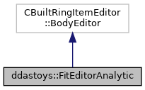

do not remove this div, it is closed by doxygen! 
|  |
| --- |
| DDASToys for NSCLDAQ6.2-000 |

 end header part 
 Generated by Doxygen 1.9.1 

 window showing the filter options 

 iframe showing the search results (closed by default) 

- **ddastoys**
- [[FitEditorAnalytic|classddastoys_1_1FitEditorAnalytic]]

 top 
[Public Member Functions](#pub-methods) |
[[List of all members|classddastoys_1_1FitEditorAnalytic-members]]

ddastoys::FitEditorAnalytic Class Reference

header
Fit trace data using the analytic fitting functions and populate and save a hit extension with the results.  
 [[More...|classddastoys_1_1FitEditorAnalytic#details]]

`#include <FitEditorAnalytic.h>`

Inheritance diagram for ddastoys::FitEditorAnalytic:

[[[legend|graph_legend]]]

Collaboration diagram for ddastoys::FitEditorAnalytic:

[[[legend|graph_legend]]]

|  |  |
| --- | --- |
| Public Member Functions |
|  | FitEditorAnalytic() |
|  | Constructor.More... |
|  |
|  | FitEditorAnalytic(constFitEditorAnalytic&rhs) |
|  | Copy constructor.More... |
|  |
|  | FitEditorAnalytic(FitEditorAnalytic&&rhs) noexcept |
|  | Move constructor.More... |
|  |
| FitEditorAnalytic& | operator=(constFitEditorAnalytic&rhs) |
|  | Copy assignment operator.More... |
|  |
| FitEditorAnalytic& | operator=(FitEditorAnalytic&&rhs) noexcept |
|  | Move assignment operator.More... |
|  |
| virtual | ~FitEditorAnalytic() |
|  | Destructor.More... |
|  |
| virtual std::vector< CBuiltRingItemEditor::BodySegment > | operator()(pRingItemHeader pHdr, pBodyHeader pBHdr, size_t bodySize, void *pBody) |
|  | Perform the fit and create a fit extension for a single fragment.More... |
|  |
| virtual void | free(iovec &e) |
|  | Free the dynamic fit extension descriptor(s).More... |
|  |

## Detailed Description

Fit trace data using the analytic fitting functions and populate and save a hit extension with the results.

Extending the hit with this editor overwrites any existing extension. This class is intended for use with the EventEditor framework providing a complete description of the new event body. Resides in the ddastoys namespace.

## Constructor & Destructor Documentation

## [◆](#a7acb31121f6fc4bb9487a0a6796080a6)FitEditorAnalytic() [1/3]

|  |  |  |  |  |
| --- | --- | --- | --- | --- |
| ddastoys::FitEditorAnalytic::FitEditorAnalytic | ( |  | ) |  |

Constructor.

Sets up the configuration manager to parse config files and manage configuration data. Reads the fit config file.

## [◆](#a6d1ba2757ecad6d050e94f56f741d476)FitEditorAnalytic() [2/3]

|  |  |  |  |  |  |
| --- | --- | --- | --- | --- | --- |
| ddastoys::FitEditorAnalytic::FitEditorAnalytic | ( | constFitEditorAnalytic& | rhs | ) |  |

Copy constructor.

Parameters
|  |  |
| --- | --- |
| rhs | Object to copy construct. |

## [◆](#abb014bd8dde3609c62207cfaef1b85b5)FitEditorAnalytic() [3/3]

|  |  |  |  |  |  |  |  |
| --- | --- | --- | --- | --- | --- | --- | --- |
| ddastoys::FitEditorAnalytic::FitEditorAnalytic(FitEditorAnalytic&&rhs) | ddastoys::FitEditorAnalytic::FitEditorAnalytic | ( | FitEditorAnalytic&& | rhs | ) |  | noexcept |
| ddastoys::FitEditorAnalytic::FitEditorAnalytic | ( | FitEditorAnalytic&& | rhs | ) |  |

Move constructor.

Parameters
|  |  |
| --- | --- |
| rhs | Object to move construct. |

Constructs using move assignment.

## [◆](#a2118e5f50d0abb0296e2fafeecfc4502)~FitEditorAnalytic()

|  |  |  |  |  |  |  |
| --- | --- | --- | --- | --- | --- | --- |
| ddastoys::FitEditorAnalytic::~FitEditorAnalytic() | ddastoys::FitEditorAnalytic::~FitEditorAnalytic | ( |  | ) |  | virtual |
| ddastoys::FitEditorAnalytic::~FitEditorAnalytic | ( |  | ) |  |

Destructor.

Delete the [[Configuration|classddastoys_1_1Configuration]] object managed by this class.

## Member Function Documentation

## [◆](#a456ae3d7ce567242612a9046904cfd9a)free()

|  |  |  |  |  |  |  |  |
| --- | --- | --- | --- | --- | --- | --- | --- |
| void ddastoys::FitEditorAnalytic::free(iovec &e) | void ddastoys::FitEditorAnalytic::free | ( | iovec & | e | ) |  | virtual |
| void ddastoys::FitEditorAnalytic::free | ( | iovec & | e | ) |  |

Free the dynamic fit extension descriptor(s).

Parameters
|  |  |
| --- | --- |
| e | IOvec we need to free. |

## [◆](#a37a0c73bc2428d947b5b40081e2e5515)operator()()

|  |  |  |  |  |  |  |  |  |  |  |  |  |  |  |  |  |  |  |  |  |  |
| --- | --- | --- | --- | --- | --- | --- | --- | --- | --- | --- | --- | --- | --- | --- | --- | --- | --- | --- | --- | --- | --- |
| std::vector< CBuiltRingItemEditor::BodySegment > ddastoys::FitEditorAnalytic::operator()(pRingItemHeaderpHdr,pBodyHeaderpBHdr,size_tbodySize,void *pBody) | std::vector< CBuiltRingItemEditor::BodySegment > ddastoys::FitEditorAnalytic::operator() | ( | pRingItemHeader | pHdr, |  |  | pBodyHeader | pBHdr, |  |  | size_t | bodySize, |  |  | void * | pBody |  | ) |  |  | virtual |
| std::vector< CBuiltRingItemEditor::BodySegment > ddastoys::FitEditorAnalytic::operator() | ( | pRingItemHeader | pHdr, |
|  |  | pBodyHeader | pBHdr, |
|  |  | size_t | bodySize, |
|  |  | void * | pBody |
|  | ) |  |  |

Perform the fit and create a fit extension for a single fragment.

Parameters
|  |  |
| --- | --- |
| pHdr | Pointer to the ring item header of the hit. |
| pBHdr | Pointer to the body header pointer for the hit. |
| bodySize | Number of bytes in the body. |
| pBody | Pointer to the body. |

ReturnsFinal segment descriptors.
This is the hook into the [[FitEditorAnalytic|classddastoys_1_1FitEditorAnalytic]] class. Here we:

- Parse the fragment into a hit.
- Produce a IOvec element for the existing hit (without any fit that might have been there).
- See if the configuration manager says we should fit and if so, create the trace.
- Get the fit limits and saturation value.
- Get the number of pulses to fit.
- Do the fits.
- Create an IOvec entry for the extension we created (dynamic).

## [◆](#adac6d3ebfac2f17717c6082503725c55)operator=() [1/2]

|  |  |  |  |  |  |
| --- | --- | --- | --- | --- | --- |
| FitEditorAnalytic& ddastoys::FitEditorAnalytic::operator= | ( | constFitEditorAnalytic& | rhs | ) |  |

Copy assignment operator.

Parameters
|  |  |
| --- | --- |
| rhs | Object to copy assign. |

ReturnsReference to created object.

## [◆](#a93223d4d66d506bda46e1b9205bd076d)operator=() [2/2]

|  |  |  |  |  |  |  |  |
| --- | --- | --- | --- | --- | --- | --- | --- |
| FitEditorAnalytic& ddastoys::FitEditorAnalytic::operator=(FitEditorAnalytic&&rhs) | FitEditorAnalytic& ddastoys::FitEditorAnalytic::operator= | ( | FitEditorAnalytic&& | rhs | ) |  | noexcept |
| FitEditorAnalytic& ddastoys::FitEditorAnalytic::operator= | ( | FitEditorAnalytic&& | rhs | ) |  |

Move assignment operator.

Parameters
|  |  |
| --- | --- |
| rhs | Object to move assign. |

ReturnsReference to created object.

---

The documentation for this class was generated from the following files:- [[FitEditorAnalytic.h|FitEditorAnalytic_8h_source]]
- [[FitEditorAnalytic.cpp|FitEditorAnalytic_8cpp]]

 contents 
 start footer part 

---

Generated by  1.9.1
