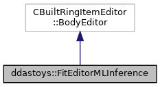

do not remove this div, it is closed by doxygen! 
|  |
| --- |
| DDASToys for NSCLDAQ6.2-000 |

 end header part 
 Generated by Doxygen 1.9.1 

 window showing the filter options 

 iframe showing the search results (closed by default) 

- **ddastoys**
- [FitEditorMLInference](https://github.com/FRIBDAQ/docs/tree/main/ddastoys-6.2-000/classddastoys_1_1FitEditorMLInference.md)

 top 
[Public Member Functions](#pub-methods) |
[List of all members](https://github.com/FRIBDAQ/docs/tree/main/ddastoys-6.2-000/classddastoys_1_1FitEditorMLInference-members.md)

ddastoys::FitEditorMLInference Class Reference

header
Fit trace data using machine-learning inference with a detector response model defined by the analytic fit functions.  
 [More...](https://github.com/FRIBDAQ/docs/tree/main/ddastoys-6.2-000/classddastoys_1_1FitEditorMLInference.md#details)

`#include <FitEditorMLInference.h>`

Inheritance diagram for ddastoys::FitEditorMLInference:

[[legend](https://github.com/FRIBDAQ/docs/tree/main/ddastoys-6.2-000/graph_legend.md)]

Collaboration diagram for ddastoys::FitEditorMLInference:

[[legend](https://github.com/FRIBDAQ/docs/tree/main/ddastoys-6.2-000/graph_legend.md)]

|  |  |
| --- | --- |
| Public Member Functions |
|  | FitEditorMLInference() |
|  | Constructor.More... |
|  |
|  | FitEditorMLInference(constFitEditorMLInference&rhs) |
|  | Copy constructor.More... |
|  |
|  | FitEditorMLInference(FitEditorMLInference&&rhs) noexcept |
|  | Move constructor.More... |
|  |
| FitEditorMLInference& | operator=(constFitEditorMLInference&rhs) |
|  | Copy assignment operator.More... |
|  |
| FitEditorMLInference& | operator=(FitEditorMLInference&&rhs) noexcept |
|  | Move assignment operator.More... |
|  |
| virtual | ~FitEditorMLInference() |
|  | Destructor.More... |
|  |
| virtual std::vector< CBuiltRingItemEditor::BodySegment > | operator()(pRingItemHeader pHdr, pBodyHeader pBHdr, size_t bodySize, void *pBody) |
|  | Perform the fit and create a fit extension for a single fragment.More... |
|  |
| virtual void | free(iovec &e) |
|  | Free the dynamic fit extension descriptor(s).More... |
|  |

## Detailed Description

Fit trace data using machine-learning inference with a detector response model defined by the analytic fit functions.

Extending the hit with this editor overwrites any existing extension. This class is intended for use with the EventEditor framework providing a complete description of the new event body.

## Constructor & Destructor Documentation

## [◆](#a471e3f88230c6f6515aab43788c8645d)FitEditorMLInference() [1/3]

|  |  |  |  |  |
| --- | --- | --- | --- | --- |
| ddastoys::FitEditorMLInference::FitEditorMLInference | ( |  | ) |  |

Constructor.

Sets up the configuration manager to parse config files and manage configuration data. Reads the fit config file. Loads all ML models specified in the configuration. Stores models in a map keyed by the path to their associated PyTorch file.

## [◆](#a5e3b5de6d4ba0c5281f9f48448b91b90)FitEditorMLInference() [2/3]

|  |  |  |  |  |  |
| --- | --- | --- | --- | --- | --- |
| ddastoys::FitEditorMLInference::FitEditorMLInference | ( | constFitEditorMLInference& | rhs | ) |  |

Copy constructor.

- Parameters
  |  |  |
  | --- | --- |
  | rhs | Object to copy construct. |

## [◆](#a8884ce240ffe44d82b0ad8054cdac614)FitEditorMLInference() [3/3]

|  |  |  |  |  |  |  |  |
| --- | --- | --- | --- | --- | --- | --- | --- |
| ddastoys::FitEditorMLInference::FitEditorMLInference(FitEditorMLInference&&rhs) | ddastoys::FitEditorMLInference::FitEditorMLInference | ( | FitEditorMLInference&& | rhs | ) |  | noexcept |
| ddastoys::FitEditorMLInference::FitEditorMLInference | ( | FitEditorMLInference&& | rhs | ) |  |

Move constructor.

- Parameters
  |  |  |
  | --- | --- |
  | rhs | Object to move construct. |

Constructs using move assignment.

## [◆](#a5e1af5690f9cdf346de91868d40968c2)~FitEditorMLInference()

|  |  |  |  |  |  |  |
| --- | --- | --- | --- | --- | --- | --- |
| ddastoys::FitEditorMLInference::~FitEditorMLInference() | ddastoys::FitEditorMLInference::~FitEditorMLInference | ( |  | ) |  | virtual |
| ddastoys::FitEditorMLInference::~FitEditorMLInference | ( |  | ) |  |

Destructor.

Delete the [Configuration](https://github.com/FRIBDAQ/docs/tree/main/ddastoys-6.2-000/classddastoys_1_1Configuration.md) object managed by this class.

## Member Function Documentation

## [◆](#a3f9483cecb40afec96c5f4fd2147ad6f)free()

|  |  |  |  |  |  |  |  |
| --- | --- | --- | --- | --- | --- | --- | --- |
| void ddastoys::FitEditorMLInference::free(iovec &e) | void ddastoys::FitEditorMLInference::free | ( | iovec & | e | ) |  | virtual |
| void ddastoys::FitEditorMLInference::free | ( | iovec & | e | ) |  |

Free the dynamic fit extension descriptor(s).

- Parameters
  |  |  |
  | --- | --- |
  | e | IOvec we need to free. |

## [◆](#aec80def3c2a2c6afd708cacce02740e0)operator()()

|  |  |  |  |  |  |  |  |  |  |  |  |  |  |  |  |  |  |  |  |  |  |
| --- | --- | --- | --- | --- | --- | --- | --- | --- | --- | --- | --- | --- | --- | --- | --- | --- | --- | --- | --- | --- | --- |
| std::vector< CBuiltRingItemEditor::BodySegment > ddastoys::FitEditorMLInference::operator()(pRingItemHeaderpHdr,pBodyHeaderpBHdr,size_tbodySize,void *pBody) | std::vector< CBuiltRingItemEditor::BodySegment > ddastoys::FitEditorMLInference::operator() | ( | pRingItemHeader | pHdr, |  |  | pBodyHeader | pBHdr, |  |  | size_t | bodySize, |  |  | void * | pBody |  | ) |  |  | virtual |
| std::vector< CBuiltRingItemEditor::BodySegment > ddastoys::FitEditorMLInference::operator() | ( | pRingItemHeader | pHdr, |
|  |  | pBodyHeader | pBHdr, |
|  |  | size_t | bodySize, |
|  |  | void * | pBody |
|  | ) |  |  |

Perform the fit and create a fit extension for a single fragment.

- Parameters
  |  |  |
  | --- | --- |
  | pHdr | Pointer to the ring item header of the hit. |
  | pBHdr | Pointer to the body header pointer for the hit. |
  | bodySize | Number of bytes in the body. |
  | pBody | Pointer to the body. |

- Returns
  Final segment descriptors.

This is the hook into the [FitEditorMLInference](https://github.com/FRIBDAQ/docs/tree/main/ddastoys-6.2-000/classddastoys_1_1FitEditorMLInference.md) class. Here we:

- Parse the fragment into a hit.
- Produce a IOvec element for the existing hit (without any fit that might have been there).
- See if the configuration manager says we should fit and if so, get the trace from the hit.
- Do the inference step
- Create an IOvec entry for the extension we created (dynamic).

## [◆](#ac92df8acc509c05dabd4ba4e84aa83f2)operator=() [1/2]

|  |  |  |  |  |  |
| --- | --- | --- | --- | --- | --- |
| FitEditorMLInference& ddastoys::FitEditorMLInference::operator= | ( | constFitEditorMLInference& | rhs | ) |  |

Copy assignment operator.

- Parameters
  |  |  |
  | --- | --- |
  | rhs | Object to copy assign. |

- Returns
  Reference to created object.

## [◆](#ae894239167365ade91a86defa3b991af)operator=() [2/2]

|  |  |  |  |  |  |  |  |
| --- | --- | --- | --- | --- | --- | --- | --- |
| FitEditorMLInference& ddastoys::FitEditorMLInference::operator=(FitEditorMLInference&&rhs) | FitEditorMLInference& ddastoys::FitEditorMLInference::operator= | ( | FitEditorMLInference&& | rhs | ) |  | noexcept |
| FitEditorMLInference& ddastoys::FitEditorMLInference::operator= | ( | FitEditorMLInference&& | rhs | ) |  |

Move assignment operator.

- Parameters
  |  |  |
  | --- | --- |
  | rhs | Object to move assign. |

- Returns
  Reference to created object.

---

The documentation for this class was generated from the following files:- [FitEditorMLInference.h](https://github.com/FRIBDAQ/docs/tree/main/ddastoys-6.2-000/FitEditorMLInference_8h_source.md)
- [FitEditorMLInference.cpp](https://github.com/FRIBDAQ/docs/tree/main/ddastoys-6.2-000/FitEditorMLInference_8cpp.md)

 contents 
 start footer part 

---

Generated by  1.9.1
