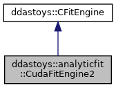

do not remove this div, it is closed by doxygen! 
|  |
| --- |
| DDASToys for NSCLDAQ6.2-000 |

 end header part 
 Generated by Doxygen 1.9.1 

 window showing the filter options 

 iframe showing the search results (closed by default) 

- **ddastoys**
- **analyticfit**
- [CudaFitEngine2](https://github.com/FRIBDAQ/docs/tree/main/ddastoys-6.2-000/classddastoys_1_1analyticfit_1_1CudaFitEngine2.md)

 top 
[Public Member Functions](#pub-methods) |
[List of all members](https://github.com/FRIBDAQ/docs/tree/main/ddastoys-6.2-000/classddastoys_1_1analyticfit_1_1CudaFitEngine2-members.md)

ddastoys::analyticfit::CudaFitEngine2 Class Reference

header
CUDA-aware fit engine for analytic double pulse fits.  
 [More...](https://github.com/FRIBDAQ/docs/tree/main/ddastoys-6.2-000/classddastoys_1_1analyticfit_1_1CudaFitEngine2.md#details)

`#include <jacobian_analytic.h>`

Inheritance diagram for ddastoys::analyticfit::CudaFitEngine2:

[[legend](https://github.com/FRIBDAQ/docs/tree/main/ddastoys-6.2-000/graph_legend.md)]

Collaboration diagram for ddastoys::analyticfit::CudaFitEngine2:

[[legend](https://github.com/FRIBDAQ/docs/tree/main/ddastoys-6.2-000/graph_legend.md)]

|  |  |
| --- | --- |
| Public Member Functions |
|  | CudaFitEngine2(std::vector< std::pair< uint16_t, uint16_t >> &data) |
|  | Constructor.More... |
|  |
|  | ~CudaFitEngine2() |
|  | Destructor.More... |
|  |
| virtual void | jacobian(const gsl_vector *p, gsl_matrix *J) |
|  | Marshall the parameter and call the jacobian2 kernel. Then pull the Jacobian matrix out of the GPU and marshall it back into the GSL Jacobian matrix.More... |
|  |
| virtual void | residuals(const gsl_vector *p, gsl_vector *r) |
|  | Fire off the kernel to compute the pointwise residuals.More... |
|  |
| Public Member Functions inherited fromddastoys::CFitEngine |
|  | CFitEngine(std::vector< std::pair< uint16_t, uint16_t >> &data) |
|  | Constructor.More... |
|  |
| virtual | ~CFitEngine() |
|  | Destructor. |
|  |

|  |  |
| --- | --- |
| Additional Inherited Members |
| Protected Attributes inherited fromddastoys::CFitEngine |
| std::vector< uint16_t > | x |
|  | Trace x coordinate vector. |
|  |
| std::vector< uint16_t > | y |
|  | Trace y coordinate vector. |
|  |

## Detailed Description

CUDA-aware fit engine for analytic double pulse fits.

The concept is that each GSL lmfitter can supply a pair of methods: One that computes a vector of residuals and one that computes a Jacobian matrix of partial derivatives. At the implementation level we have two types of fits we need done: Single pulse fits and double pulse fits (the engines with names ending in 1 or 2). For each fit type we have two fit engines: 1) Serial computation (the engines with names starting with Serial) 2) GPU accelerated (the engines with names starting with Cuda).

Finally a fit factory can generate the appropriate fit engine as desired by the actual fit.

- **[Todo:](https://github.com/FRIBDAQ/docs/tree/main/ddastoys-6.2-000/todo.md#_todo000004)**
  (ASC 10/30/23): Manages some device pointers. Not copyable, and most likely is not ever copied. But we can make it safe.

## Constructor & Destructor Documentation

## [◆](#a88d444932918e4e861a3359601cf11c3)CudaFitEngine2()

|  |  |  |  |  |  |
| --- | --- | --- | --- | --- | --- |
| ddastoys::analyticfit::CudaFitEngine2::CudaFitEngine2 | ( | std::vector< std::pair< uint16_t, uint16_t >> & | data | ) |  |

Constructor.

- Parameters
  |  |  |
  | --- | --- |
  | data | The trace data in x/y pairs. |

Allocate the GPU resources:

- Trace x array
- Trace y array.
- Residual array.
- Jacobian vector (m_npts * 9)
- Move the trace into the GPU where it stays for all iterations of the fit.

## [◆](#a8174e72f7fdd7ad2039223605080e5a2)~CudaFitEngine2()

|  |  |  |  |  |
| --- | --- | --- | --- | --- |
| ddastoys::analyticfit::CudaFitEngine2::~CudaFitEngine2 | ( |  | ) |  |

Destructor.

Just frees the device blocks.

## Member Function Documentation

## [◆](#a59480ccd2761639a782db66df8af0d2b)jacobian()

|  |  |  |  |  |  |  |  |  |  |  |  |  |  |
| --- | --- | --- | --- | --- | --- | --- | --- | --- | --- | --- | --- | --- | --- |
| void ddastoys::analyticfit::CudaFitEngine2::jacobian(const gsl_vector *p,gsl_matrix *J) | void ddastoys::analyticfit::CudaFitEngine2::jacobian | ( | const gsl_vector * | p, |  |  | gsl_matrix * | J |  | ) |  |  | virtual |
| void ddastoys::analyticfit::CudaFitEngine2::jacobian | ( | const gsl_vector * | p, |
|  |  | gsl_matrix * | J |
|  | ) |  |  |

Marshall the parameter and call the jacobian2 kernel. Then pull the Jacobian matrix out of the GPU and marshall it back into the GSL Jacobian matrix.

- Parameters
  |  |  |
  | --- | --- |
  | p | Parameter vector from GSL. |
  | J | Jacobian matrix to output. |

- Note
  We organize the computing into 32 thread blocks because there are 32 thread per warp.

Implements [ddastoys::CFitEngine](https://github.com/FRIBDAQ/docs/tree/main/ddastoys-6.2-000/classddastoys_1_1CFitEngine.md#a96d60c77a96448db9fa01871070b0ef6).

## [◆](#a1db08004bd6f37f8f62861a8a311b30e)residuals()

|  |  |  |  |  |  |  |  |  |  |  |  |  |  |
| --- | --- | --- | --- | --- | --- | --- | --- | --- | --- | --- | --- | --- | --- |
| void ddastoys::analyticfit::CudaFitEngine2::residuals(const gsl_vector *p,gsl_vector *r) | void ddastoys::analyticfit::CudaFitEngine2::residuals | ( | const gsl_vector * | p, |  |  | gsl_vector * | r |  | ) |  |  | virtual |
| void ddastoys::analyticfit::CudaFitEngine2::residuals | ( | const gsl_vector * | p, |
|  |  | gsl_vector * | r |
|  | ) |  |  |

Fire off the kernel to compute the pointwise residuals.

- Parameters
  |  |  |
  | --- | --- |
  | p | Fit parameters. |
  | r | Residual vector. |

Implements [ddastoys::CFitEngine](https://github.com/FRIBDAQ/docs/tree/main/ddastoys-6.2-000/classddastoys_1_1CFitEngine.md#abe25c7b7ff9be5e5cd2ab16567189e1d).

---

The documentation for this class was generated from the following files:- [jacobian_analytic.h](https://github.com/FRIBDAQ/docs/tree/main/ddastoys-6.2-000/jacobian__analytic_8h_source.md)
- [CudaFitEngineAnalytic.cu](https://github.com/FRIBDAQ/docs/tree/main/ddastoys-6.2-000/CudaFitEngineAnalytic_8cu.md)

 contents 
 start footer part 

---

Generated by  1.9.1
