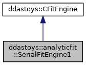

do not remove this div, it is closed by doxygen! 
|  |
| --- |
| DDASToys for NSCLDAQ6.2-000 |

 end header part 
 Generated by Doxygen 1.9.1 

 window showing the filter options 

 iframe showing the search results (closed by default) 

- **ddastoys**
- **analyticfit**
- [[SerialFitEngine1|https://github.com/FRIBDAQ/docs/tree/main/ddastoys-6.2-000/classddastoys_1_1analyticfit_1_1SerialFitEngine1.md]]

 top 
[Public Member Functions](#pub-methods) |
[[List of all members|https://github.com/FRIBDAQ/docs/tree/main/ddastoys-6.2-000/classddastoys_1_1analyticfit_1_1SerialFitEngine1-members.md]]

ddastoys::analyticfit::SerialFitEngine1 Class Reference

header
Fit engine for analytic single pulse fits.  
 [[More...|https://github.com/FRIBDAQ/docs/tree/main/ddastoys-6.2-000/classddastoys_1_1analyticfit_1_1SerialFitEngine1.md#details]]

`#include <jacobian_analytic.h>`

Inheritance diagram for ddastoys::analyticfit::SerialFitEngine1:

[[[legend|https://github.com/FRIBDAQ/docs/tree/main/ddastoys-6.2-000/graph_legend.md]]]

Collaboration diagram for ddastoys::analyticfit::SerialFitEngine1:

[[[legend|https://github.com/FRIBDAQ/docs/tree/main/ddastoys-6.2-000/graph_legend.md]]]

|  |  |
| --- | --- |
| Public Member Functions |
|  | ~SerialFitEngine1() |
|  |
|  |
|  | SerialFitEngine1(std::vector< std::pair< uint16_t, uint16_t >> &data) |
|  | Constructor.More... |
|  |
| virtual void | jacobian(const gsl_vector *p, gsl_matrix *J) |
|  | Compute the Jacobian matrix.More... |
|  |
| virtual void | residuals(const gsl_vector *p, gsl_vector *r) |
|  | Compute the vector of residuals.More... |
|  |
| Public Member Functions inherited fromddastoys::CFitEngine |
|  | CFitEngine(std::vector< std::pair< uint16_t, uint16_t >> &data) |
|  | Constructor.More... |
|  |
| virtual | ~CFitEngine() |
|  | Destructor. |
|  |

|  |  |
| --- | --- |
| Additional Inherited Members |
| Protected Attributes inherited fromddastoys::CFitEngine |
| std::vector< uint16_t > | x |
|  | Trace x coordinate vector. |
|  |
| std::vector< uint16_t > | y |
|  | Trace y coordinate vector. |
|  |

## Detailed Description

Fit engine for analytic single pulse fits.

The concept is that each GSL lmfitter can supply a pair of methods: One that computes a vector of residuals and one that computes a Jacobian matrix of partial derivatives. At the implementation level we have two types of fits we need done: Single pulse fits and double pulse fits (the engines with names ending in 1 or 2). For each fit type we have two fit engines: 1) Serial computation (the engines with names starting with Serial) 2) GPU accelerated (the engines with names starting with Cuda). Finally a fit factory can generate the appropriate fit engine as desired by the actual fit.

## Constructor & Destructor Documentation

## [◆](#a8845508f89df90aca7ddb0752b59307f)SerialFitEngine1()

|  |  |  |  |  |  |
| --- | --- | --- | --- | --- | --- |
| ddastoys::analyticfit::SerialFitEngine1::SerialFitEngine1 | ( | std::vector< std::pair< uint16_t, uint16_t >> & | data | ) |  |

Constructor.

- Parameters
  |  |  |
  | --- | --- |
  | data | The trace data. |

Construct the fit engine and set the input data. Delegates to base class construction.

## [◆](#a40e41bfee2c232521b3583b927a1c3c3)~SerialFitEngine1()

|  |  |  |  |  |  |  |
| --- | --- | --- | --- | --- | --- | --- |
| ddastoys::analyticfit::SerialFitEngine1::~SerialFitEngine1() | ddastoys::analyticfit::SerialFitEngine1::~SerialFitEngine1 | ( |  | ) |  | inline |
| ddastoys::analyticfit::SerialFitEngine1::~SerialFitEngine1 | ( |  | ) |  |

Destructor.

## Member Function Documentation

## [◆](#a24723626242f1694379c0f8af26d175d)jacobian()

|  |  |  |  |  |  |  |  |  |  |  |  |  |  |
| --- | --- | --- | --- | --- | --- | --- | --- | --- | --- | --- | --- | --- | --- |
| void ddastoys::analyticfit::SerialFitEngine1::jacobian(const gsl_vector *p,gsl_matrix *J) | void ddastoys::analyticfit::SerialFitEngine1::jacobian | ( | const gsl_vector * | p, |  |  | gsl_matrix * | J |  | ) |  |  | virtual |
| void ddastoys::analyticfit::SerialFitEngine1::jacobian | ( | const gsl_vector * | p, |
|  |  | gsl_matrix * | J |
|  | ) |  |  |

Compute the Jacobian matrix.

- Parameters
  |  |  |  |
  | --- | --- | --- |
  | [in] | p | Current fit parameterization. |
  | [out] | J | The Jacobian for this iteration of the fit. |

Compute the Jacobian matrix of the fit with respect to current values of the fit parameters. Weights are set to 1.0 and the x, y base class members are the trace data.

Implements [[ddastoys::CFitEngine|https://github.com/FRIBDAQ/docs/tree/main/ddastoys-6.2-000/classddastoys_1_1CFitEngine.md#a96d60c77a96448db9fa01871070b0ef6]].

## [◆](#ad8c1242fa432745d0eee0d703f82aedc)residuals()

|  |  |  |  |  |  |  |  |  |  |  |  |  |  |
| --- | --- | --- | --- | --- | --- | --- | --- | --- | --- | --- | --- | --- | --- |
| void ddastoys::analyticfit::SerialFitEngine1::residuals(const gsl_vector *p,gsl_vector *r) | void ddastoys::analyticfit::SerialFitEngine1::residuals | ( | const gsl_vector * | p, |  |  | gsl_vector * | r |  | ) |  |  | virtual |
| void ddastoys::analyticfit::SerialFitEngine1::residuals | ( | const gsl_vector * | p, |
|  |  | gsl_vector * | r |
|  | ) |  |  |

Compute the vector of residuals.

- Parameters
  |  |  |  |
  | --- | --- | --- |
  | [in] | p | Current fit parameters. |
  | [out] | r | Vector of residual values. |

Implements [[ddastoys::CFitEngine|https://github.com/FRIBDAQ/docs/tree/main/ddastoys-6.2-000/classddastoys_1_1CFitEngine.md#abe25c7b7ff9be5e5cd2ab16567189e1d]].

---

The documentation for this class was generated from the following files:- [[jacobian_analytic.h|https://github.com/FRIBDAQ/docs/tree/main/ddastoys-6.2-000/jacobian__analytic_8h_source.md]]
- [[SerialFitEngineAnalytic.cpp|https://github.com/FRIBDAQ/docs/tree/main/ddastoys-6.2-000/SerialFitEngineAnalytic_8cpp.md]]

 contents 
 start footer part 

---

Generated by  1.9.1
