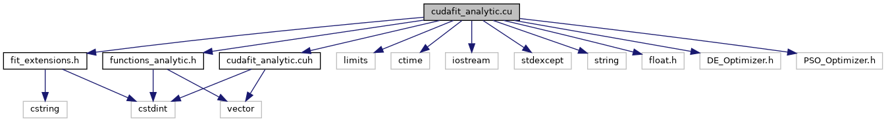

do not remove this div, it is closed by doxygen! 
|  |
| --- |
| DDASToys for NSCLDAQ6.2-000 |

 end header part 
 Generated by Doxygen 1.9.1 

 window showing the filter options 

 iframe showing the search results (closed by default)

 top 
[Macros](#define-members) |
[Functions](#func-members)

cudafit_analytic.cu File Reference

header
Provide trace fitting using the libucdafit library.  
[More...](#details)

`#include "cudafit_analytic.cuh"`  

`#include <limits>`  

`#include <ctime>`  

`#include <iostream>`  

`#include <stdexcept>`  

`#include <string>`  

`#include <float.h>`  

`#include <DE_Optimizer.h>`  

`#include <PSO_Optimizer.h>`  

`#include "fit_extensions.h"`  

`#include "functions_analytic.h"`  

`#include "reductions.cu"`

Include dependency graph for cudafit_analytic.cu:

|  |  |
| --- | --- |
| Functions |
| __host__ __device__ float | logistic(float A, float k, float x1, float x) |
|  | Evaluate a logistic function for the specified parameters and point.More... |
|  |
| __host__ __device__ float | decay(float A, float k, float x1, float x) |
|  | Exponential decay function.More... |
|  |
| __host__ __device__ float | singlePulse(float A1, float k1, float k2, float x1, float C, float x) |
|  | Evaluate the value of a single pulse in accordance with our canonical functional form.More... |
|  |
| __host__ __device__ float | doublePulse(float A1, float k1, float k2, float x1, float A2, float k3, float k4, float x2, float C, float x) |
|  | Evaluate the canonical form of a double pulse.More... |
|  |
| __host__ __device__ float | chiFitness1(const float *pParams, float x, float y, float wt) |
|  | Computes chi-square fitness for one point in one solution given that d_fitness has pulled out what we need. This fitness is for a single-pulse fit.More... |
|  |
| __host__ __device__ float | chiFitness2(const float *pParams, float x, float y, float wt) |
|  | Computes chi-square fitness contribution for one point in one solution given that our caller has pulled out what we need.More... |
|  |
| __global__ void | d_fitness1(const float *pSolutions, float *pFitnesses, int nParams, int nSol, unsigned short *pXcoords, unsigned short *pYcoords, float *pWeights, int nPoints) |
|  | This function lives in the GPU and:More... |
|  |
| __global__ void | d_fitness2(const float *pSolutions, float *pFitnesses, int nParams, int nSol, unsigned short *pXcoords, unsigned short *pYcoords, float *pWeights, int nPoints) |
|  | This function lives in the GPU and:More... |
|  |
| void | h_fitSingle(const CudaOptimize::SolutionSet *solutions, CudaOptimize::FitnessSet *fitnesses, dim3 grid, dim3 block) |
|  | Invokes the kernel that produces the fitness measure. The fitness is computed in the GPU and is the chi square.More... |
|  |
| void | h_fitDouble(const CudaOptimize::SolutionSet *solutions, CudaOptimize::FitnessSet *fitnesses, dim3 grid, dim3 block) |
|  | Host part to setup computation of the fitnesses across the swarm for our fits for a double pulse. Really this just sets up the kernel call for fitness2 which does the rest.More... |
|  |

## Detailed Description

Provide trace fitting using the libucdafit library.

- Author
  Ron Fox[fox@n.nosp@m.scl..nosp@m.msu.e.nosp@m.du](#)

- Note
  We provide call compatible interfaces with lmfit1 and lmfit2.

  This fit will not thread due to libcudaoptimize's need for us to have global data for the device pointers to the trace.

## Function Documentation

## [◆](#a01116e08731662bf49113e97ada001ef)chiFitness1()

|  |  |  |  |
| --- | --- | --- | --- |
| __host__ __device__ float chiFitness1 | ( | const float * | pParams, |
|  |  | float | x, |
|  |  | float | y, |
|  |  | float | wt |
|  | ) |  |  |

Computes chi-square fitness for one point in one solution given that d_fitness has pulled out what we need. This fitness is for a single-pulse fit.

The choice of weight determines whether the returned value is Neyman's (weight by variance estimated from data wt = 1/y) or Pearson's (weight by variance estimated from fit wt = 1/fit).

- Parameters
  |  |  |
  | --- | --- |
  | pParams | Pointer to this solutions parameters. |
  | x | x-coordinate. |
  | y | y-coordinate. |
  | wt | Weight for this coordinate. |

- Returns
  Chi-square between fit function and trace data.

## [◆](#ad008eca1dfb3ed6f79612d959d0ad0ab)chiFitness2()

|  |  |  |  |
| --- | --- | --- | --- |
| __host__ __device__ float chiFitness2 | ( | const float * | pParams, |
|  |  | float | x, |
|  |  | float | y, |
|  |  | float | wt |
|  | ) |  |  |

Computes chi-square fitness contribution for one point in one solution given that our caller has pulled out what we need.

The choice of weight determines whether the returned value is Neyman's (weight by variance estimated from data wt = 1/y) or Pearson's (weight by variance estimated from fit wt = 1/fit).

- Parameters
  |  |  |
  | --- | --- |
  | pParams | Pointer to this solutions parameters. |
  | x | x-coordinate. |
  | y | y-coordinate. |
  | wt | Weight for this coordinate. |

- Returns
  Chi-square between fit function and trace data.

## [◆](#a78fbfa89e7b83fc2ea2a7e65f2c0da01)d_fitness1()

|  |  |  |  |
| --- | --- | --- | --- |
| __global__ void d_fitness1 | ( | const float * | pSolutions, |
|  |  | float * | pFitnesses, |
|  |  | int | nParams, |
|  |  | int | nSol, |
|  |  | unsigned short * | pXcoords, |
|  |  | unsigned short * | pYcoords, |
|  |  | float * | pWeights, |
|  |  | int | nPoints |
|  | ) |  |  |

This function lives in the GPU and:

- Computes the chi-square contribution for a single point for a single solution in the swarm for a single pulse with an offset.
- Uses reduceToSum to sum the chisquare contributions over the entire trace. The result is put into the fitness value for our solution.

- Parameters
  |  |  |
  | --- | --- |
  | pSolutions | Pointer to solutions array in the GPU. |
  | pFitnesses | Pointer to the array of fitnesse for all solutions in the swarm. |
  | nParams | Number of parameters in the fit (should be 5). |
  | nSol | Number of solutions in the swarm. |
  | pXcoords | Trace x-coordinates array. |
  | pYcoords | Trace y-coordinates array. |
  | pWeights | y weights to apply. |
  | nPoints | Number of points in the trace. |

## [◆](#a9b54457d422df1ecf4f422c4903c0b1b)d_fitness2()

|  |  |  |  |
| --- | --- | --- | --- |
| __global__ void d_fitness2 | ( | const float * | pSolutions, |
|  |  | float * | pFitnesses, |
|  |  | int | nParams, |
|  |  | int | nSol, |
|  |  | unsigned short * | pXcoords, |
|  |  | unsigned short * | pYcoords, |
|  |  | float * | pWeights, |
|  |  | int | nPoints |
|  | ) |  |  |

This function lives in the GPU and:

- Computes the chi-square contribution for a single point for a single solution in the swarm for a single pulse with an offset.
- Uses reduceToSum to sum the chisquare contributions over the entire trace. The result is put into the fitness value for our solution.

- Parameters
  |  |  |
  | --- | --- |
  | pSolutions | Pointer to solutions array in the GPU. |
  | pFitnesses | Pointer to the array of fitnesse for all solutions in the swarm. |
  | nParams | Number of parameters in the fit (should be 5). |
  | nSol | Number of solutions in the swarm. |
  | pXcoords | Trace x-coordinates array. |
  | pYcoords | Trace y-coordinates array. |
  | pWeights | y weights to apply. |
  | nPoints | Number of points in the trace. |

## [◆](#ad53c1c2be1465b8eafe9b926a680b752)decay()

|  |  |  |  |
| --- | --- | --- | --- |
| __host__ __device__ float decay | ( | float | A, |
|  |  | float | k, |
|  |  | float | x1, |
|  |  | float | x |
|  | ) |  |  |

Exponential decay function.

Signals from detectors usually have a falling shape that approximates an exponential. This function evaluates this decay at some point.

- Parameters
  |  |  |
  | --- | --- |
  | A | Amplitude of the signal |
  | k | Decay time factor f the signal. |
  | x1 | Position of the pulse. |
  | x | Where to evaluate the signal. |

- Returns
  Exponential decay evaluated at x.

## [◆](#a7b6549a9395d3f8f40b2f12e790198e6)doublePulse()

|  |  |  |  |
| --- | --- | --- | --- |
| __host__ __device__ float doublePulse | ( | float | A1, |
|  |  | float | k1, |
|  |  | float | k2, |
|  |  | float | x1, |
|  |  | float | A2, |
|  |  | float | k3, |
|  |  | float | k4, |
|  |  | float | x2, |
|  |  | float | C, |
|  |  | float | x |
|  | ) |  |  |

Evaluate the canonical form of a double pulse.

This is done by summing two single pulses. The constant term is thrown into the first pulse. The second pulse gets a constant term of 0.

- Parameters
  |  |  |
  | --- | --- |
  | A1 | Amplitude of the first pulse. |
  | k1 | Steepness of first pulse rise. |
  | k2 | Decay time of the first pulse. |
  | x1 | Position of the first pulse. |
  | A2 | Amplitude of the second pulse. |
  | k3 | Steepness of second pulse rise. |
  | k4 | Decay time of second pulse. |
  | x2 | Position of second pulse. |
  | C | Constant offset the pulses sit on. |
  | x | Position at which to evaluate the pulse. |

- Returns
  Value of the double-pulse function evaluated at x.

## [◆](#a5482cd4de0390a1a23d211ee9d8f671d)h_fitDouble()

|  |  |  |  |
| --- | --- | --- | --- |
| void h_fitDouble | ( | const CudaOptimize::SolutionSet * | solutions, |
|  |  | CudaOptimize::FitnessSet * | fitnesses, |
|  |  | dim3 | grid, |
|  |  | dim3 | block |
|  | ) |  |  |

Host part to setup computation of the fitnesses across the swarm for our fits for a double pulse. Really this just sets up the kernel call for fitness2 which does the rest.

- Parameters
  |  |  |
  | --- | --- |
  | solutions | Pointer to the current Solution set. |
  | fitnesses | Pointer to the current fitness set |
  | grid | Computaional grid geometry. |
  | block | Shapes of the blocks within the grid. |

## [◆](#ab1cbd653db743c1a5bb2c316ff33cef8)h_fitSingle()

|  |  |  |  |
| --- | --- | --- | --- |
| void h_fitSingle | ( | const CudaOptimize::SolutionSet * | solutions, |
|  |  | CudaOptimize::FitnessSet * | fitnesses, |
|  |  | dim3 | grid, |
|  |  | dim3 | block |
|  | ) |  |  |

Invokes the kernel that produces the fitness measure. The fitness is computed in the GPU and is the chi square.

- Parameters
  |  |  |
  | --- | --- |
  | solutions | Pointer to the Cuda solution set. |
  | fitnesses | Pointer to the current fitness set |
  | grid | Computational grid being used. |
  | block | Shapes of blocks within the grid. |

## [◆](#a8ad7a892e2871cb7e23665a5884f6735)logistic()

|  |  |  |  |
| --- | --- | --- | --- |
| __host__ __device__ float logistic | ( | float | A, |
|  |  | float | k, |
|  |  | float | x1, |
|  |  | float | x |
|  | ) |  |  |

Evaluate a logistic function for the specified parameters and point.

A logistic function is a function with a sigmoidal shape. We use it to fit the rising edge of signals DDAS digitizes from detectors. See e.g. [https://en.wikipedia.org/wiki/Logistic_function](https://en.wikipedia.org/wiki/Logistic_function) for a discussion of this function.

- Parameters
  |  |  |
  | --- | --- |
  | A | Amplitude of the signal. |
  | k | Steepness of the signal (related to the rise time). |
  | x1 | Mid point of the rise of the sigmoid. |
  | x | Location at which to evaluate the function. |

- Returns
  Logistic function evaluated at x.

## [◆](#a33c26171ad9cfabf1613966d81761eff)singlePulse()

|  |  |  |  |
| --- | --- | --- | --- |
| __host__ __device__ float singlePulse | ( | float | A1, |
|  |  | float | k1, |
|  |  | float | k2, |
|  |  | float | x1, |
|  |  | float | C, |
|  |  | float | x |
|  | ) |  |  |

Evaluate the value of a single pulse in accordance with our canonical functional form.

The form is a sigmoid rise with an exponential decay that sits on top of a constant offset. The exponential decay is turned on with [[switchOn()|group__analytic#gab8955e8a8a70e7c53a8ee2ccb5173d4e]] above when x > the rise point of the sigmoid.

- Parameters
  |  |  |
  | --- | --- |
  | A1 | Pulse amplitiude |
  | k1 | Sigmoid rise steepness. |
  | k2 | Exponential decay time constant. |
  | x1 | Sigmoid position. |
  | C | Constant offset. |
  | x | Position at which to evaluate this function. |

- Returns
  Single pulse evaluated at x.

 contents 
 start footer part 

---

Generated by  1.9.1
