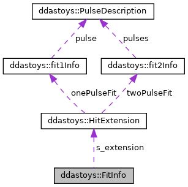

do not remove this div, it is closed by doxygen! 
|  |
| --- |
| DDASToys for NSCLDAQ6.2-000 |

 end header part 
 Generated by Doxygen 1.9.1 

 window showing the filter options 

 iframe showing the search results (closed by default) 

- **ddastoys**
- [[structddastoys_1_1FitInfo]]

 top 
[Public Member Functions](#pub-methods) |
[Public Attributes](#pub-attribs) |
[[structddastoys_1_1FitInfo-members]]

ddastoys::FitInfo Struct Reference

header
A fit extension that knows its size.  
 [[structddastoys_1_1FitInfo#details]]

`#include <fit_extensions.h>`

Collaboration diagram for ddastoys::FitInfo:

[[[graph_legend]]]

|  |  |
| --- | --- |
| Public Member Functions |
|  | FitInfo() |
|  | CreatesFitInfo, set its size, and zeroes parameters. |
|  |

|  |  |
| --- | --- |
| Public Attributes |
| HitExtension | s_extension |
|  | The hit extension data. |
|  |
| uint32_t | s_size |
|  | sizeof(HitExtension) |
|  |

## Detailed Description

A fit extension that knows its size.

---

The documentation for this struct was generated from the following file:- [[fit__extensions_8h_source]]

 contents 
 start footer part 

---

Generated by  1.9.1
