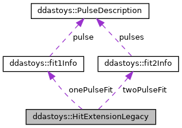

do not remove this div, it is closed by doxygen! 
|  |
| --- |
| DDASToys for NSCLDAQ6.2-000 |

 end header part 
 Generated by Doxygen 1.9.1 

 window showing the filter options 

 iframe showing the search results (closed by default) 

- **ddastoys**
- [[structddastoys_1_1HitExtensionLegacy]]

 top 
[Public Attributes](#pub-attribs) |
[[structddastoys_1_1HitExtensionLegacy-members]]

ddastoys::HitExtensionLegacy Struct Reference

header
Legacy data structure appended to each fit hit. This is the hit extension struct for DDASToys pre-6.0-000.  
 [[structddastoys_1_1HitExtensionLegacy#details]]

`#include <fit_extensions.h>`

Collaboration diagram for ddastoys::HitExtensionLegacy:

[[[graph_legend]]]

|  |  |
| --- | --- |
| Public Attributes |
| fit1Info | onePulseFit |
|  | Single-pulse fit information. |
|  |
| fit2Info | twoPulseFit |
|  | Double-pulse fit information. |
|  |

## Detailed Description

Legacy data structure appended to each fit hit. This is the hit extension struct for DDASToys pre-6.0-000.

---

The documentation for this struct was generated from the following file:- [[fit__extensions_8h_source]]

 contents 
 start footer part 

---

Generated by  1.9.1
