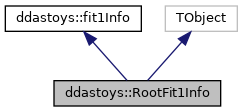
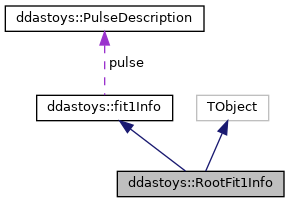

do not remove this div, it is closed by doxygen! 
|  |
| --- |
| DDASToys for NSCLDAQ6.2-000 |

 end header part 
 Generated by Doxygen 1.9.1 

 window showing the filter options 

 iframe showing the search results (closed by default) 

- **ddastoys**
- [[structddastoys_1_1RootFit1Info]]

 top 
[Public Member Functions](#pub-methods) |
[[structddastoys_1_1RootFit1Info-members]]

ddastoys::RootFit1Info Struct Reference

header
Full fitting information for the single pulse.  
 [[structddastoys_1_1RootFit1Info#details]]

`#include <RootExtensions.h>`

Inheritance diagram for ddastoys::RootFit1Info:

[[[graph_legend]]]

Collaboration diagram for ddastoys::RootFit1Info:

[[[graph_legend]]]

|  |  |
| --- | --- |
| Public Member Functions |
|  | ClassDef(RootFit1Info, 1) |
|  | Required for inheritence from TObject. |
|  |

|  |  |
| --- | --- |
| Additional Inherited Members |
| Public Attributes inherited fromddastoys::fit1Info |
| PulseDescription | pulse |
|  | Description of the pulse parameters. |
|  |
| double | chiSquare |
|  | Chi-square value of the fit. |
|  |
| double | offset |
|  | Constant offset. |
|  |
| unsigned | iterations |
|  | Iterations for fit to converge. |
|  |
| unsigned | fitStatus |
|  | Fit status from GSL. |
|  |

## Detailed Description

Full fitting information for the single pulse.

---

The documentation for this struct was generated from the following file:- [[RootExtensions_8h_source]]

 contents 
 start footer part 

---

Generated by  1.9.1
