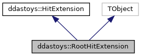
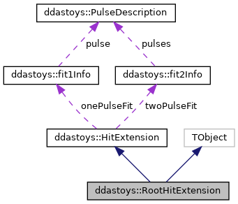

do not remove this div, it is closed by doxygen! 
|  |
| --- |
| DDASToys for NSCLDAQ6.2-000 |

 end header part 
 Generated by Doxygen 1.9.1 

 window showing the filter options 

 iframe showing the search results (closed by default) 

- **ddastoys**
- [[structddastoys_1_1RootHitExtension]]

 top 
[Public Member Functions](#pub-methods) |
[[structddastoys_1_1RootHitExtension-members]]

ddastoys::RootHitExtension Struct Reference

header
The data structure containing the full fit information.  
 [[structddastoys_1_1RootHitExtension#details]]

`#include <RootExtensions.h>`

Inheritance diagram for ddastoys::RootHitExtension:

[[[graph_legend]]]

Collaboration diagram for ddastoys::RootHitExtension:

[[[graph_legend]]]

|  |  |
| --- | --- |
| Public Member Functions |
|  | ClassDef(RootHitExtension, 1) |
|  | Required for inheritence from TObject. |
|  |
| Public Member Functions inherited fromddastoys::HitExtension |
|  | HitExtension()=default |
|  | Default constructor. |
|  |
|  | HitExtension(constHitExtensionLegacy&leg) |
|  | Construct from legacy extension.More... |
|  |

|  |  |
| --- | --- |
| Additional Inherited Members |
| Public Attributes inherited fromddastoys::HitExtension |
| fit1Info | onePulseFit |
|  | Single-pulse fit information. |
|  |
| fit2Info | twoPulseFit |
|  | Double-pulse fit information. |
|  |
| double | singleProb |
|  | Probability of single pulse. |
|  |
| double | doubleProb |
|  | Probability of double pulse. |
|  |

## Detailed Description

The data structure containing the full fit information.

---

The documentation for this struct was generated from the following file:- [[RootExtensions_8h_source]]

 contents 
 start footer part 

---

Generated by  1.9.1
