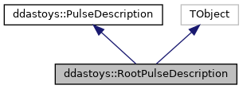

do not remove this div, it is closed by doxygen! 
|  |
| --- |
| DDASToys for NSCLDAQ6.2-000 |

 end header part 
 Generated by Doxygen 1.9.1 

 window showing the filter options 

 iframe showing the search results (closed by default) 

- **ddastoys**
- [[structddastoys_1_1RootPulseDescription]]

 top 
[Public Member Functions](#pub-methods) |
[[structddastoys_1_1RootPulseDescription-members]]

ddastoys::RootPulseDescription Struct Reference[[group__ddasrootfitformat]]

header
Describes a single pulse without an offset.  
 [[structddastoys_1_1RootPulseDescription#details]]

`#include <RootExtensions.h>`

Inheritance diagram for ddastoys::RootPulseDescription:

[[[graph_legend]]]

Collaboration diagram for ddastoys::RootPulseDescription:

[[[graph_legend]]]

|  |  |
| --- | --- |
| Public Member Functions |
|  | ClassDef(RootPulseDescription, 1) |
|  | Required for inheritence from TObject. |
|  |

|  |  |
| --- | --- |
| Additional Inherited Members |
| Public Attributes inherited fromddastoys::PulseDescription |
| double | position |
|  | Where the pulse is. |
|  |
| double | amplitude |
|  | Pulse amplitude. |
|  |
| double | steepness |
|  | Logistic steepness factor. |
|  |
| double | decayTime |
|  | Exponential decay constant. |
|  |

## Detailed Description

Describes a single pulse without an offset.

---

The documentation for this struct was generated from the following file:- [[RootExtensions_8h_source]]

 contents 
 start footer part 

---

Generated by  1.9.1
