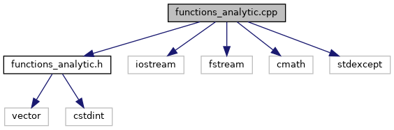

do not remove this div, it is closed by doxygen! 
|  |
| --- |
| DDASToys for NSCLDAQ6.2-000 |

 end header part 
 Generated by Doxygen 1.9.1 

 window showing the filter options 

 iframe showing the search results (closed by default)

 top 
[Functions](#func-members)

functions_analytic.cpp File Reference

header
Implement analytic functions used to fit DDAS pulses.  
[More...](#details)

`#include "functions_analytic.h"`  

`#include <iostream>`  

`#include <fstream>`  

`#include <cmath>`  

`#include <stdexcept>`

Include dependency graph for functions_analytic.cpp:

|  |  |
| --- | --- |
| Functions |
| double | pulseAmplitude(double A, double k1, double k2, double x0) |
|  |

## Detailed Description

Implement analytic functions used to fit DDAS pulses.

NoteAll functions are in the ddastoys::analytic namespace.

## Function Documentation

## [◆](#a4c15c04ccdd0a70976fbc146e66e8d06)pulseAmplitude()

|  |  |  |  |
| --- | --- | --- | --- |
| double pulseAmplitude | ( | double | A, |
|  |  | double | k1, |
|  |  | double | k2, |
|  |  | double | x0 |
|  | ) |  |  |

This function is a wrapper for DDAS:AnalyticFit::pulseAmplitude and issues a warning if it is called. It exists for backwards compatability and should not be used. The correct function in the ddastoys::analytic namespace should be called instead.

 contents 
 start footer part 

---

Generated by  1.9.1
