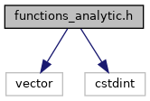
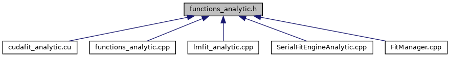

do not remove this div, it is closed by doxygen! 
|  |
| --- |
| DDASToys for NSCLDAQ6.2-000 |

 end header part 
 Generated by Doxygen 1.9.1 

 window showing the filter options 

 iframe showing the search results (closed by default)

 top 
functions_analytic.h File Reference

header
Provide code to evaluate various functions used to fit DDAS pulses.  
[More...](#details)

`#include <vector>`  

`#include <cstdint>`

Include dependency graph for functions_analytic.h:

This graph shows which files directly or indirectly include this file:

[[functions__analytic_8h_source]]

|  |  |
| --- | --- |
| Functions |
|  |
| double | ddastoys::analyticfit::logistic(double A, double k, double x1, double x) |
|  | Evaluate a logistic function for the specified parameters and point.More... |
|  |
| double | ddastoys::analyticfit::decay(double A, double k, double x1, double x) |
|  | Evaluate an exponential decay for the specific parameters and point.More... |
|  |
| double | ddastoys::analyticfit::switchOn(double x1, double x) |
|  | Logistic switch to turn on a function evaluation at a given point.More... |
|  |
| double | ddastoys::analyticfit::singlePulse(double A1, double k1, double k2, double x1, double C, double x) |
|  | Evaluate the single pulse fit function at a given point.More... |
|  |
| double | ddastoys::analyticfit::doublePulse(double A1, double k1, double k2, double x1, double A2, double k3, double k4, double x2, double C, double x) |
|  | Evaluate the double pulse fit function at a given point.More... |
|  |
| double | ddastoys::analyticfit::pulseAmplitude(double A, double k1, double k2, double x0) |
|  | Calculate the pulse amplitude corrected for the ballistic deficit imposed by the exponential decay.More... |
|  |
| double | ddastoys::analyticfit::chiSquare1(double A1, double k1, double k2, double x1, double C, const std::vector< uint16_t > &trace, int low=0, int high=-1) |
|  | Computes the chi-square goodness-of-fit for a specific parameterization of a single pulse canonical form with respect to a trace.More... |
|  |
| double | ddastoys::analyticfit::chiSquare1(double A1, double k1, double k2, double x1, double C, const std::vector< std::pair< uint16_t, uint16_t > > &points) |
|  | Computes the chi-square goodness-of-fit for a specific parameterization of a single pulse canonical form with respect to a trace.More... |
|  |
| double | ddastoys::analyticfit::chiSquare2(double A1, double k1, double k2, double x1, double A2, double k3, double k4, double x2, double C, const std::vector< uint16_t > &trace, int low=0, int high=-1) |
|  | Computes the chi-square goodness of a specific parameterization of a double pulse canonical form with respect to a trace.More... |
|  |
| double | ddastoys::analyticfit::chiSquare2(double A1, double k1, double k2, double x1, double A2, double k3, double k4, double x2, double C, const std::vector< std::pair< uint16_t, uint16_t > > &points) |
|  | Computes the chi-square goodness of a specific parameterization of a double pulse canonical form with respect to a trace.More... |
|  |
| void | ddastoys::analyticfit::writeTrace(const char *filename, const char *title, const std::vector< uint16_t > &trace) |
|  | Write a single trace to a file.More... |
|  |
| void | ddastoys::analyticfit::writeTrace2(const char *filename, const char *title, const std::vector< uint16_t > &trace1, const std::vector< uint16_t > &trace2) |
|  | Write two traces to a file.More... |
|  |

## Detailed Description

Provide code to evaluate various functions used to fit DDAS pulses.

NoteAll functions are in the ddastoys::analyticfit namespace.

 contents 
 start footer part 

---

Generated by  1.9.1
