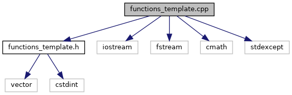

do not remove this div, it is closed by doxygen! 
|  |
| --- |
| DDASToys for NSCLDAQ6.2-000 |

 end header part 
 Generated by Doxygen 1.9.1 

 window showing the filter options 

 iframe showing the search results (closed by default)

 top 
functions_template.cpp File Reference

header
Implement functions used to fit DDAS pulses using a trace template.  
[More...](#details)

`#include "functions_template.h"`  

`#include <iostream>`  

`#include <fstream>`  

`#include <cmath>`  

`#include <stdexcept>`

Include dependency graph for functions_template.cpp:

## Detailed Description

Implement functions used to fit DDAS pulses using a trace template.

NoteAll functions are in the DDAS::TemplateFit namespace

 contents 
 start footer part 

---

Generated by  1.9.1
