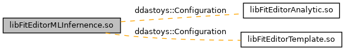

do not remove this div, it is closed by doxygen! 
|  |
| --- |
| DDASToys for NSCLDAQ6.2-000 |

 end header part 
 Generated by Doxygen 1.9.1

 top 
 window showing the filter options 

 iframe showing the search results (closed by default) 

[Classes](#nested-classes)

libFitEditorMLInfernence.so

header
Plugin library for machine-learning inference fitting.  
[More...](#details)

Collaboration diagram for libFitEditorMLInfernence.so:

|  |  |
| --- | --- |
| Classes |
| class | ddastoys::Configuration |
|  | Manage fit configuration information.More... |
|  |
| void | ddastoys::mlinference::performInference(FitInfo*pResult, std::vector< uint16_t > &trace, unsigned saturation, torch::jit::script::Module &module) |
|  | Perform ML inference to determine the pulse parameters.More... |
|  |

## Detailed Description

Plugin library for machine-learning inference fitting.

## Function Documentation

## [◆](#ga2225a2049f9ca999e4a9dc364892a3ff)performInference()

|  |  |  |  |
| --- | --- | --- | --- |
| void ddastoys::mlinference::performInference | ( | FitInfo* | pResult, |
|  |  | std::vector< uint16_t > & | trace, |
|  |  | unsigned | saturation, |
|  |  | torch::jit::script::Module & | module |
|  | ) |  |  |

Perform ML inference to determine the pulse parameters.

Parameters
|  |  |  |
| --- | --- | --- |
| [in,out] | pResult | Pointer to the fit results. |
| [in] | trace | References the trace we're processing. |
| [in] | saturation | ADC saturation value. Only samples below the saturation threshold are used to extrat the pulse parameters. |
| [in] | module | References the inference model for this channel. |

This is the interface to perform the machine-learning inference fit on a single trace analogous to the lmfit functions for iterative fitting. The steps are pretty simple:

- Preprocess the trace (offest removal and normalization).
- Perform inference on normalized input.
- Postprocess the trace (rescaling, extract and store fit parameters).

 contents 
 start footer part 

---

Generated by  1.9.1
