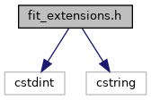
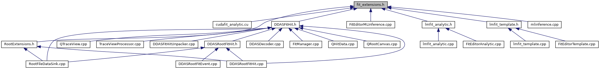

do not remove this div, it is closed by doxygen! 
|  |
| --- |
| DDASToys for NSCLDAQ6.2-000 |

 end header part 
 Generated by Doxygen 1.9.1 

 window showing the filter options 

 iframe showing the search results (closed by default)

 top 
[Classes](#nested-classes)

fit_extensions.h File Reference

header
Define structs used by fitting functions and to extend DDAS hits.  
[More...](#details)

`#include <cstdint>`  

`#include <cstring>`

Include dependency graph for fit_extensions.h:

This graph shows which files directly or indirectly include this file:

[[Go to the source code of this file.|https://github.com/FRIBDAQ/docs/tree/main/ddastoys-6.2-000/fit__extensions_8h_source.md]]

|  |  |
| --- | --- |
| Classes |
| struct | ddastoys::PulseDescription |
|  | Describes a single pulse without an offset.More... |
|  |
| struct | ddastoys::fit1Info |
|  | Full fitting information for the single pulse.More... |
|  |
| struct | ddastoys::fit2Info |
|  | Full fitting information for the double pulse.More... |
|  |
| struct | ddastoys::HitExtensionLegacy |
|  | Legacy data structure appended to each fit hit. This is the hit extension struct for DDASToys pre-6.0-000.More... |
|  |
| struct | ddastoys::HitExtension |
|  | The data structure appended to each fit hit.More... |
|  |
| struct | ddastoys::nullExtension |
|  | A null fit extension is a single 32-bit word.More... |
|  |
| struct | ddastoys::FitInfoLegacy |
|  | Legacy fit extension that knows its size. This is the fit info struct for DDASToys pre-6.0-000.More... |
|  |
| struct | ddastoys::FitInfo |
|  | A fit extension that knows its size.More... |
|  |

## Detailed Description

Define structs used by fitting functions and to extend DDAS hits.

 contents 
 start footer part 

---

Generated by  1.9.1
