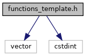
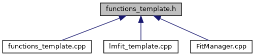

do not remove this div, it is closed by doxygen! 
|  |
| --- |
| DDASToys for NSCLDAQ6.2-000 |

 end header part 
 Generated by Doxygen 1.9.1 

 window showing the filter options 

 iframe showing the search results (closed by default)

 top 
functions_template.h File Reference

header
Define functions used to fit DDAS pulses using a trace template.  
[More...](#details)

`#include <vector>`  

`#include <cstdint>`

Include dependency graph for functions_template.h:

This graph shows which files directly or indirectly include this file:

[Go to the source code of this file.](https://github.com/FRIBDAQ/docs/tree/main/ddastoys-6.2-000/functions__template_8h_source.md)

|  |  |
| --- | --- |
| Functions |
|  |
| double | ddastoys::templatefit::singlePulse(double S1, double x1, double C, double x, const std::vector< double > &trace_template) |
|  | Evaluate the single pulse fit function at a given point.More... |
|  |
| double | ddastoys::templatefit::doublePulse(double S1, double x1, double S2, double x2, double C, double x, const std::vector< double > &trace_template) |
|  | Evaluate the double pulse fit function at a given point.More... |
|  |
| double | ddastoys::templatefit::chiSquare1(double S1, double x1, double C, const std::vector< std::pair< uint16_t, uint16_t > > &points, const std::vector< double > &trace_template) |
|  | Computes the chi-square goodness of a specific parameterization of a single pulse canonical form with respect to a trace.More... |
|  |
| double | ddastoys::templatefit::chiSquare2(double S1, double x1, double S2, double x2, double C, const std::vector< std::pair< uint16_t, uint16_t > > &points, const std::vector< double > &trace_template) |
|  | Computes the chi-square goodness of a specific parameterization of a double pulse canonical form with respect to a trace.More... |
|  |

## Detailed Description

Define functions used to fit DDAS pulses using a trace template.

- Note
  All functions are in the DDAS::TemplateFit namespace

 contents 
 start footer part 

---

Generated by  1.9.1
