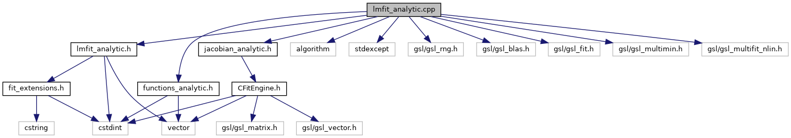

do not remove this div, it is closed by doxygen! 
|  |
| --- |
| DDASToys for NSCLDAQ6.2-000 |

 end header part 
 Generated by Doxygen 1.9.1 

 window showing the filter options 

 iframe showing the search results (closed by default)

 top 
[Functions](#func-members)

lmfit_analytic.cpp File Reference

header
Implementation of analytic fitting functions we use in GSL's LM fitter.  
[More...](#details)

`#include "lmfit_analytic.h"`  

`#include <algorithm>`  

`#include <stdexcept>`  

`#include <gsl/gsl_rng.h>`  

`#include <gsl/gsl_blas.h>`  

`#include <gsl/gsl_fit.h>`  

`#include <gsl/gsl_multimin.h>`  

`#include <gsl/gsl_multifit_nlin.h>`  

`#include "functions_analytic.h"`  

`#include "jacobian_analytic.h"`

Include dependency graph for lmfit_analytic.cpp:

|  |  |
| --- | --- |
| Functions |
| double | estimateK1(int xmax, double C0, const std::vector< uint16_t > &trace) |
|  | Estimate a value for the steepness parameter of the rising side of the pulse.More... |
|  |

## Detailed Description

Implementation of analytic fitting functions we use in GSL's LM fitter.

## Function Documentation

## [◆](#a282cb59029a978cd191e16f88ccd42a3)estimateK1()

|  |  |  |  |
| --- | --- | --- | --- |
| double estimateK1 | ( | int | xmax, |
|  |  | double | C0, |
|  |  | const std::vector< uint16_t > & | trace |
|  | ) |  |  |

Estimate a value for the steepness parameter of the rising side of the pulse.

Parameters
|  |  |
| --- | --- |
| xmax | Where the maximum point is. |
| C0 | Estimate for the constant offset. |
| trace | The trace data. |

ReturnsThe risetime estimate.
We approximate xmax as 0.9 of maximum and use that ln(9)/(xmax - xhalf) gives k where xhalf is the position of 1/2 height. If we can't find xhalf then we fall back on a guess of 0.1.

**[[Todo:|todo#_todo000005]]**Should allow this fallback value to be an input parameter. 
NoteFor now assume that the half position is within the AOI and are not correcting for flattops.

 contents 
 start footer part 

---

Generated by  1.9.1
