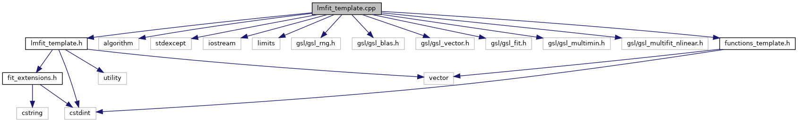

do not remove this div, it is closed by doxygen! 
|  |
| --- |
| DDASToys for NSCLDAQ6.2-000 |

 end header part 
 Generated by Doxygen 1.9.1 

 window showing the filter options 

 iframe showing the search results (closed by default)

 top 
lmfit_template.cpp File Reference

header
Implementation of template fitting functions we use in GSL's LM fitter.  
[More...](#details)

`#include "lmfit_template.h"`  

`#include <algorithm>`  

`#include <stdexcept>`  

`#include <iostream>`  

`#include <limits>`  

`#include <gsl/gsl_rng.h>`  

`#include <gsl/gsl_blas.h>`  

`#include <gsl/gsl_vector.h>`  

`#include <gsl/gsl_fit.h>`  

`#include <gsl/gsl_multimin.h>`  

`#include <gsl/gsl_multifit_nlinear.h>`  

`#include "functions_template.h"`

Include dependency graph for lmfit_template.cpp:

## Detailed Description

Implementation of template fitting functions we use in GSL's LM fitter.

- Note
  Fit functions are in the DDAS::TemplateFit namespace

 contents 
 start footer part 

---

Generated by  1.9.1
