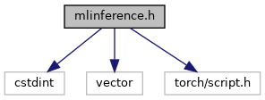
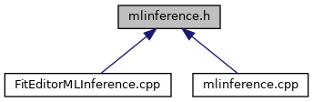

do not remove this div, it is closed by doxygen! 
|  |
| --- |
| DDASToys for NSCLDAQ6.2-000 |

 end header part 
 Generated by Doxygen 1.9.1 

 window showing the filter options 

 iframe showing the search results (closed by default)

 top 
mlinference.h File Reference

header
Function definitions for the machine-learning inference editor.  
[More...](#details)

`#include <cstdint>`  

`#include <vector>`  

`#include <torch/script.h>`

Include dependency graph for mlinference.h:

This graph shows which files directly or indirectly include this file:

[[Go to the source code of this file.|mlinference_8h_source]]

|  |  |
| --- | --- |
| Functions |
|  |
| void | ddastoys::mlinference::performInference(FitInfo*pResult, std::vector< uint16_t > &trace, unsigned saturation, torch::jit::script::Module &module) |
|  | Perform ML inference to determine the pulse parameters.More... |
|  |

## Detailed Description

Function definitions for the machine-learning inference editor.

 contents 
 start footer part 

---

Generated by  1.9.1
