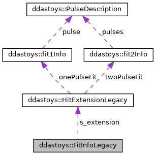

do not remove this div, it is closed by doxygen! 
|  |
| --- |
| DDASToys for NSCLDAQ6.2-000 |

 end header part 
 Generated by Doxygen 1.9.1 

 window showing the filter options 

 iframe showing the search results (closed by default) 

- **ddastoys**
- [[FitInfoLegacy|structddastoys_1_1FitInfoLegacy]]

 top 
[Public Member Functions](#pub-methods) |
[Public Attributes](#pub-attribs) |
[[List of all members|structddastoys_1_1FitInfoLegacy-members]]

ddastoys::FitInfoLegacy Struct Reference

header
Legacy fit extension that knows its size. This is the fit info struct for DDASToys pre-6.0-000.  
 [[More...|structddastoys_1_1FitInfoLegacy#details]]

`#include <fit_extensions.h>`

Collaboration diagram for ddastoys::FitInfoLegacy:

[[[legend|graph_legend]]]

|  |  |
| --- | --- |
| Public Member Functions |
|  | FitInfoLegacy() |
|  | CreatesFitInfo, set its size, and zeroes fit parameters. |
|  |

|  |  |
| --- | --- |
| Public Attributes |
| HitExtensionLegacy | s_extension |
|  | The hit extension data. |
|  |
| uint32_t | s_size |
|  | sizeof(HitExtensionLegacy) |
|  |

## Detailed Description

Legacy fit extension that knows its size. This is the fit info struct for DDASToys pre-6.0-000.

---

The documentation for this struct was generated from the following file:- [[fit_extensions.h|fit__extensions_8h_source]]

 contents 
 start footer part 

---

Generated by  1.9.1
