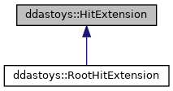
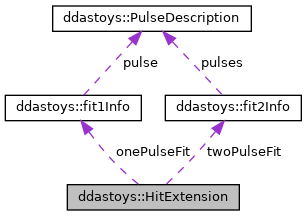

do not remove this div, it is closed by doxygen! 
|  |
| --- |
| DDASToys for NSCLDAQ6.2-000 |

 end header part 
 Generated by Doxygen 1.9.1 

 window showing the filter options 

 iframe showing the search results (closed by default) 

- **ddastoys**
- [HitExtension](https://github.com/FRIBDAQ/docs/tree/main/ddastoys-6.2-000/structddastoys_1_1HitExtension.md)

 top 
[Public Member Functions](#pub-methods) |
[Public Attributes](#pub-attribs) |
[List of all members](https://github.com/FRIBDAQ/docs/tree/main/ddastoys-6.2-000/structddastoys_1_1HitExtension-members.md)

ddastoys::HitExtension Struct Reference

header
The data structure appended to each fit hit.  
 [More...](https://github.com/FRIBDAQ/docs/tree/main/ddastoys-6.2-000/structddastoys_1_1HitExtension.md#details)

`#include <fit_extensions.h>`

Inheritance diagram for ddastoys::HitExtension:

[[legend](https://github.com/FRIBDAQ/docs/tree/main/ddastoys-6.2-000/graph_legend.md)]

Collaboration diagram for ddastoys::HitExtension:

[[legend](https://github.com/FRIBDAQ/docs/tree/main/ddastoys-6.2-000/graph_legend.md)]

|  |  |
| --- | --- |
| Public Member Functions |
|  | HitExtension()=default |
|  | Default constructor. |
|  |
|  | HitExtension(constHitExtensionLegacy&leg) |
|  | Construct from legacy extension.More... |
|  |

|  |  |
| --- | --- |
| Public Attributes |
| fit1Info | onePulseFit |
|  | Single-pulse fit information. |
|  |
| fit2Info | twoPulseFit |
|  | Double-pulse fit information. |
|  |
| double | singleProb |
|  | Probability of single pulse. |
|  |
| double | doubleProb |
|  | Probability of double pulse. |
|  |

## Detailed Description

The data structure appended to each fit hit.

## Constructor & Destructor Documentation

## [◆](#a8b3e47c0e5b15d05624c17906ff583df)HitExtension()

|  |  |  |  |  |  |  |  |
| --- | --- | --- | --- | --- | --- | --- | --- |
| ddastoys::HitExtension::HitExtension(constHitExtensionLegacy&leg) | ddastoys::HitExtension::HitExtension | ( | constHitExtensionLegacy& | leg | ) |  | inline |
| ddastoys::HitExtension::HitExtension | ( | constHitExtensionLegacy& | leg | ) |  |

Construct from legacy extension.

- Parameters
  |  |  |
  | --- | --- |
  | leg | Legacy extension to construct from. |

- Note
  Single- and double-pulse probabilities are set to 0 since the old-style extension does not contain any classificaton data.

---

The documentation for this struct was generated from the following file:- [fit_extensions.h](https://github.com/FRIBDAQ/docs/tree/main/ddastoys-6.2-000/fit__extensions_8h_source.md)

 contents 
 start footer part 

---

Generated by  1.9.1
