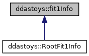
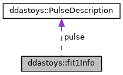

do not remove this div, it is closed by doxygen! 
|  |
| --- |
| DDASToys for NSCLDAQ6.2-000 |

 end header part 
 Generated by Doxygen 1.9.1 

 window showing the filter options 

 iframe showing the search results (closed by default) 

- **ddastoys**
- [[fit1Info|https://github.com/FRIBDAQ/docs/tree/main/ddastoys-6.2-000/structddastoys_1_1fit1Info.md]]

 top 
[Public Attributes](#pub-attribs) |
[[List of all members|https://github.com/FRIBDAQ/docs/tree/main/ddastoys-6.2-000/structddastoys_1_1fit1Info-members.md]]

ddastoys::fit1Info Struct Reference

header
Full fitting information for the single pulse.  
 [[More...|https://github.com/FRIBDAQ/docs/tree/main/ddastoys-6.2-000/structddastoys_1_1fit1Info.md#details]]

`#include <fit_extensions.h>`

Inheritance diagram for ddastoys::fit1Info:

[[[legend|https://github.com/FRIBDAQ/docs/tree/main/ddastoys-6.2-000/graph_legend.md]]]

Collaboration diagram for ddastoys::fit1Info:

[[[legend|https://github.com/FRIBDAQ/docs/tree/main/ddastoys-6.2-000/graph_legend.md]]]

|  |  |
| --- | --- |
| Public Attributes |
| PulseDescription | pulse |
|  | Description of the pulse parameters. |
|  |
| double | chiSquare |
|  | Chi-square value of the fit. |
|  |
| double | offset |
|  | Constant offset. |
|  |
| unsigned | iterations |
|  | Iterations for fit to converge. |
|  |
| unsigned | fitStatus |
|  | Fit status from GSL. |
|  |

## Detailed Description

Full fitting information for the single pulse.

---

The documentation for this struct was generated from the following file:- [[fit_extensions.h|https://github.com/FRIBDAQ/docs/tree/main/ddastoys-6.2-000/fit__extensions_8h_source.md]]

 contents 
 start footer part 

---

Generated by  1.9.1
