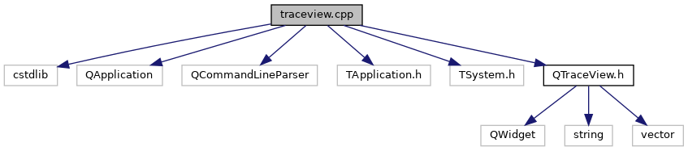

do not remove this div, it is closed by doxygen! 
|  |
| --- |
| DDASToys for NSCLDAQ6.2-000 |

 end header part 
 Generated by Doxygen 1.9.1 

 window showing the filter options 

 iframe showing the search results (closed by default) 

- [[TraceView|dir_618b423c2be057087b8e9298ecdc31ba]]

 top 
[Functions](#func-members)

traceview.cpp File Reference

header
traceview main. Run the Qt application.  
[More...](#details)

`#include <cstdlib>`  

`#include <QApplication>`  

`#include <QCommandLineParser>`  

`#include <TApplication.h>`  

`#include <TSystem.h>`  

`#include "QTraceView.h"`

Include dependency graph for traceview.cpp:

|  |  |
| --- | --- |
| Functions |
| int | main(int argc, char *argv[]) |
|  | traceview main.More... |
|  |

## Detailed Description

traceview main. Run the Qt application.

## Function Documentation

## [◆](#a0ddf1224851353fc92bfbff6f499fa97)main()

|  |  |  |  |
| --- | --- | --- | --- |
| int main | ( | int | argc, |
|  |  | char * | argv[] |
|  | ) |  |  |

traceview main.

Parameters
|  |  |
| --- | --- |
| argc | Argument count. |
| argv | Argument vector. |

Returnsint 
Return values
|  |  |
| --- | --- |
| 0 | Application exits successfully. |
| !=0 | Error. |

Create the main application. The application has a command line parser to allow the user to pass commands at runtime to configure the initial viewer settings. A TApplication necessary for the embedded Root canvas is also created.

 contents 
 start footer part 

---

Generated by  1.9.1
