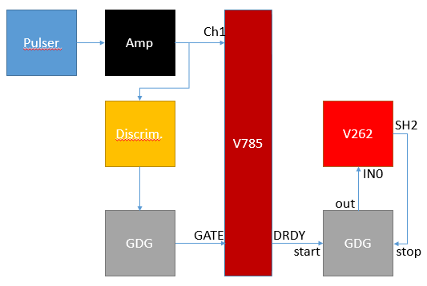
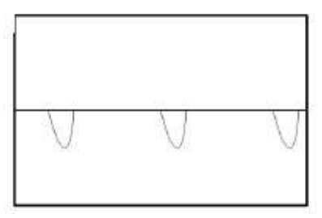
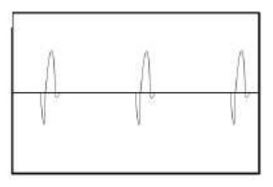
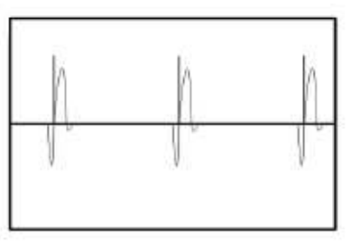
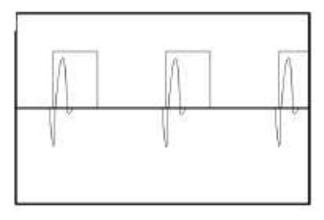

|  |  |  |
| --- | --- | --- |
| NSCL DAQ Software Documentation |
| Prev | Chapter 11. Using NSCLDAQ with a CAEN V785 Peak-Sensing ADC and CAEN V262 IO Register | Next |

---

# 11.2. The electronics

The CAEN V785 is a 12-bit, 32-channel analog-to-digital converter that
      returns a digitized value of the maximum voltage that occurs during the
      time a gate is present. The input signal must be positive and less
      than 4V. The V785 is a VME-based module. For a complete understanding
      of the module I suggest that you obtain a copy of the product manual,
      available as a PDF at [http://www.caen.it/](http://www.caen.it/).

The CAEN V262 is a device that can perform basic functions when an input
      signal is received. For this setup, a register on the device will be
      polled by software to determine if a signal is present. You can also find
      the product manual for this by visiting the manufacturer's website at
      [http://www.caen.it/](http://www.caen.it/).

## 11.2.1. A minimal electronics setup

The following items will be needed to build our simple setup:

- CAEN V785 ADC module
- VME Crate
- SBS Bit3 PCI/VME bus interface
- NIM Crate
- NIM Spectroscopy amplifier of some sort
- NIM Discriminator
- Two channels of NIM Gate and delay generator
- NIM Signal splitter
- LEMO to Ribbon cable converter
- Pulser
- 50-Ohm LEMO terminator
- An assortment of LEMO cables
- A 34-conductor ribbon cable with 3M connectors on each end
- An oscilloscope
- A CAEN V262 IO Register

**Figure 11-1. A simple electronics setup for the CAEN V785**

Before starting, be sure that you can secure all of these items, many
        are available through the NSCL electronics pool. Figure 1-1 shows
        the complete setup of the system, due to the varying amount of
        familiarity of readers to the electronics, a brief description of
        the component and what the signal coming out of it should look like
        will be given.

We will first look at the signal from the pulser. A pocket will
        work well for this. A pocket pulser will give a small negative
        pulse, but we will invert it later. The signal directly from the
        pulser will look like figure 1-2 when viewed on a scope. The pulser
        only works when terminated with 50 Ohms.

The pulser will run directly into a NIM based amplifier. This
        amplifer serves two purposes. First it will amplify our signal
        helping it stand out against any noise we might have in the
        channel. It will also invert the negative pulser signal giving us
        the positive signal that is required by the V785. The signal coming
        from the bi-polar output of the amplifier will look like figure
        1-3. Adjust the gain on the amplifier until you output signal has
        an amplitude of about 2V

**Figure 11-2. Pulser Output Signal**

**Figure 11-3. Amplifer Output Signal**

After you are happy with the signal from the amplifier, plug
        the bipolar output into the splitter. The splitter will simply split
        the signal much like a "T" but will keep the 50 Ohm termination
        needed by the pulser.

Take an output of the splitter, convert it to a ribbon cable, and plug
        that into the channel inputs of the V785.  Ribbon cable can be difficult
        to work with because it is easy to get it twisted and lose track of
        which end is which. To avoid this look carefully at the coloring on the
        cable you are using and be sure it is plugged into the correct channel of
        the ADC. Another useful tip is that the connectors typically
        have a marking on one end to conventionally identify channel 0.

The other output from the splitter will go into a discriminator.  This
        could be either a leading edge or a constant fraction discriminator. The
        job of the discriminator is to output a logic signal when an input
        signals has exceeded a certain voltage threshold. The output signal will
        be used to tell the ADC to initiate the process of recording the peak
        height of the signal. The discriminator will have a threshold knob, be
        sure that the threshold is set above any background noise that may be
        present so that the discriminator only trips on the pulser signal.  It
        will be useful to look at the both the logic pulse and the signal from
        the amplifier at the same time when setting the threshold value. Figure
        1-4 shows what you will see.

**Figure 11-4. Amplified Signal with Logic Pulser**

When the threshold is set to a reasonable level, connect one of the
        discriminator outputs to the start of one channel of your gate
        and delay generator. The gate and delay generator will generate a
        gate when it receives a logic signal from the discriminator. When
        looking at the signal from the amplifier and the gate at the same
        time on the scope, the signal pulse should fall within the gate as
        seen in figure 1-5. If the gate is occurring too early you can use
        the gate and delay generator to delay the gate or to make the gate
        last longer. If the gate is too late you need to delay the signal
        pulse, that can be done using a delay module, or by adding cable
        delay. When you are happy with the gate timing, plug it into one of
        the LEMO connectors on the CAEN V785 labeled gate, put a 50 Ohm
        terminator in the other one.

**Figure 11-5. Amplified Signal and Gate**

Next we will take the "DRDY" output of the V785 and send that into
        the start input of a gate delay generator. We will then take the output
        of that gate delay generator into the IN0 of the CAEN V262. Next you
        should connect the SHP2 output of the V262 to the stop input of the GDG. 
        This scheme ensures that the signal at INO is held high long enough for
        the software to recognize it.

At this point your setup should be complete. Now is good time to
        make sure that your setup is the same as Figure 1-1. If everything
        is setup correctly the BUSY and DRDY lights on the V785 should be
        lit up when we start actually taking data in subsequent sections of
        this tutorial.

---

|  |  |  |
| --- | --- | --- |
| Prev | Home | Next |
| Using NSCLDAQ with a CAEN V785 Peak-Sensing ADC and CAEN V262 IO Register | Up | Setting up the software |
