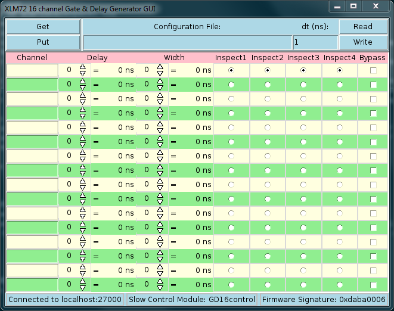

|  |  |  |
| --- | --- | --- |
| NSCL DAQ Software Documentation |
| Prev | Chapter 15. XLM72 Gate Delay Control GUI | Next |


---

# <a name="AEN6897"></a>15.3. Launching the XLM72GateDelayControl

The first thing you need to realize is that the XLM72GateDelayControl is
      a client to the slow controls server within VMUSBReadout. For that reason, the very first
      thing that you need to do is ensure that your instance of VMUSBReadout is
      running and that it has been fed the ctlconfig.tcl that was described in
      the previous section. By default, VMUSBReadout will listen on port 27000
      for connections, however this will be different if you have specified a
      different value to the --port command-line option on VMUSBReadout or if
      you already have another application listening on port 27000.

Now that VMUSBReadout is running, it is time to launch the
      XLM72GateDelayControl program. It should be living in the $DAQBIN
      directory (note that DAQBIN is set properly by sourcing the daqsetup.bash
      script in a specific install directory of NSCLDAQ). The only required
      argument for launching the application is the -module option. The value
      for this is the name of the module loaded into the slow controls server.
      In the previous section we set this to be "GD16control". The application
      needs to also be provided the name of the host and port number associated with the
      slow controls server. These are given sensible defaults of "localhost"
      and 27000, so you do not have to explicitly specify them if your
      VMUSBReadout is running locally and listening on the default port. If you
      know these values to be different that the defaults, then you should explicitly pass the
      correct values to XLM72GateDelayControl using the -host and -port options. 
      The one final piece of the information that must be known
      is the name of a ring buffer to look for state transitions on and it is
      specified by the -ring option. Once again, this is given the default
      value of tcp://localhost/USERNAME, where USERNAME is your user name. It
      is the default location that VMUSBReadout will output its data if not
      expicitly specified to be otherwise.

The application makes use of the ring buffer name provided by monitoring
      data passing through it for the purpose of locking the GUI while a run is
      in process. The locking mechanism is quite simple, any END_RUN or
      PAUSE_RUN item observed in the ringbuffer will unlock the GUI while any
      BEGIN_RUN or RESUME_RUN item will lock it. If the ringbuffer does not
      exist, an error will be printed to the terminal and the program will
      exit. This is to protect the user from accidentally changing the state of the
      gate and delay generator while a run is in progress.

Finally, let's be more illustrative about how to launch the program.
      Assume that we have our VMUSBReadout program running locally, is
      listening on port 27000 for slow controls server connections, has a slow
      controls module loaded into it called "GD16control", and is outputting
      data into the default ring buffer. To launch the application, you can
      enter the command

```

$DAQBIN/XLM72GateDelayControl -module GD16control
    
```

You can learn all of the parameters that can be passed to the application at startup by 
      passing the -help option. By doing so, you will see the following output.

```

XLM72GateDelayControl -module value ?option value? :
 -module value        name of module registered to slow-controls server [MANDATORY] <> 
 -host value          host running VMUSBReadout slow-controls server <localhost>
 -port value          port the slow-controls server is listening on <27000>
 -ring value          name of ring VMUSBReadout is filling <> 
 -configfile value    name of configuration file to read from to initialize the GUI <>
 --                   Forcibly stop option processing
 -help                Print this message
 -?                   Print this message

User must pass a valid value for the -module option
    
```


|  |  |
| --- | --- |
|  | It is important to note that at the moment the GUI only works when the -host parameter is localhost. |


This command should cause a window to open that looks like this:

<a name="AEN6910"></a>**Figure 15-1. Screenshot of XLM72GateDelayControl**



A screenshot of the gate delay GUI immediately upon startup.

Finally, it is useful to point out the final option that can be passed to
      the XLM72GateDelayGUI. That option is the -configfile option and is used
      for specifying the name of the configuration file that should be
      atomatically loaded into the GUI on startup. The user should realize that
      this does not automatically apply the restored configuration to the XLM.
      It merely loads it into the GUI for viewing. If the user wants to apply
      this to the device, then they can press the "Put" button to "put" the
      configuration into the device. Otherwise, the user can press the "Get"
      button to discard the restored configuration in favor of the current
      state of the device. The main utility in this feature is more for the
      sake of channel labels. Once a configuration is restored from a file, the
      labels will remain after a "Get" or "Put" operation.

To write the state of the GUI to a configuration file, you should simply
      write the name of the configuration file in the text entry at the top of
      the GUI and then press "Write". It will overwrite any existing file with
      that name without prompting you, so tred carefully. Also, the output will
      be an array named "gd16" with elements containing the values currently 
      displayed in the GUI. See the section [[*The Saved File*|https://github.com/FRIBDAQ/docs/tree/main/nscldaq-11.3-020/x6925.md]]

---

|  |  |  |
| --- | --- | --- |
| Prev | Home | Next |
| Setting up an XLM72 as a gate delay generator for remote control | Up | Overview of Functionality |
