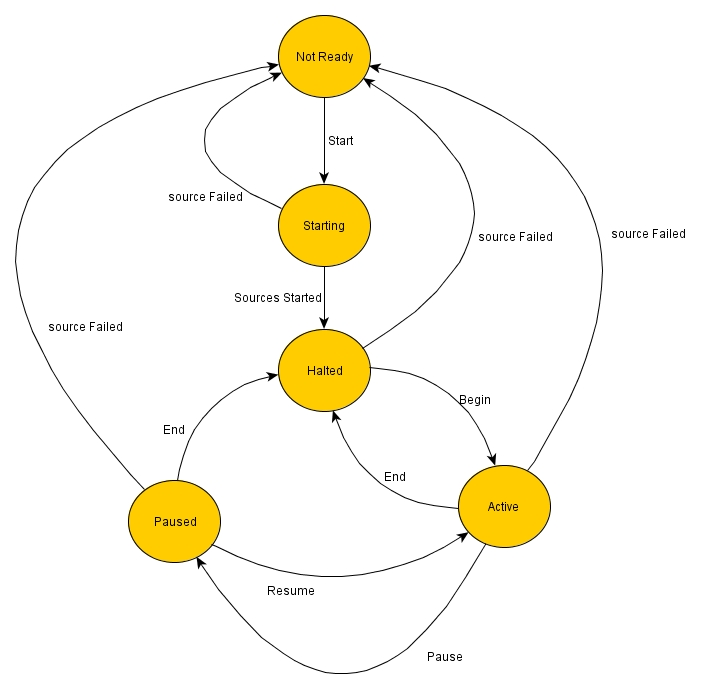

|  |  |  |
| --- | --- | --- |
| NSCL DAQ Software Documentation |
| Prev |  | Next |

---

# Chapter 6. ReadoutGUI & ReadoutShell

The ReadoutShell is a graphical user interface that
        servers as a front end for experiment control. The terms ReadoutShell
        and ReadoutGUI are typically used interchangeably, though
        ReadoutGUI properly refers to the packaged user interface and
        ReadoutShell properly refers to the program that launches the
        ReadoutGUI interface. The ReadoutGUI for NSCLDAQ-11 is
        significantly different than that of earlier versions.  The
        ReadoutShell for NSCLDAQ-11 has been built to better support the
        multi-data source/event builder environment that NSCLDAQ-11 provides.

The remainder of this chapter describes:

- The principles of operation of the ReadoutShell.
- The ReadoutShell's GUI (ReadoutGUI) and how to operate it.
- The way the event logger ties into the Readout GUI and
                      The directory structure the ReadoutShell maintains
                      to support an experiment.
- Ways in which the ReadoutShell supports customization
                      of both its appearance and operation.

Reference material on the API provided by the ReadoutShell can be found in
      the [[3rdogui|r61884]] man page section.

# 6.1. Principles of operation

This chapter describes the underlying principles of operation
            of the event builder.  Along the way terminology that will be used
            in the remainder of this chapter will be informally defined.

The purpose of the ReadoutShell is to provide a graphical user interface
            that can control a set of readout programs or *Data Sources*.
            To do this, the ReadoutShell must know how to ask readout programs
            of various types to start, stop, pause and resume (if supported) runs.
            To do this it uses a set of *Data Source Providers*.
            You can think of a data source provider as a set of software that knows
            how to run a specific type of data source program.

The ReadoutShell and Data source providers communicate via a
            well defined programmatic interface that is described in
            [[3provider|r64750]].

At the core of the ReadoutShell is a finite state automaton or
            *State Machine*.  The State machine defines
            a set of running modes or *States* the ReadoutShell
            can be in as well as the set of legal states to which the system
            can proceed via *State Transitions*.
            The ReadoutShell state machine provides a mechanism for other
            components of the ReadoutShell to register an interest in the transitions
            between states and to take appropriate action both prior to leaving
            a state and upon completing the transition to the new state.
            Functionality that is registered on a state machine is referred to
            as a *bundle*

For example, event logging is implemented as a bundle.  As the
            state machine is transitioning from a halted state to an active state,
            the event log bundle starts up the event logger. When the state machine
            transitions either from the paused, or active states to the halted
            state, the bundle waits for logging to complete and then finalizes
            the run data by maintaining the correct filesystem/directory
            structure.

We complete this section with a diagram of the state machine
            and a description of each state, what it means to be in that state,
            the legal transitions from that state and what it means to make
            those transitions.

**Figure 6-1. ReadoutShell's state diagram**

As we will see in the discussion below, some of the transitions
            that go directly back to NotReady actually
            represent a transition through Halted followed by
            a transition to NotReady.  The diagram's transitions
            are abbreviated in order to reduce the complexity and provide the
            intent (that the 'stable' end state of the transition is
            NotReady).

Let's look at each state from top to bottom.

NotReadyThis state means that none of the data sources are running
                        and therefore the system is not yet ready to be used.
                        In this state you can define the set of data sources
                        to use.  The Start button
                        causes a transition to the Starting
                        state.

StartingOn making a transition to the Starting
                        state, the data source manager attempts to start all of the
                        data sources.  If any of the data sources fail to start,
                        a transition back to the NotReady state
                        is forced.  Once all data sources start successfully,
                        the data source manager forces a transition to the
                        Halted state.

HaltedIn the Halted state, the system is
                        ready for use.  The Begin button
                        can start a data taking run transitioning to the
                        Active state.  If a data source
                        fails, the system will transition back to the
                        NotReady state.

ActiveIn this state, all data sources are actively taking data.
                        If a data source fails, the data source manager will
                        attempt to gracefully stop the run (transition to
                        Halted).  Regardless, eventually
                        a failing data source will result in the NotReady
                        state.

If all data sources being used support paused runs, the
                        Pause button is available
                        and clicking it will result in a transition to the
                        Paused state.
                        The End button is always available
                        in this state and forces a transition to Halted,
                        cleanly ending the run.

PausedThis state represents a temporary halt of data taking
                        that does not close event files.   The
                        state is only reachable if all event sources support
                        pausing a run. If not, the Pause
                        button is not shown so operators of the GUI cannot
                        force a transition to this state.

Once Paused clicking the
                        Resume button forces a transtion
                        back to the Active state while
                        clicking the End button forces
                        a transition to the Halted state (ending
                        the run).

If any data source fails during the Paused
                        state, the data source manager attempts to force a transition
                        to the Halted state prior to forcing a
                        transition to the NotReady state.

---

|  |  |  |
| --- | --- | --- |
| Prev | Home | Next |
| The ccusbcamac Tcl package | Up | Operating the user interface |
