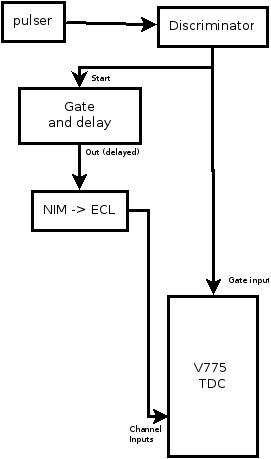

---
---

---

# 11.2. Setting up the Electronics.

A minimal electronics setup will need to:

- Provide a start signal to the TDC
- Provide a stop signal to the TDC. For this setup we will use
                  a delayed start signal.

In this simple setup we will trigger the computer readout when
            data are ready in the TDC.  Since we only have a single module,
            its busy output also indicates when the system as a whole
            is busy.

The electronics diagram below lets us use a simple pocket pulser
            to run this system:

**Figure 11-1. V775 Simple setup electronics block diagram.**

The discriminator creates a digital pulse from the analog
            pulser signals.  One discriminator output is fed to the
            Gate NIM input of the TDC and will
            serve as the TDC start signal.  A second output is delayed
            by the Gate and delay generator before being converted to
            the differential ECL signal expected on the ribbon cable
            inputs of the V775.

When you connect the ribbon cable between the V775 and
            NIM->ECL converter, be careful the read the module
            front panels to ensure that pin 1 on the NIM-> ECL
            converter goes to pin 1 on the TDC.

---
