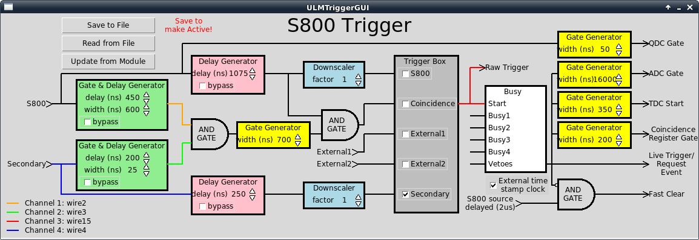

---
---

---

# <a name="vmusb3-CBDULMTrigger"></a>CBDULMTrigger

<a name="AEN92505"></a>## Name

CBDULMTrigger -- control a LeCroy 2637 ULM running trigger firmware on a CAMAC branch

<a name="AEN92508"></a>## Synopsis

**
CBDULMTrigger create *name base*
**

**
CBDULMTrigger config *name option value ...*
**

**
CBDULMTrigger cget *name*
**

<a name="AEN92518"></a>## DESCRIPTION

The CBDULMTrigger is intended to control a LeCroy 2367 ULM situated on a camac
branch rooted in a VME crate by a CES CBD8210 branch driver. If you intend to
utilize the driver in a camac crate controlled by a CCUSB, see the ULMTrigger
command. It provides the exact same functionality but understands the CCUSB to
be its controller.

The CBDULMTrigger cannot be registered as a stack module by itself. Instead it
must be registered first to a CBDCamacCrate. That CBDCamacCrate must then be
registered to a CBDCamacBranch module.

Two options need to be specified to function properly. The first is firmware
which defines the location of the firmware file to load. The second is the slot
number in the camac crate it lives in.

On initialization the module will always be cleared and the GO bit set to 1.

At the end of the run, the GO bit is set to 0.

During stack execution initiated by an event trigger, the following logic is
  carried out:

```

if "-registerRead" is true
    Read the register

if "-eventwiseClear" is true
    Clear the register
  
```


  
  By default, both -registerRead and -eventwiseClear are set to false.

<a name="AEN92527"></a>## OPTIONS


- **-slot** *value*
  Specifies the slot of the CAMAC crate the target module is occupying.
  	Default is 1.
- **-firmware** *path*
  The path to the firmware file usbtrig.bit. Default is "" making this a
  	mandatory parameter.
- **-readRegister** *bool*
  Specifies whether to add a hit register read into the event stack.
  	Defaults to true.
- **-eventwiseClear** *bool*
  Specifies whether to send a clear command via the CAMAC dataway at the
  	end of the event. Defaults to true.
- **-forceFirmwareLoad** *bool*
  By default, the ULM will only load the firmware if it fails to validate
  	the configuration. This occurs always after a bad firmware load or after
  	a crate has been power cycled. Firmware loads take a bit of time so it
  	is worthwhile to skip reloading the firmware on every run. However,
  	sometimes it may be considered useful. This option causes the firmware
  	to be loaded at the start of EVERY run. Defaults to false.
- **-configuration** *num*
  Specifies the number that will be used to validate a successful firmware
  	configuration. This number is compared to the value returned by the
  	function A=15 F=0.  Default is 0

The next set of parameters allow the user to intialize the trigger parameters.
      These are best understood by referencing a picture of the ULM trigger
      GUI.   See below:

<a name="AEN92568"></a>**Figure 1. S800 Trigger GUI**




- **-pcDelay** *num*
  Primary S800 Gate and delay generator delay value
  			in units of 25ns.  This is for the green box at the left
  			of the top branch of the trigger logic.
  			Default is 0.
- **-pcWidth** *num*
  Primary S800 Gate and delay generator width value in
  			units of 25 ns. This is for the green box at the left of
  			the top branch of the trigger logic.
  			Default is 0.
- **-scDelay** *num*
  Secondary gate and delay generator delay value
  			in 25ns units.  This is for the green box to the
  			left of the bottom branch of the trigger logic.
  			Default is 0.
- **-scWidth** *num*
  Secondary gate and delay generator width
  			in 25ns units.  This is for the green box to the
  			left of the bottom branch of the trigger logic.
  			Default is 0.
- **-psDelay**
  Delay length in units of 25ns for the delay generator
  		     (pink box) in the primary trigger branch of the logic.
  		     Default is 0.
- **-ccWidth** *num*
  Width of the coincidence gate (yellow box
  		     after the AND in the middle of the trigger
  		     logic) in 25ns units.  Default is 0.
- **-ssDelay** *num*
  Length of delay in 25ns units for the delay generator
  			 in the secondary trigger.  This is the pink box
  			 at the bottom of the trigger GUI.
  			 Default is 0.
- **-bypasses** *num*
  Bitmask of bypasses (check boxes on various elements
  			of the trigger logic). 
  			Default is 0.
- **-pdFactor** *num*
  S800 downscale value (the blue box at the top
  			middle of the trigger GUI). Default is 0.
- **-sdFactor** *num*
  Secondary trigger scaledown value (the blue box
  		      at the bottom middle of the trigger GUI). Default is 0.
- **-triggerBox** *num*
  Bit mask for the check boxes in the
  			Trigger Box. Default is 0.
- **-inspect1** *num*
  Selects the wire number routed to the inpect 1
  			output. Default is 0.
- **-inspect2** *num*
  Selects the wire number routed to the
  			inspect 2 output. Default is 0.
- **-inspect3** *num*
  Selects the wire number routed to the
  			inspect 3 output. Default is 0.
- **-inspect4** *num*
  Selects the wire number routed to the
  			inspect 4 output. Default is 0.
- **-adcWidth** *num*
  Selects the width of the output from the
  		     ADC Gate generator (see the yellow boxes to the
  		     right of the trigger GUI).
  		     Units are 25ns. Default is 0.
- **-qdcWidth** *num*
  Sets the width (in 25 ns units) of the
  			gate generator for the QDC.  See the
  			yellow boxes at the right of the trigger
  			GUI. Default is 0.
- **-tdcWidth** *num*
  Sets the width of the TDC gate generator in
  			25ns units.  See the yellow boxes at the
  			right of the trigger GUI. Default is 0.
- **-coincWidth** *num*
  Sets the width of the coincidence gate generator
  			in 25ns units.  Default is 0.

<a name="AEN92688"></a>## EXAMPLES

<a name="AEN92690"></a>**Example 1. Setup of a single ULM trigger module**

```

# Define values for each parameter in TRIGGER array
CBDULMTrigger create sclr -slot 23
CBDULMTrigger config ulm firmware /user/s800/server/fpga/usbtrig.bit
CBDULMTrigger config ulm -pcDelay $TRIGGER(PCDelay) \
                  -pcWidth $TRIGGER(PCWidth) \
                  -scDelay $TRIGGER(SCDelay) \
                  -scWidth $TRIGGER(SCWidth) \
                  -psDelay $TRIGGER(PSDelay) \
                  -ccWidth $TRIGGER(CCWidth) \
                  -ssDelay $TRIGGER(SSDelay) \
                  -bypasses $TRIGGER(Bypasses) \
                  -pdFactor $TRIGGER(PDFactor) \
                  -sdFactor $TRIGGER(SDFactor) \
                  -triggerBox $TRIGGER(TriggerBox) \
                  -inspect1 $TRIGGER(Inspect1) \
                  -inspect2 $TRIGGER(Inspect2) \
                  -inspect3 $TRIGGER(Inspect3) \
                  -inspect4 $TRIGGER(Inspect4) \
                  -adcWidth $TRIGGER(ADCWidth) \
                  -qdcWidth $TRIGGER(QDCWidth) \
                  -tdcWidth $TRIGGER(TDCWidth) \
                  -coincWidth $TRIGGER(CoincidenceWidth) \
                  -configuration $TRIGGER(configuration) 
CBDULMTrigger config trig -forceFirmwareLoad off
CBDULMTrigger config trig -readRegister on
CBDULMTrigger config trig -eventwiseClear off


# Create a crate to stick it in
CBDCamacCrate create crate0 -crate 1
CBDCamacCrate config crate0 -modules [list trig]

# Create a branch to register the crate in
CBDCamacBranch create branch0 -branch 0
CBDCamacBranch config branch0 -crates [list crate0]
         
```

Sets up a ULM module in slot 23 of crate 1 on branch 0.

---
