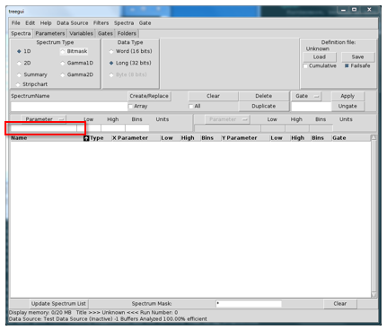
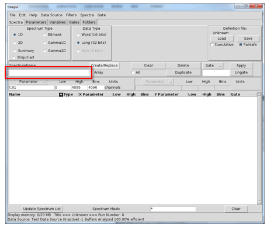
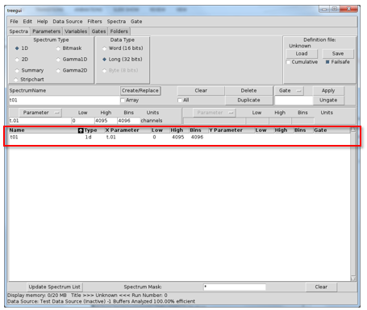
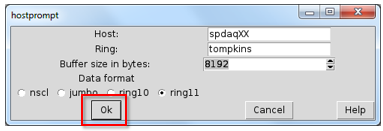
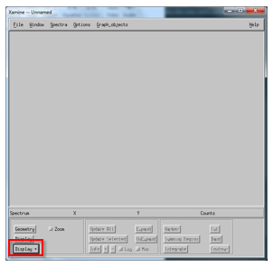
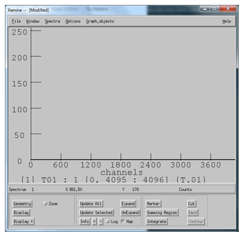

|  |  |  |
| --- | --- | --- |
| NSCL DAQ Software Documentation |
| Prev | Chapter 13. A Simple VMUSBReadout Experiment Tutorial | Next |


---

# <a name="AEN7628"></a>13.8. Using SpecTcl

To start using SpecTcl, you need to define at least one histogram and then
      attach to a data source. Let's start by launch SpecTcl. In the directory
      that you have copied the skeleton into, there should be a
      SpecTclRC.tcl  file. This is a Tcl script that gets
      sourced upon start up. We will not dwell on the details of it here, but
      you need to make sure it is present. In that directory launch SpecTcl:

```

spdaqXX> ./SpecTcl
    
```

SpecTcl can take a while to start up so give it 5 to 10 seconds to
      complete its initialization routines. Once it is up and running, you
      should have four new windows open that correspond to Xamine, the TreeGui,
      the SpecTcl control panel, and tkcon. The definition of histograms is
      accomplished in the TreeGui. Without exploring all of the options for
      histograms, a one dimensions histogram is created by selecting a tree
      parameter to associate with it and also a name to refer to the histogram
      by. Let's create our first 1-d histogram:


1. In the middle of the window on the left, there is a text entry for a
             tree parameter name. We know our tree parameters are named "t.XX" so
             we can choose an index and write the name. Here I choose "t.01". In
             the following figure, I have highlighted the text entry in red.
   
   If you do not know the name of your tree parameter, you can use the
             "Parameter" button above the text entry to select one.
2. Next we need to give our histogram a name. Lacking any sense of
             creativity at the moment, I choose to name the histogram "t01". Enter
             this is the text entry below the label "SpectrumName". In the
             following figure I have hightlighted it in red.
   
3. To actually create the histogram, you need to press the
             "Create/Replace" button to the upper right of where you specified the
             name of the histogram. Once you have pressed this, a row should have
             been added to the previously empty list of histograms (once again it
             is highlighted in red). The window should look like this:
   

With a histogram created, we need to attach SpecTcl to a data stream.
      Let's assume that your Readout program is running and spewing out data.
      SpecTcl can be directed to attach to this "online" data stream by going to
      the "Data Sources" drop-down menu and selecting "Online...". A dialogue
      will pop up that will direct you to specify a ring buffer name. Let's
      assume that the ring name is "tompkins" and the ringbuffer lives on
      computer whose hostname is "spdaqXX". You can disregard the buffer size
      because it does not influence parsing when dealing with ring items.
      Instead, we will select that our data format is "ring11" to indicate that
      the data is in the 11.0 data format. At the end your dialogue should look
      something like this:



When you have the appropriate data source specified, you can press "Ok"
      (highlighted in red in the figure).

The status bar at the bottom of the tree gui should show that it is
      connect and processing events at this point. The next thing to do is move
      to the Xamine window and display our histogram. The bottom left corner of
      the Xamine window has a button labeled "Display+".



Press the "Display+" button and select a histogram to display. In my case,
      there is only a single histogram named "t01" to choose from. Click on the
      histogram name and press "Okay". The histogram should now be visible and
      Xamine should look something like this:



You can press "Update All" to see the histogram grow in counts from here
      on out. With a single histogram created, you should be able to figure out
      how to create other 1-d histograms and even 2-d histograms. The process is
      very similar. Be aware, that you need to create a histogram prior to attaching
      to a data source for it to receive any data.

---

|  |  |  |
| --- | --- | --- |
| Prev | Home | Next |
| The VMUSBSpecTcl Alternative | Up | Conclusion |
