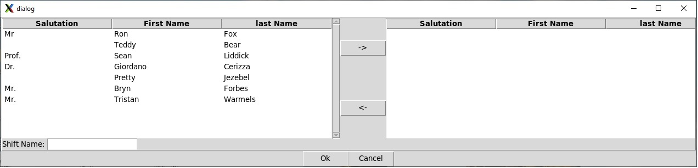
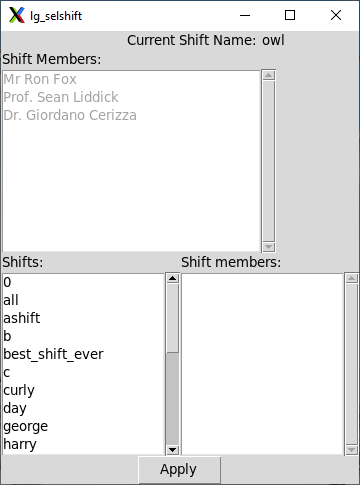

---
---

---

# <a name="sec.lg_setup"></a>25.2. Setting up a logbook for use.

This section will go over the tasks you need to perform to setup a
         logbook for use in an upcoming experiment. We will describe:


- How to create a logbook database file and make it current.
- How to add people to your logbook.  People added to a logbook
                 can have items (notes, run transitions) associated with them.
                 You should add everyone who is working on your experiment to your
                 logbook.
- How to create shifts which indicate which groups of people
                 will be on duty simultaneously during data collection.
                 Run state transitions (e.g. begin run actions) are attributed
                 to the current shift, and by extension the members of that current
                 shift.
- How to setup your ReadoutCallouts.tcl file to automate
                 run state transition logging.

## <a name="AEN10452"></a>25.2.1. Creating a logbook and making it current.

The **lg_create** command (in $DAQBIN),
            allows you to create a new logbook and optionally make it current.
            When you create a logbook you must not only provide the filename
            into which the logbook will be stored, but information about
            what they logbook is for that will be stored in the key value store
            of the logbook.  Specifically  you need to provide:


- Experiment-id
  The experiment this logbook is used for.  This is normally
                       an experiment id assigned by the facility in which the
                       experiment is being performed.  For example
                       e17011 is an NSCL/FIRB experiment
                       approved by the 2017 PAC.
- Spokesperson
  The name of the experiment's spokesperson or other responsible
                       person.  This, as with all values in the key value store
                       is free form text.  The system doesn't care
                       if, for example, I use Mr. Ron Fox,
                       or Fox, Ron.
- Purpose
  Should be a brief statement of the purpose of the logbook.

The command line for **lg_create** requires that
            you provide the filename and, if you want to make the logbook
            current, the -current flag. All other parameters are
            graphically prompted if not supplied.  If you issue the
            **lg_create** command by itself, its usage
            will be output.  The example below shows how to create a
            logbook for an experiment and make it the current logbook.

<a name="AEN10476"></a>**Example 25-1. Creating a logbook and making it current**

```

$DAQBIN/lg_create -filename ~/e17011.logbook -current 1 \
   -experiment e17011 -spokesperson "Ben Crider" -exp-purpose "Beta decay in 80Ge"
            
```

## <a name="AEN10479"></a>25.2.2. Organizing the people on an experiment

It seems obvious to say so but experiments are run by people. During
            data taking, those people are organized into shifts.  When runs
            undergo state transitions (start, stop, pause, resume), it's important,
            not only, to log that this happened, but which shift was on duty
            at the time.

The NSCLDAQ logbook facility provides the following facilities to
            manage the members of an experiment.


- People can be added to the experiment logbook.
- Shifts can be created which contain an arbitrary number
                    of people that are known to the logbook
- The *current shift* can be specified.
                    The current shift is the shift that's on duty and, therefore,
                    will be associated with data taking state transition log entries.

Shifts should be static once data taking has started.  This is because
            it is a shift that's associated with a run state transition, not the
            current members of that shift.   Consider the following case as an example.

Suppose I have an experiment with three members, A, B, C. Suppose,
            I make a shift called S which and add members A and B to it, and make
            that the current shift.  Now I start a run.  That's associated with
            shift S. I end the run.  If I then edit shift S to remove person B
            and add person C, the run I just take, is still associated with
            shift S and therefore thinks data taking was during a shift that
            involved person A and C rather than person A, and B -- because shift
            S was edited out from underneath that run.

You can make new shifts at any time.  If shift membership changes
            during the run, just make a new shift and and add the proper members
            to it.

### <a name="AEN10494"></a>25.2.2.1. Adding People.

People are added to the currently selected logbook using
               **lg_addperson**.  People are defined by a
               last name, a first name and an optional salutation (e.g. Prof. or Ms.).
               The examples below add people to the current logbook

<a name="AEN10498"></a>**Example 25-2. Using **lg_addperson to add people to the logbook****

```

$DAQBIN/lg_addperson Fox Ron  Mr.         # Mr. Ron Fox
$DAQBIN/lg_addperson Cerizza Giordano Dr. # Dr. Giordano Cerizza
$DAQBIN/lg_addperson Student Graduate     # Graduate Student (no salutation)
$DAQBIN/lg_addperson                      # Graphically prompt for person.
               
```

### <a name="AEN10502"></a>25.2.2.2. Using **lg_mkshift** to create and poopulate shifts

The example below shows how to use **lg_mkshift**
               both to create and empty shift, that can be edited using
               the shift manager, **lg_mgshift** and create
               a shift stocking it with an initial set of people.

<a name="AEN10508"></a>**Example 25-3. Using **lg_mkshift****

```

$DAQBIN/lg_mkshift  swing           # Make empty shift named swing.
$DAQGIN/lg_mkshift                  # Bring up shift editor.
               
```

The second form of the **lg_mkshift** command
               brings up a graphical editor that allows you to create a shift
               and stock it with people.  This editor is shown in
               [*The shift editor*](https://github.com/FRIBDAQ/docs/tree/main/nscldaq-12.2/x10440.md#fig.lg_shifteditor)
               below.

<a name="fig.lg_shifteditor"></a>**Figure 25-2. The shift editor**



In this figure, the left list contains the list of people known
               to the logbook. You can select one or more of them and click the
               -> button to add those people to the shift.
               The list on the right contains the members of the shift you are
               building to this point. You can remove members from the shift
               by selecting them and clicking the <-.
               Finally, the entry at the lower left is where you should enter the
               shift's name.  Click Ok to attempt to create
               the shift and Cancel to abandon shift creation.

### <a name="AEN10523"></a>25.2.2.3. Using **lg_mgshift** and **lg_selshift**

**lg_mgshift** is a shift management program.  It
               allows you to create, edit and list members of shift.

If you created an empty shift using **lg_mkshift**,
               you can use **lg_mgshift** to stock it with people.

Here are examples of **lg_mgshift** in use.

<a name="AEN10534"></a>**Example 25-4. Using **lg_mgshift** to manage shifts**

```

$DAQBIN/lg_mgshift create              # Create/edit shift
$DAQBIN/lg_mgshift create newshift     # Create/edit with newshift as the shiftname.
$DAQBIN/lg_mgshift edit                # Select a shift from a list of shifts then edit it.
$DAQBIN/lg_mgshift edit oldshift       # Edits with oldshift as the shiftname.
$DAQBIN/lg_mgshift list                # Lists all shift and their members.
$DAQBIN/lg_mgshift list owl            # Lists the members of the owl shift.
               
```

Note that **lg_mgshift** makes use of the
               same shift editor
               ([*The shift editor*](https://github.com/FRIBDAQ/docs/tree/main/nscldaq-12.2/x10440.md#fig.lg_shifteditor))
               as **lg_mkshift**.  It is perfectly reasonable to
               create a shift from an existing shift.  Use the **edit**
               subcommand and specify the existing shift.  Change the shift name
               to the new shift and modify the shift membership.

**lg_selshift** (Select shift) allows you to select
               the current (on duty shift).  This shift will be associated with
               any data taking state transitions until the next invocation
               of **lg_selshift** changes the current shift.

You can invoke this command in one of two ways:

<a name="AEN10547"></a>**Example 25-5. Using **lg_selshift** to select the current shift**

```

$DAQBIN/lg_selshift owl                # Set the current shif to the owl shift.
$DAQBIN/lg_selshift                    # Bring up the graphical shift selector.
               
```

The shift selector is shown in
               [*The shift selector.*](https://github.com/FRIBDAQ/docs/tree/main/nscldaq-12.2/x10440.md#fig.lg_selshift)
               below.

<a name="fig.lg_selshift"></a>**Figure 25-3. The shift selector.**



In the shift selector, the top part of the selector shows the
               current shift, if any, and a list of its members.
               The list box at the bottom left contains a list of the shifts
               that have been defined.  Clicking one will list its members in the
               list box at the bottom right.

When you've selected the shift you want to be current, just
               click Apply and that shift will be made
               current and the top of the selector will update.  When the
               shift you want to make current is current, click the
               X at the top right if you want to exit.

It's quite normal to leave the selector up throughout data taking
               so that shift changes can be easily made without needing to invoke
               **lg_selshfit** again.

---
