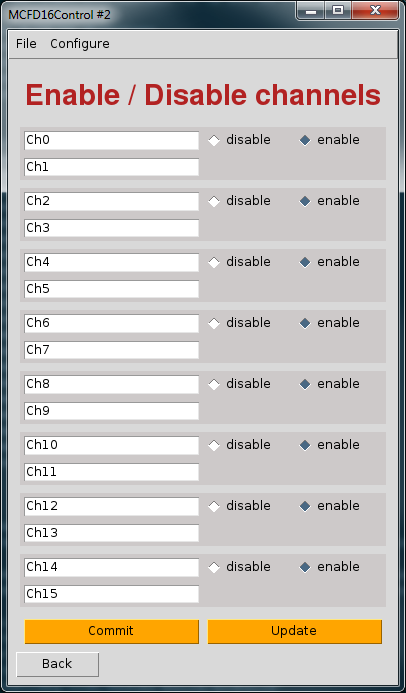
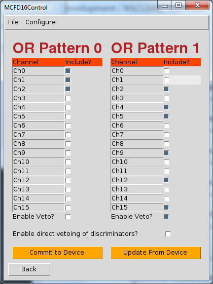

---

# 17.4. Configuration menu

To provide some extra configuration control of the device, there are a few
      specialized configuration dialogs that can be reached from the "Configure"
      drop down menu. They are described here.

## 17.4.1. Enable/Disable Channel

The output for channels can be disabled in the MCFD-16. Support for this 
        feature is provided through the dialog at "Configure > Enable/disable..."
        It is important to realize that enabling and disabling a channel is done
        for channel pairs rather than individual channels. The same semantics apply 
        to this dialog for committing settings to the module as for the rest of
        the application. You must press "Commit" to transfer the state of the GUI to
        the module. You can read the state of the module by pressing the "Update" button.
        Each commit operation is always followed by an update operation intrinsically so
        that you can see whether a change succeeded or failed.

**Figure 17-3. Channel Enable/Disable Configuration Dialog**

## 17.4.2. Configurable 16-Channel OR Trigger

The MCFD-16 provides 3 trigger outputs that can be defined to emit
        signals defined by various logic internal to the device. NSCLDAQ supports
        setting two of these [trigger 0 (front panel output) and trigger 1 (back
        panel output)] to emit a configurable 16-channel OR. Each of these is
        configurable through the "Configure > Trigger OR..." menu. In the
        dialog, there are two columns labeled "OR Pattern 0" and "OR Pattern
        1". The OR Pattern 0 column configures the output for trigger 0 and the
        OR Pattern 1 column configures the output for trigger 1.  The same
        semantics hold for causing a change to the device as for the rest of
        the MCFD16Control application.  Changes to the GUI are not applied to
        the device until the "Commit to Device" button is pressed. If you want
        to update the GUI to reflect the state of the module, you should press
        the "Update From Device" button. Note that when you press "Commit to
        Device", the GUI will automatically follow the writes to the module
        with a read.  The read does the same thing as when you press "Update
        From Device".

Another control accessible from this dialog is the ability to enable
        and disable the direct vetoing of the discriminators. This is referred
        to as the fast veto in the manual. Enabling this applies the veto to the
        discriminator stage of the module, which is before it reaches the logic
        for the trigger decision. It has been observed that if
        the veto associated with the OR pattern is disabled and the fast veto
        is enabled, there might still be some triggers when the input signal
        has a very fast rise time and the bandwidth limit setting is not
        enabled. The triggers are caused by nonlinearities in the amplfication
        stage of the MCFD-16. The moral of the story is that if you want to
        ensure that the trigger is not outputted when a veto is present, then
        you should not rely on the fast veto being enabled. Rather you should
        select the veto setting for the OR pattern you are concerned with.

**Figure 17-4. OR Pattern Configuration Dialog**

---
