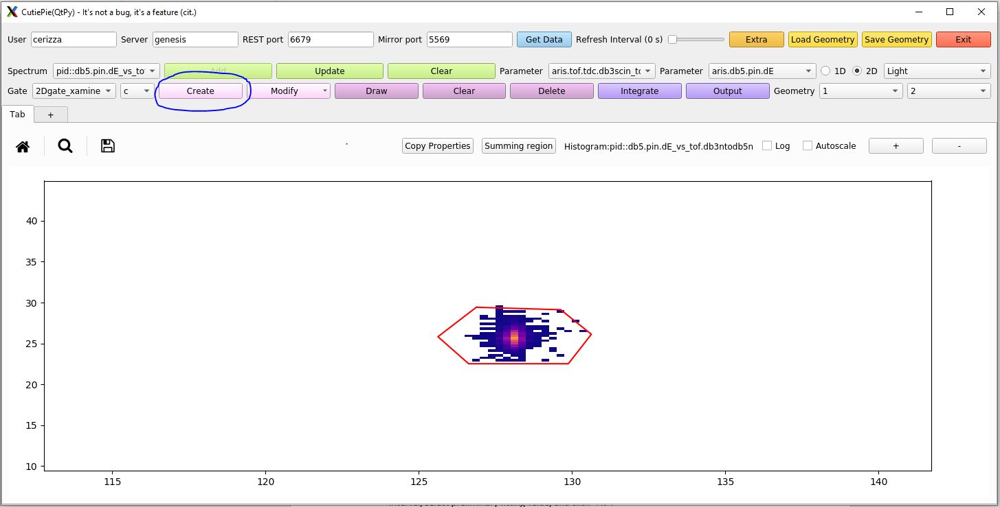
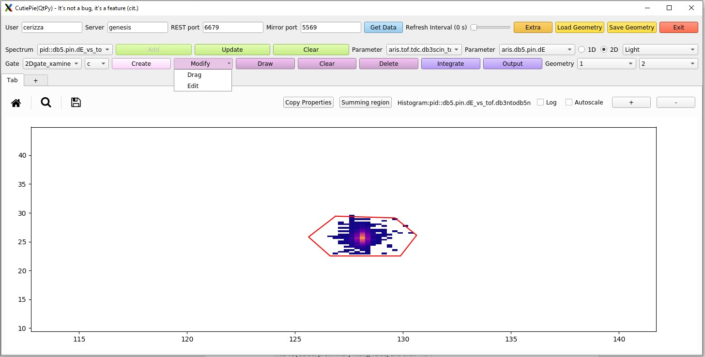
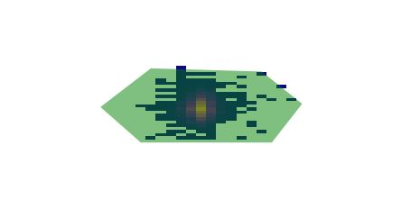
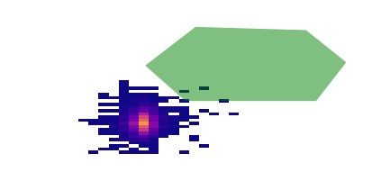
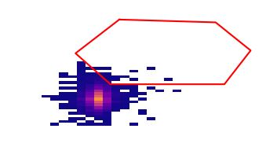
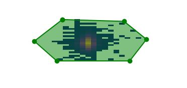
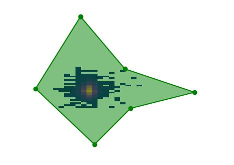
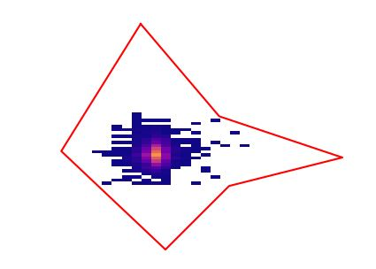

|  |  |  |
| --- | --- | --- |
| CutiePie (QtPy) (version 5.13-000) |
| Prev |  | Next |

---

# Chapter 5. Gating and summing regions

To enable to ability to create or edit (to be released soon) gates or summing region, the user needs to double click on the selected plot. Double clicking allows CutiePie to enter in
	interactive mode and new functionalities will be enabled.

**Figure 5-1. Creating a gate**

	By clicking "Create", a couple of popup boxes will show up asking for a name and a gate type (i.e. slice, contour, band, ...). Once the last popup disappears, the user can click anywhere to start
	create the lines or a polygon, depending on the histogram type. A double click command stops the creation of the gate, and pushes the shape to the TreeGui where it can be applied for further data
	selection. To exit the interactive mode a double click command will return to the multi-panel view.
	For "Summing region", there are a few differences: different line color, no input naming, and automatic integration with the Output popup window showing up.
	**Figure 5-2. Editing a gate**

	From the drop down menu to the left of the Create/Modify buttons, select the gate of interest. By clicking Modify, a submenu with two options will appear: Drag and Edit.
	Select on the plot the contour/lines of interest, they turn green. For Drag:
	**Figure 5-3. A selected contour will turn into a filled polygon**

**Figure 5-4. By clicking once on the polygon, you can drag it anywhere you need. The polygon will follow your mouse movement without keeping the button clicked.**

**Figure 5-5. By right-clicking the polygon will return to contour updating the gate definition with the new position.**

	For Edit:
	**Figure 5-6. A selected contour will turn into a filled polygon with marked vertices.**

**Figure 5-7. By clicking on a vertex and dragging it, one can modify the shape of the gate. If needed, one can add a vertex by using the key-binding i (insert)
	  or remove a vertex with d (delete)**

**Figure 5-8. By right-clicking the polygon will return to contour updating the gate definition with the new position.**

---

|  |  |  |
| --- | --- | --- |
| Prev | Home | Next |
| Plotting window |  | How to start CutiePie |
