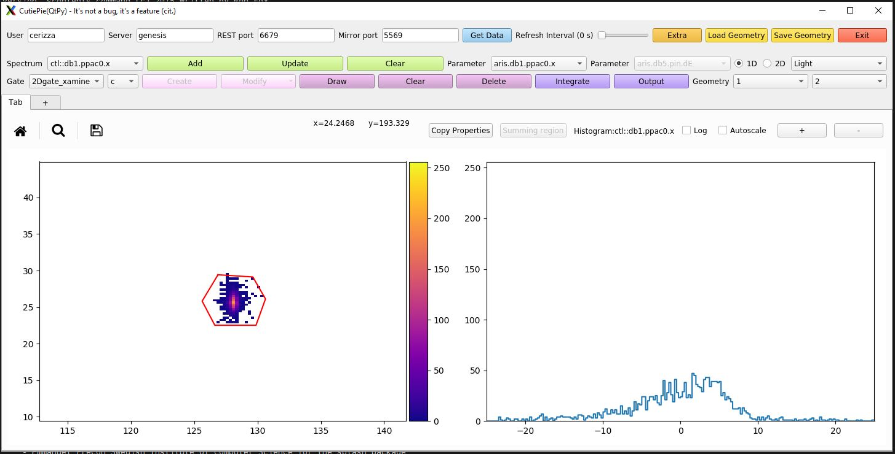
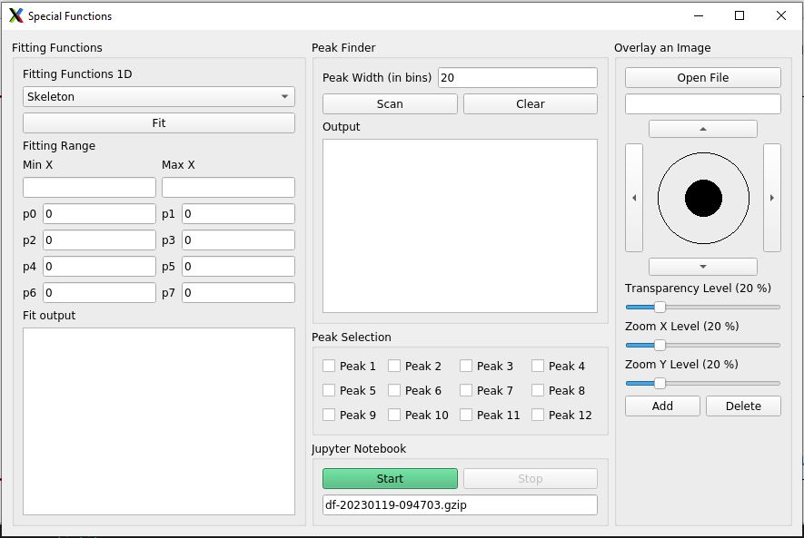
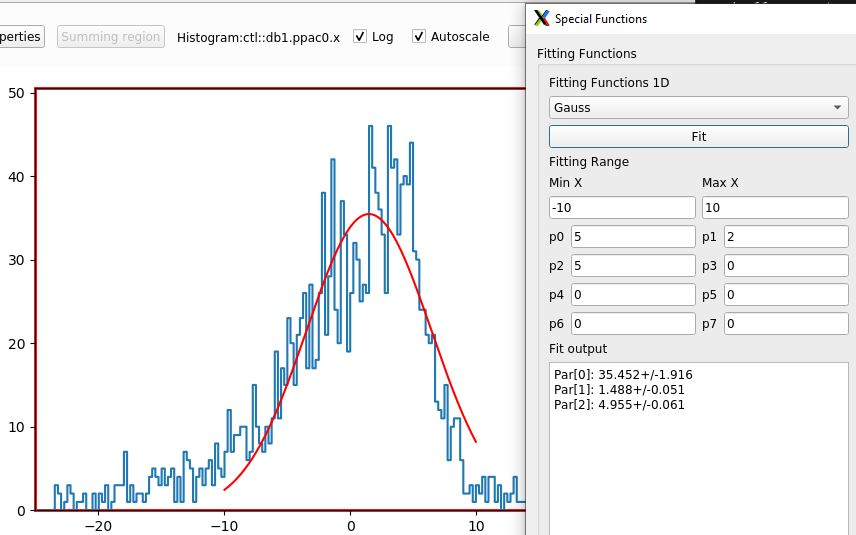
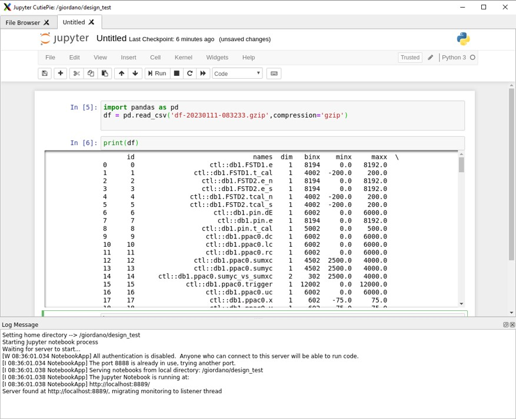

---

# Chapter 3. Features

The idea behind introducing an alternative to Xamine was to provide the same basic functions developed over the years. On top of that, building new tools while keeping the graphics simple
	and clean. As shown in the Figure 3-1, there are three main rows with several fields, buttons, and menu that are active (the disabled ones will be updated in newer releases):

**Figure 3-1. CutiePie GUI main window.**

- Configuration: it contains fields to configure and access the data, set polling time for automatic updates, and load/save window geometry.
- Spectrum information: it lists in a scrolldown menu all the available spectra created in the TreeGui, and offers options to add/update/clear spectra while updating
  		  information such as parameters and type of histogram.
- Gate and Output: it lists in a scrolldown menu all the available gates applied in the TreeGUI, and offers options to create/edit/draw/clear new gates that will be
  		  available in the TreeGUI. The integrate and output buttons offers a quick calculation sheet for integrations over 1D/2D gate. It allows the export of the sheet in
  		  csv format for further analysis.
  **Figure 3-2. Output popup window.**
  
- Special functions: it contains all the new advanced features that CutiePie offers
  **Figure 3-3. Extra function popup window.**
  
  - Fitting: for 1D spectra, the ability of fitting histograms with several pre-defined functions is offered. Fit restuls are displayed in an output box.
    **Figure 3-4. Fitting popup window.**
    
  - Peak finder: for 1D spectra, it automatically scans the histogram and outputs the peak position and the FWHM. The variable parameter in the search is the peak width threshold
    			in units of bins. Found peaks can be displayed on the plot and singularly turned off.
    **Figure 3-5. Peak finder popup window.**
    
  - Overlaying image: the menu consists of open file, a joystick for gross and fine controls for positioning the image, X- and Y-zoom for adapting the figure to the plot,
    			and transparency level controls. This option has been introduced for simplify the comparison between simulated and real data (i.e. S800 CRDC masking, PID, ...).
    **Figure 3-6. Overlay image popup window.**
    
    			Here an example of a giant anteater picture overlaid to a two dimensional spectrum.
    			**Figure 3-7. Example of overlaid image on a plot.**
    
  - Jupyter notebook: when clicking "Start", a local server starts to run Jupyter Notebook. At the same time, the data available in the shared memory are dumped into a
    			dataframe formatted as csv file. This solution allows users to perform data analysis on an interactive web tool with hooks to Python and ROOT libraries.
    **Figure 3-8. Example of Jupyter notebook.**
    

---
