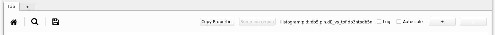
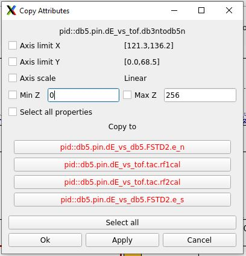

|  |  |  |
| --- | --- | --- |
| CutiePie (QtPy) (version 5.13-000) |
| Prev |  | Next |

---

# Chapter 4. Plotting window

The plotting window is characterized by a tab system that allows users to load different geometry windows and quickly switch from one to the other.
	On the top left, from left to right:

**Figure 4-1. Canvas quick actions**

- Home button: returns to the original format of the spectrum.
- Magnifying glass: allows to interactively select and magnifying a region in the plot.
- 3.5'' Floppy disk: saves the figure into a graphics format (jpg, png).
- Copy Properties: opens a popup window with several options
  **Figure 4-2. Copy Properties**
  
  	      The pannel automatically fills information for the selected plot, allows to select what property needs to be copied to a clickable list of histograms of the same dimensions (1D or 2D).
- Summing region: please see next chapter for more details on how to enable it.
- Histogram name: updated by hovering the mouse to the corresponding histogram.
- Log and Autoscale: self scaling feature for a selected histogram. Autoscale applies automatically to all the histograms.
- +/- buttons: for a selected spectrum, it zooms in/out (i.e. 1D: modifies the y scale by a factor of 2, 2D: modifies the z scale by a factor of 2)

---

|  |  |  |
| --- | --- | --- |
| Prev | Home | Next |
| Features |  | Gating and summing regions |
