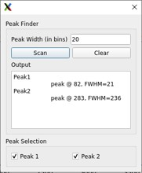
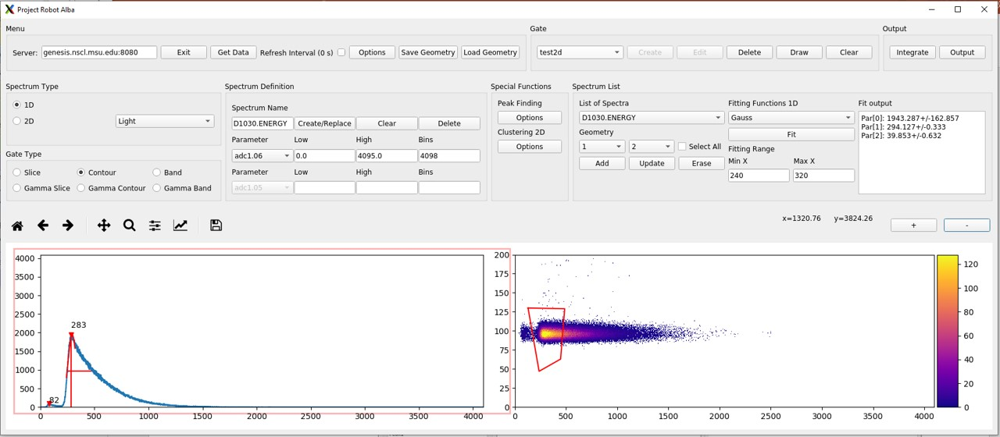
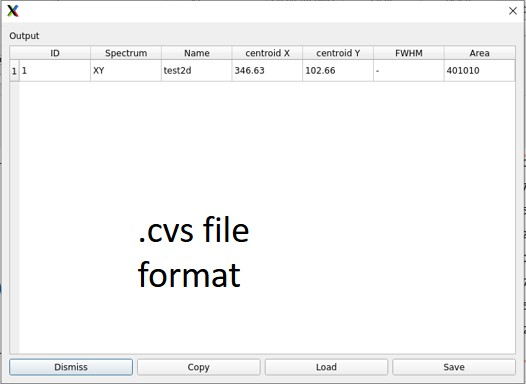

---
---

---

# Chapter 4. Special Functions

This submenu contains all the new advanced features that CutiePie offers:

- Peak finder: for 1D spectra, it automatically scans the histogram and outputs the peak position and the FWHM. The variable parameter in the search is the peak width threshold
  		  in units of bins. Found peaks can be displayed on the plot and singularly turned off.
- Peak finder: for 1D spectra, it automatically scans the histogram and outputs the peak position and the FWHM. The variable parameter in the search is the peak width threshold
  		  in units of bins. Found peaks can be displayed on the plot and singularly turned off.
  **Figure 4-1. Peak finder popup window.**
  

**Figure 4-2. CutiePie GUI main window.**

**Figure 4-3. Output popup window.**

---
