Provide site root to javascript 

 Work around some values being stored in localStorage wrapped in quotes 

 Set the theme before any content is loaded, prevents flash 

 Hide / unhide sidebar before it is displayed 

1. [[**1.** Chapter 1 - Introduction|https://github.com/FRIBDAQ/docs/tree/main/rustogramer/chapter_1.md]]
2. 1. [[**1.1.** How to use this book|https://github.com/FRIBDAQ/docs/tree/main/rustogramer/chap1_1.md]]
3. [[**2.** Chapter 2 - Preparing data for Rustogramer|https://github.com/FRIBDAQ/docs/tree/main/rustogramer/chapter_2.md]]
4. 1. [[**2.1.** The FRIB analysis pipeline|https://github.com/FRIBDAQ/docs/tree/main/rustogramer/chap2_1.md]]
   2. [[**2.2.** Format of data Rustogramer accepts|https://github.com/FRIBDAQ/docs/tree/main/rustogramer/chap2_2.md]]
5. [[**3.** Chapter 3 - Running Rustogramer|https://github.com/FRIBDAQ/docs/tree/main/rustogramer/chapter_3.md]]
6. [[**4.** Chapter 4 - Using the Rustogramer GUI|https://github.com/FRIBDAQ/docs/tree/main/rustogramer/chapter_4.md]]
7. 1. [[**4.1.** The Spectra Tab|https://github.com/FRIBDAQ/docs/tree/main/rustogramer/chap4_1.md]]
   2. [[**4.2.** The Parameters Tab|https://github.com/FRIBDAQ/docs/tree/main/rustogramer/chap4_2.md]]
   3. [[**4.3.** The Variables Tab|https://github.com/FRIBDAQ/docs/tree/main/rustogramer/chap4_3.md]]
   4. [[**4.4.** The Gate Tab|https://github.com/FRIBDAQ/docs/tree/main/rustogramer/chap4_4.md]]
   5. [[**4.5.** The BindSets Tab|https://github.com/FRIBDAQ/docs/tree/main/rustogramer/chap4_bindsets.md]]
   6. [[**4.6.** The File Menu|https://github.com/FRIBDAQ/docs/tree/main/rustogramer/chap4_5.md]]
   7. [[**4.7.** The Data Source Menu|https://github.com/FRIBDAQ/docs/tree/main/rustogramer/chap4_6.md]]
   8. [[**4.8.** The Filters Menu|https://github.com/FRIBDAQ/docs/tree/main/rustogramer/chap4_filters.md]]
   9. [[**4.9.** The Spectra Menu|https://github.com/FRIBDAQ/docs/tree/main/rustogramer/chap4_7.md]]
   10. [[**4.10.** The Gate Menu|https://github.com/FRIBDAQ/docs/tree/main/rustogramer/chap4_8.md]]
8. [[**5.** Chapter 5 - Using CutiePie to display histograms|https://github.com/FRIBDAQ/docs/tree/main/rustogramer/chapter_5.md]]
9. [[**6.** Chapter 6 - the REST interface|https://github.com/FRIBDAQ/docs/tree/main/rustogramer/chapter_6.md]]
10. 1. [[**6.1.** Tcl REST interface|https://github.com/FRIBDAQ/docs/tree/main/rustogramer/chap6_1.md]]
   2. [[**6.2.** Python REST interface|https://github.com/FRIBDAQ/docs/tree/main/rustogramer/chap6_2.md]]
11. [[**7.** Chapter 7 - Reference material|https://github.com/FRIBDAQ/docs/tree/main/rustogramer/chapter7.md]]
12. 1. [[**7.1.** Command Line Options|https://github.com/FRIBDAQ/docs/tree/main/rustogramer/chap7_1.md]]
   2. [[**7.2.** REST requests and responses|https://github.com/FRIBDAQ/docs/tree/main/rustogramer/chap7_2.md]]
   3. 1. [[**7.2.1.** Response format|https://github.com/FRIBDAQ/docs/tree/main/rustogramer/chap7_2_responses.md]]
      2. [[**7.2.2.** /spectcl/parameter requests|https://github.com/FRIBDAQ/docs/tree/main/rustogramer/chap7_2_parameter.md]]
      3. [[**7.2.3.** /spectcl/rawparameter requests|https://github.com/FRIBDAQ/docs/tree/main/rustogramer/chap7_2_rawparameter.md]]
      4. [[**7.2.4.** /spectcl/gate requests|https://github.com/FRIBDAQ/docs/tree/main/rustogramer/chap7_2_gates.md]]
      5. [[**7.2.5.** /spectcl/spectrum requests|https://github.com/FRIBDAQ/docs/tree/main/rustogramer/chap7_2_spectrum.md]]
      6. [[**7.2.6.** /spectcl/attach requests|https://github.com/FRIBDAQ/docs/tree/main/rustogramer/chap7_2_attach.md]]
      7. [[**7.2.7.** /spectcl/analyze requests|https://github.com/FRIBDAQ/docs/tree/main/rustogramer/chap7_2_analyze.md]]
      8. [[**7.2.8.** /spectcl/apply requests|https://github.com/FRIBDAQ/docs/tree/main/rustogramer/chap7_2_apply.md]]
      9. [[**7.2.9.** /spectcl/ungate requests|https://github.com/FRIBDAQ/docs/tree/main/rustogramer/chap7_2_ungate.md]]
      10. [[**7.2.10.** /spectcl/channel requests|https://github.com/FRIBDAQ/docs/tree/main/rustogramer/chap7_2_channel.md]]
      11. [[**7.2.11.** /spectcl/evbunpack requests|https://github.com/FRIBDAQ/docs/tree/main/rustogramer/chap7_2_evbunpack.md]]
      12. [[**7.2.12.** /spectcl/filter requests|https://github.com/FRIBDAQ/docs/tree/main/rustogramer/chap7_2_filter.md]]
      13. [[**7.2.13.** /spectcl/fit requests|https://github.com/FRIBDAQ/docs/tree/main/rustogramer/chap7_2_fit.md]]
      14. [[**7.2.14.** /spectcl/fold requests|https://github.com/FRIBDAQ/docs/tree/main/rustogramer/chap7_2_fold.md]]
      15. [[**7.2.15.** /spectcl/integrate requests|https://github.com/FRIBDAQ/docs/tree/main/rustogramer/chap7_2_integrate.md]]
      16. [[**7.2.16.** /spectcl/shmem requests|https://github.com/FRIBDAQ/docs/tree/main/rustogramer/chap7_2_shmem.md]]
      17. [[**7.2.17.** /spectcl/sbind requests|https://github.com/FRIBDAQ/docs/tree/main/rustogramer/chap7_2_sbind.md]]
      18. [[**7.2.18.** /spectcl/unbind requests|https://github.com/FRIBDAQ/docs/tree/main/rustogramer/chap7_2_ubind.md]]
      19. [[**7.2.19.** /spectcl/mirror requests|https://github.com/FRIBDAQ/docs/tree/main/rustogramer/chap7_2_mirror.md]]
      20. [[**7.2.20.** /spectcl/pman requests|https://github.com/FRIBDAQ/docs/tree/main/rustogramer/chap7_2_pman.md]]
      21. [[**7.2.21.** /spectcl/project requests|https://github.com/FRIBDAQ/docs/tree/main/rustogramer/chap7_2_project.md]]
      22. [[**7.2.22.** /spectcl/psuedo requests|https://github.com/FRIBDAQ/docs/tree/main/rustogramer/chap7_2_pseudo.md]]
      23. [[**7.2.23.** /spectcl/rootree requests|https://github.com/FRIBDAQ/docs/tree/main/rustogramer/chap7_2_roottree.md]]
      24. [[**7.2.24.** /spectcl/script requests|https://github.com/FRIBDAQ/docs/tree/main/rustogramer/chap7_2_script.md]]
      25. [[**7.2.25.** /spectcl/treevariable requests|https://github.com/FRIBDAQ/docs/tree/main/rustogramer/chap7_2_treevariable.md]]
      26. [[**7.2.26.** /spectcl/version requests|https://github.com/FRIBDAQ/docs/tree/main/rustogramer/chap7_2_version.md]]
      27. [[**7.2.27.** /spectcl/exit requests|https://github.com/FRIBDAQ/docs/tree/main/rustogramer/chap7_2_exit.md]]
      28. [[**7.2.28.** /spectcl/ringformat requests|https://github.com/FRIBDAQ/docs/tree/main/rustogramer/chap7_2_ringformat.md]]
      29. [[**7.2.29.** /spectcl/specstats requests|https://github.com/FRIBDAQ/docs/tree/main/rustogramer/chap7_2_specstats.md]]
      30. [[**7.2.30.** /spectcl/swrite requests|https://github.com/FRIBDAQ/docs/tree/main/rustogramer/chap7_2_swrite.md]]
      31. [[**7.2.31.** /spectcl/sread requests|https://github.com/FRIBDAQ/docs/tree/main/rustogramer/chap7_2_sread.md]]
      32. [[**7.2.32.** /spectcl/trace requests|https://github.com/FRIBDAQ/docs/tree/main/rustogramer/chap7_2_trace.md]]
   4. [[**7.3.** Shared memory Mirror service|https://github.com/FRIBDAQ/docs/tree/main/rustogramer/chap7_mirror.md]]
   5. [[**7.4.** Tcl REST reference|https://github.com/FRIBDAQ/docs/tree/main/rustogramer/chap7_3.md]]
   6. [[**7.5.** Python REST reference|https://github.com/FRIBDAQ/docs/tree/main/rustogramer/chap7_4.md]]
   7. [[**7.6.** Looking at the Rustogramer internals documentation|https://github.com/FRIBDAQ/docs/tree/main/rustogramer/chap7_5.md]]
   8. [[**7.7.** Schema of configuration files|https://github.com/FRIBDAQ/docs/tree/main/rustogramer/chap7_6.md]]
   9. [[**7.8.** Format of JSON Spectrum contents files|https://github.com/FRIBDAQ/docs/tree/main/rustogramer/chap7_7.md]]
13. [[**8.** Appendix I - Installing Rustogramer|https://github.com/FRIBDAQ/docs/tree/main/rustogramer/apppendix_1.md]]

 Track and set sidebar scroll position 

**

**

- Light
- Rust
- Coal
- Navy
- Ayu

**

# Rustogramer User Guide

[[**|https://github.com/FRIBDAQ/docs/tree/main/rustogramer/print.md]]

 Apply ARIA attributes after the sidebar and the sidebar toggle button are added to the DOM 

# [The Spectra Tab](#the-spectra-tab)

The spectra tab has three components:

- A set of tabs that selec spectrum editors.  The actual set of tabs depends on the program the GUI is connected to as SpecTcl implements a few spectrum types that are not implemented in Rustogramer.
- A vertical bar of buttons that provide access to operations on spectra.
- A filterable spectrum list. Spectra in this list can be selected so that they become the target of some opeartions.

## [The Button bar.](#the-button-bar)

The button bar contains the controls show below:

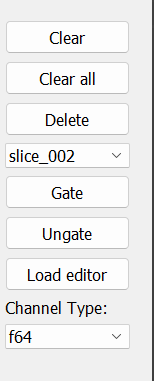

The button bar works in conjunction with selected spectra in the spectrum listing
(see [The Spectrum Listing](#the-spectrum-listing)).

As we will see in the section that describes the spectrum listing, you can select any number of spectra in the list.

- The `Clear` button clears the contents of all selected spectra.
- The `Clear All` button clears the contents of all spectra.
- The `Delete` button, after prompting for confirmation, deletes the selected spectra.
- The Pull down menu below the `Delete` button allows you to select a condition.
- The `Gate` button, applies the selected conditions to all selected spectra.
- The `Ungate` button removes any condition applied to the selected spectra.
- The `Load editor` button requires that only one spectrum be selected.  It loads the definition of that spectrum into the appropriate spectrum editor and selects the tab of that editor.  This allows you to either modify the definition of that spectrum or, by changing the name, to copy the spectrum.
- The pulldown menu labeled `Channel Type:` allows you to select the data type for the channels of spectra that are created.  The values in the pull down will reflect the capabilities of the program the GUI is connected to:
  - Rustogramer only supports channels that are 64 bit floats.  Note that these get stored in shared spectrum memory as uint_32's.
  - SpecTcl supports the following channel types;
    - `long` (32 bit unsigned integer).
    - `short` (16 bit unsigned integer).
    - `bytes` (8 bit unsigned integer)

## [The Spectrum listing](#the-spectrum-listing)

The Spctrum listing part of the Spectrum Tab looks like this:

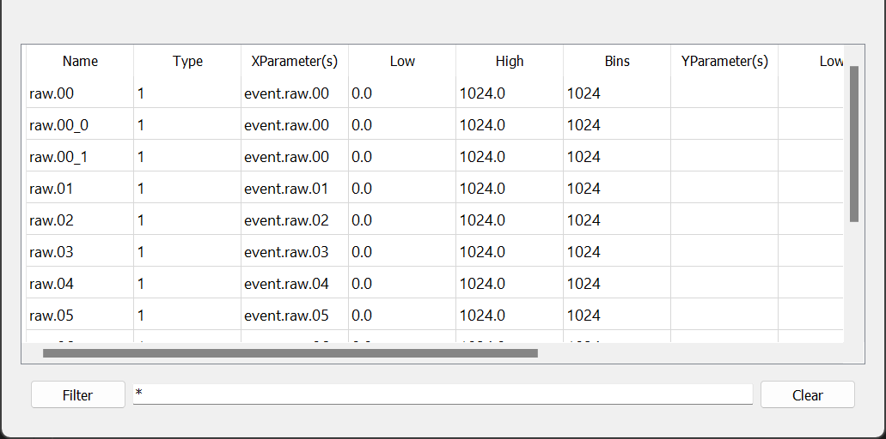

Note that you can stretch the listing horizontally and, if you stretch the entire GUI vertically, all additional space is added to the listing.

Let's start with the controls at the bottom of the listing.  The `Filter` button updates the listing to only show the spectra with names that match the pattern in the editable text field to its right.  This pattern can contain any filesystem wild card characters.  The `Clear` button clears the pattern back to the default `*`, which matches all spectra and updates the list.

The columns on the table reflect the contents of the column for each spectrumin the list.  From left to right:

- `Name` The name of the spectrum.
- `Type` The SpecTcl spectrum type string for the spectcrum.
- `XParameter(s)` lists *all* parameters on the X axis of the spectrum.
- `Low`, `High`, `Bins` to the right of `XParameter(s)` describe the X axis of the spectrum.
- `YParameter(s)` lists *all* parameters on the Y axis of the spectrumn.
- `Low`, `High`, `Bins` to the right of `YParameter(s)` describe the Y axis of the spectrum.
- `Gate` If not blank, contains the name of the condition applied to the Spectrum.

You can also stretch the column widths to match your needs.

You can select any number of spectra simultaneously and selection regions need not be contiguous.  The selected spectra are operated on by the buttons in the
[Button bar](#the-button-bar)

## [The Spectrum editors.](#the-spectrum-editors)

The tabs allow you to select spectrum editors that allow you to create/replace spectra.  Each of these editors has a

- `Name` edit which is mandatory and into which you should put the spectrum name.
- `Create/Replace` button which you should click to create the spectrum.

If, when you click the `Create/Replace` button, spectra with the same name exist, a dialog will ask you to confirm the replacement of those spectra (which will be listed in the dialog).

The set of editors (tabs) will depend on the spectrum types that are supported by the histogramer we are connected to.

The subsections below will describe each of the spectrum types and their editors:

- [1D spectrum editor](#1-d-spectrum)
- [2D Spectrum editor](#2-d-spectrum)
- [Summary Spectra](#summary-spectrum)
- [Gamma 1D spectra](#gamma-1-d-spectrum)
- [Gamma 2D spectrum editor](#gamma-2-d-spectrum)
- [Gamma Deluxe spectrum editor](#particle-gamma-spectrum)
- [2d Sum Spectrum](#2-d-sum-spectrum)
- [Projection Spectra](#projection-spectra)
- [Strip charts](#strip-charts)
- [Bit mask spectra](#bit-mask-parameters)
- [Gamma summary spectra](#gamma-summary-spectra)

### [1-D Spectrum](#1-d-spectrum)

1-D spectra (SpecTcl type `1`), histogram the values of a single parameter over a range with a specified binning.  The editor looks like this:

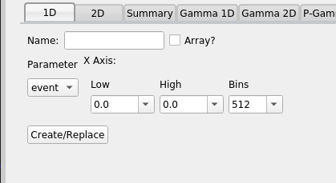

Select the parameter to histogram from the Parmater pull down.  It's a hierarchical menu using the `.` character as a path separator.  When you have selected a parameter, the full name of the parameter will appear below the pull down.  If the parameter has metadata definining the range and suggested binning, that information will initially populate the Axis pulldowns.  The Low, High and Bins pull-downs pre-load with a set of common values but you can also type a value you want in the pulldown.  If you do so, that value is added to the list of values.

The `Array?` checkbox allows you to create a group of spectra very quickliy.  Suppose, for example, you have paramters `p.0, p.1...p.15` and you want to create spectra named `p.raw.0 ... p.raw.15`.  If yo uchose any of the `p.`*n* parameters and set the name to `p.raw`, checking the `Array?` checkbox will create those spectra.

### [2-d Spectrum](#2-d-spectrum)

2-d spectram (SpecTcl type `2`) are two dimensional heat map spectra that histogram the correlated values of an x and a y parameter.  The editor for these looks like this:

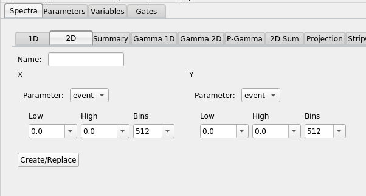

The mechanics of this editor are very similar to those of the [1D editor](#1-d-spectrum).  Select X and Y axis parameters from the pulldowns associated with each axis, ensure the axis specifications for the X and Y axes are what you want, provide a spectrum name and click `Create/Replace` to create the spectrum or overwrite (after confirmation) an exising spectrum with the same name.

### [Summary Spectrum:](#summary-spectrum)

Summary spectra (SpecTcl type `s`)  are a 2-d spectrum that allow you to look at the health of several identical spectra simultaneously.   Each X axis bin is associated with a parameter and the 1-d histogram of that parameter's values appears on the Y axis of that bin.

The summary spectrum editor editor looks like this:

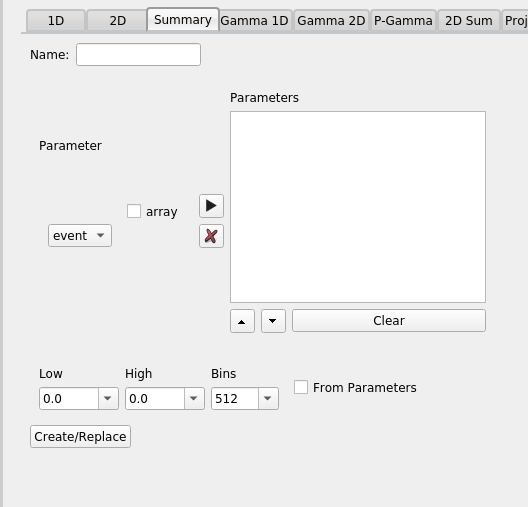

Parameter selection involves filling in the `Parameters` box to the right of the parameter chooser dropdown.  If you have selected a parameter you can add it to the list of parameters in the box by clicking the right arrow button.  To remove parameters fromt the list, select them and click the X button.  You can add a related set of parameters to the list box by checking the `array` checkbox before clicking the right arrow button.

For example, if you have parameters named `p.0, p.1 ... p.15` and you want them all in the list box, select one of them, check the `array` checkbox and click the right arrow button.  That will add all parameters that match `p.*`

You can re-order parameters.  Move parameters up in the list by selecting them (you can select more than one) and clicking the up arrow button. Similarly the down arrow button moves parameters down in the list.  The `Clear` button clears the parameter list.

The Axis inputs define the Y axis.  If `From  Parameters` is checked, than the right arrow button also loads the axis description from the parameter metadata for the parameter(s) it added.

Once the desired list of parameters has been selected, the Y axis defined and a spectrum name input; Clicking the `Create/Replace` button will create the spectrum (or replace an identically named spectrum after confirming)

### [Gamma 1-D spectrum](#gamma-1-d-spectrum)

Gamma 1-d spectra (SpecTcl type g1) are multiply incremented 1-d spectra.  The histogram is incremented for all of the values of its parameters.  You can think of it as a sum of the 1D spectra of all of its parameters.  The Gamma-1D spectrum looks exactly like the summary spectrum:

When creating a Gamma 1d spectrum, however, the list of parameters determines the set of parameters that can increment the spectrum for any event.  Note that while in summary spectra the order of the parameters in the list box determines which X axis bin that parameter occupies, for Gamma-1D Spectra, the order is meaningless.

### [Gamma 2-D spectrum](#gamma-2-d-spectrum)

Gamma 2d spectra (SpecTcl type `g2`) are 2-d spectra that increment for all pairs of spectrum parameters present in any events.  The editor for this spectrum type is similar to the summary spectrum editor but has a pair of axes:

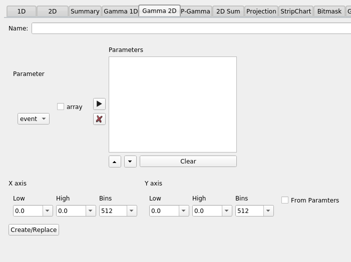

Normally the X and Y axes have the same definition but neither rustogramer nor SpecTcl require this

### [Particle Gamma Spectrum.](#particle-gamma-spectrum)

Particle gamma spectra (SpecTcl type gd) allow you to define a set of X and Y parameters.  The resulting 2d spectrum is incremented for each ordered pair of parameters in the event.  In general, this results in more than one increment per event.

The editor, therefore looks like:

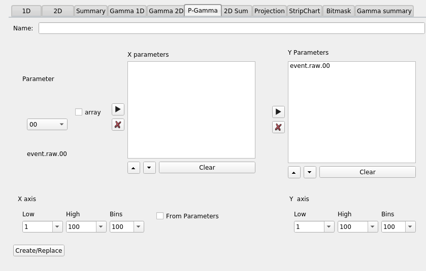

The mechanics of using this editor are the same as using the editor for a
[summary spectrum](#summary-spectrum), however:  There are two editable parameter lists. Having selected a parameter you can put it in either the X or Y parameters list depending on which of the arrow buttons you click.

### [2-D Sum spectrum](#2-d-sum-spectrum)

2d Sum spectra (SpecTcl type `m2`), are spectra that, effectively are the sum of one or more 2-d specctra.  They require an equal number of x and y paramters (unlike gamm deluxe where the number of X paramters need not be the same as the number of y parameters).  Channels are incremented for matching pairs of parameters in the event.

Suppose, for example, the X parameters are x1, x2 and the y parameters are y1 and y2.  If all four parameters are present, then two channels will be incremented.  One at the values of x1, y1 and the other at x2, y2.

The editor is identical, however to the [Gamma Deluxe editor](#particle-gamma-spectrum):

### [Projection spectra.](#projection-spectra)

Projection spectra are spectra that are created by initially projecting a suitable 2d spectrum onto one of its axes.  The projection can also occur within a Contoure that is displayable on the spectrum.  The spectrum could be created either as a snapshot, in which case it does not increment, or a "normal" spectrum in which case, if possible it will increment as addition data are analyzed.

The editor is a bit odd looking compared with the other ones we've looked at:

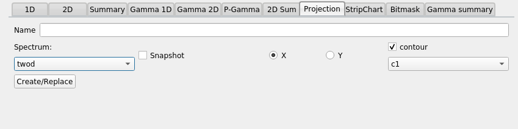

After selecting a name for the spectrum and choosing whether or not the spectrum is a snapshot or not; select a source spectrum in the Spectrum pulldown menu.  Choose if an X or Y projection is desired.

If the projection is within a contour; check the contour checkbox and choose the contour from the dropdown below the checkbox.  As usual the `Create/Replace` button, when clicked, creates the spectrum.

### [Strip charts](#strip-charts)

Strip chart spectra (SpecTcl type `S`), show the time evolution of one parameter against another.
Typically the X parameter is something that changes monotonically with time and the Y parameter represents a count of the number of times something occured within some time bucket (usually it's a computed parameter that is just set to 1 if the event of interest occured).  Strip chart spectra have the interesting characteristic that if an X value appears that is off the end of the spectrum (in either direction), the X axis is scrolled to accomodate that new value (the data too are scrolled).

The Strip chart spectrum editor looks like this:

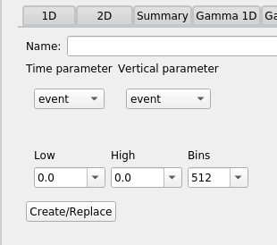

In addition to the name of the spectrum you need to select a time (X) parameter and a Y parameter.  The values of the Y parmeter that occur within a time bin are summed.   The axis specification is an initial axis range and a fixed binning along that range.  The range may scroll, but the number of bins in the range will be fixed.

### [Bit mask parameters](#bit-mask-parameters)

Spectra can also be created on parameters that represent integer bit masks (for example a trigger mask).
The editor for a bitmask spectrum looks like this:

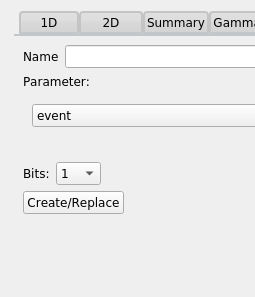

In addition to the spectrum name, select a paramter and define the number of bits that are significan (starting from the low order bit).  The spectrum will be incremented for each bit that is set in the parameter within the number of bits desired.

### [Gamma summary spectra](#gamma-summary-spectra)

A gamma summary spectrum is a bit like a summary spectrum, however, each vertical channel is a gamma spectrum.  Thus each X bin requires a list of parameters and increments will occur in the vertical stripe defined by that bin for each of those parameters present in the event.

As such the editor for Gamma Summary Spectra is a bit complicated:

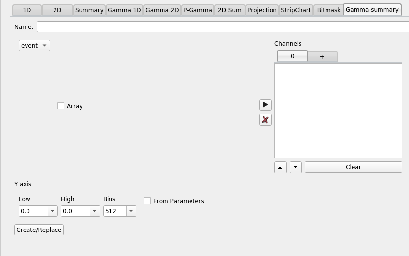

Let's start by looking at the tabbed set of list-boxes at the right of the editor.  The tabs are labeled numerically with the exception of the right most tab which is labeled `+`.  The numbered tabs represent lists of parameters for the gamma spectrum that's stacked on that bin.   E.g. The tab labled `0` which is the only numbered tab initially available should be filled in with the parameters you want on that bin.   The process of filling in these parameter list boxes should, by now, be familiar.

Clicking the tab labeled `+` will add a new tab with the next sequential X bin number.  This allows you to build up, bin-by-bin, the list of parameters for each bin.

The remainder of the editor should be familiar by now.  A spectrum name, a Y axis specification and the usual `Create/Replace` button to actually create the spectrum.

 Mobile navigation buttons 
[[**|https://github.com/FRIBDAQ/docs/tree/main/rustogramer/chapter_4.md]]
[[**|https://github.com/FRIBDAQ/docs/tree/main/rustogramer/chap4_2.md]]

[[**|https://github.com/FRIBDAQ/docs/tree/main/rustogramer/chapter_4.md]]
[[**|https://github.com/FRIBDAQ/docs/tree/main/rustogramer/chap4_2.md]]

 Custom JS scripts
