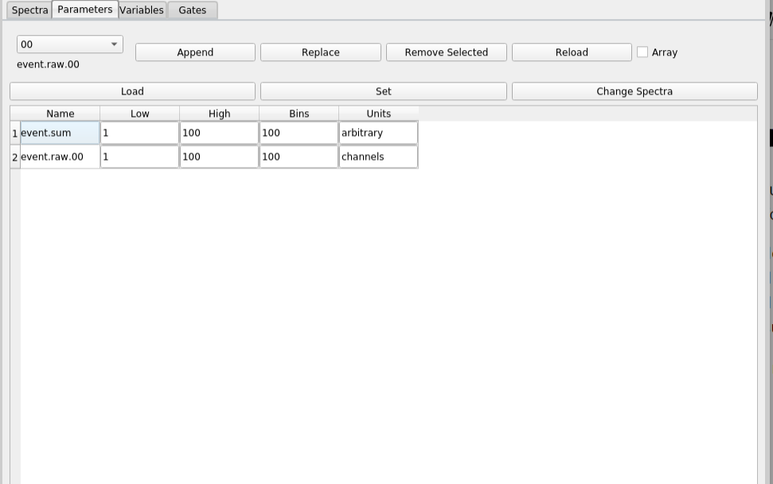

Provide site root to javascript 

 Work around some values being stored in localStorage wrapped in quotes 

 Set the theme before any content is loaded, prevents flash 

 Hide / unhide sidebar before it is displayed 

1. [[**1.** Chapter 1 - Introduction|chapter_1]]
2. 1. [[**1.1.** How to use this book|chap1_1]]
3. [[**2.** Chapter 2 - Preparing data for Rustogramer|chapter_2]]
4. 1. [[**2.1.** The FRIB analysis pipeline|chap2_1]]
   2. [[**2.2.** Format of data Rustogramer accepts|chap2_2]]
5. [[**3.** Chapter 3 - Running Rustogramer|chapter_3]]
6. [[**4.** Chapter 4 - Using the Rustogramer GUI|chapter_4]]
7. 1. [[**4.1.** The Spectra Tab|chap4_1]]
   2. [[**4.2.** The Parameters Tab|chap4_2]]
   3. [[**4.3.** The Variables Tab|chap4_3]]
   4. [[**4.4.** The Gate Tab|chap4_4]]
   5. [[**4.5.** The BindSets Tab|chap4_bindsets]]
   6. [[**4.6.** The File Menu|chap4_5]]
   7. [[**4.7.** The Data Source Menu|chap4_6]]
   8. [[**4.8.** The Filters Menu|chap4_filters]]
   9. [[**4.9.** The Spectra Menu|chap4_7]]
   10. [[**4.10.** The Gate Menu|chap4_8]]
8. [[**5.** Chapter 5 - Using CutiePie to display histograms|chapter_5]]
9. [[**6.** Chapter 6 - the REST interface|chapter_6]]
10. 1. [[**6.1.** Tcl REST interface|chap6_1]]
   2. [[**6.2.** Python REST interface|chap6_2]]
11. [[**7.** Chapter 7 - Reference material|chapter7]]
12. 1. [[**7.1.** Command Line Options|chap7_1]]
   2. [[**7.2.** REST requests and responses|chap7_2]]
   3. 1. [[**7.2.1.** Response format|chap7_2_responses]]
      2. [[**7.2.2.** /spectcl/parameter requests|chap7_2_parameter]]
      3. [[**7.2.3.** /spectcl/rawparameter requests|chap7_2_rawparameter]]
      4. [[**7.2.4.** /spectcl/gate requests|chap7_2_gates]]
      5. [[**7.2.5.** /spectcl/spectrum requests|chap7_2_spectrum]]
      6. [[**7.2.6.** /spectcl/attach requests|chap7_2_attach]]
      7. [[**7.2.7.** /spectcl/analyze requests|chap7_2_analyze]]
      8. [[**7.2.8.** /spectcl/apply requests|chap7_2_apply]]
      9. [[**7.2.9.** /spectcl/ungate requests|chap7_2_ungate]]
      10. [[**7.2.10.** /spectcl/channel requests|chap7_2_channel]]
      11. [[**7.2.11.** /spectcl/evbunpack requests|chap7_2_evbunpack]]
      12. [[**7.2.12.** /spectcl/filter requests|chap7_2_filter]]
      13. [[**7.2.13.** /spectcl/fit requests|chap7_2_fit]]
      14. [[**7.2.14.** /spectcl/fold requests|chap7_2_fold]]
      15. [[**7.2.15.** /spectcl/integrate requests|chap7_2_integrate]]
      16. [[**7.2.16.** /spectcl/shmem requests|chap7_2_shmem]]
      17. [[**7.2.17.** /spectcl/sbind requests|chap7_2_sbind]]
      18. [[**7.2.18.** /spectcl/unbind requests|chap7_2_ubind]]
      19. [[**7.2.19.** /spectcl/mirror requests|chap7_2_mirror]]
      20. [[**7.2.20.** /spectcl/pman requests|chap7_2_pman]]
      21. [[**7.2.21.** /spectcl/project requests|chap7_2_project]]
      22. [[**7.2.22.** /spectcl/psuedo requests|chap7_2_pseudo]]
      23. [[**7.2.23.** /spectcl/rootree requests|chap7_2_roottree]]
      24. [[**7.2.24.** /spectcl/script requests|chap7_2_script]]
      25. [[**7.2.25.** /spectcl/treevariable requests|chap7_2_treevariable]]
      26. [[**7.2.26.** /spectcl/version requests|chap7_2_version]]
      27. [[**7.2.27.** /spectcl/exit requests|chap7_2_exit]]
      28. [[**7.2.28.** /spectcl/ringformat requests|chap7_2_ringformat]]
      29. [[**7.2.29.** /spectcl/specstats requests|chap7_2_specstats]]
      30. [[**7.2.30.** /spectcl/swrite requests|chap7_2_swrite]]
      31. [[**7.2.31.** /spectcl/sread requests|chap7_2_sread]]
      32. [[**7.2.32.** /spectcl/trace requests|chap7_2_trace]]
   4. [[**7.3.** Shared memory Mirror service|chap7_mirror]]
   5. [[**7.4.** Tcl REST reference|chap7_3]]
   6. [[**7.5.** Python REST reference|chap7_4]]
   7. [[**7.6.** Looking at the Rustogramer internals documentation|chap7_5]]
   8. [[**7.7.** Schema of configuration files|chap7_6]]
   9. [[**7.8.** Format of JSON Spectrum contents files|chap7_7]]
13. [[**8.** Appendix I - Installing Rustogramer|apppendix_1]]

 Track and set sidebar scroll position 

**

**

- Light
- Rust
- Coal
- Navy
- Ayu

**

# Rustogramer User Guide

[[**|print]]

 Apply ARIA attributes after the sidebar and the sidebar toggle button are added to the DOM 

# [The Parameters Tab](#the-parameters-tab)

The `Parameters` tab allows you to see and modify the metadata associated with paraemters.
Each parameter optionally has the following metadata:

- `Low` The recommended low limit for axes that are defined on this parameter.
- `High` The recommended high limit for axes that are defined on this parameter.
- `Bins` The recommended number of bins between [Low, High).
- `Units` The units of measure of the parameter.

Modifying these metadata will modify the axis definitions that the GUI will suggest for spectra you define with the [[Spectrua tab|./chap4_1]].

Let's have a look at the `Parameters` tab:

The top part of this GUI contains a parameter chooser and a bunch of buttons.  The bottom part, contains
a tabular list of parameters and their metadata.  You determine which parameters are displayed.

You can edit the contents of the table as follows:

- Clicking the `Append` button adds a new row to the table that will contain the paramete metadata for the parameter currently selected in the parameter chooser.  If the Array checkbox is selected, the parameter is assumed to be  a member of an array of parameters and lines are added for all parameters in the array.
- Clicking the `Replace` button will replace the current selected row in the table with the parameter that is selected in the parameter chooser.  Only one parameter line may be selected for this
  to  operate.
- Clicking `Remove Selected`  will remove all selected rows from the table.

Once the table is populated; you an select any number of rows.  THe selection can be non-contiguous as well.  You can also edit the metadata by typing into the metadata cells in the table.  The `Reload` button will Reload the metadata for all table cells.

The following button operate on the selected rows of the table:

- `Load` - loads the parameter metadata for the selected cells from the server.
- `Set`  - Sets the parameter metadata for the selected cells into the server.
- `Change Spectra` Uses the metadata in the selected parameters to re-define the axis specifications for spectra that use any of the selected parameters.  You will be prompted to confirm along with the names of the affected spectra.

 Mobile navigation buttons 
[[**|chap4_1]]
[[**|chap4_3]]

[[**|chap4_1]]
[[**|chap4_3]]

 Custom JS scripts
