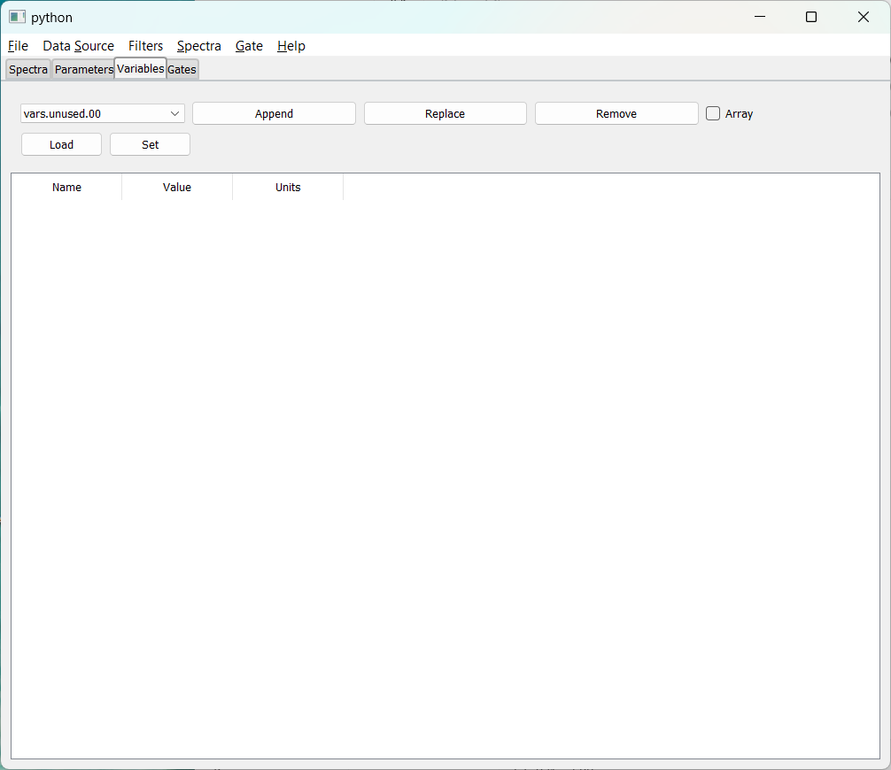

Provide site root to javascript 

 Work around some values being stored in localStorage wrapped in quotes 

 Set the theme before any content is loaded, prevents flash 

 Hide / unhide sidebar before it is displayed 

1. [[chapter_1]]
2. 1. [[chap1_1]]
3. [[chapter_2]]
4. 1. [[chap2_1]]
   2. [[chap2_2]]
5. [[chapter_3]]
6. [[chapter_4]]
7. 1. [[chap4_1]]
   2. [[chap4_2]]
   3. [[chap4_3]]
   4. [[chap4_4]]
   5. [[chap4_bindsets]]
   6. [[chap4_5]]
   7. [[chap4_6]]
   8. [[chap4_filters]]
   9. [[chap4_7]]
   10. [[chap4_8]]
8. [[chapter_5]]
9. [[chapter_6]]
10. 1. [[chap6_1]]
   2. [[chap6_2]]
11. [[chapter7]]
12. 1. [[chap7_1]]
   2. [[chap7_2]]
   3. 1. [[chap7_2_responses]]
      2. [[chap7_2_parameter]]
      3. [[chap7_2_rawparameter]]
      4. [[chap7_2_gates]]
      5. [[chap7_2_spectrum]]
      6. [[chap7_2_attach]]
      7. [[chap7_2_analyze]]
      8. [[chap7_2_apply]]
      9. [[chap7_2_ungate]]
      10. [[chap7_2_channel]]
      11. [[chap7_2_evbunpack]]
      12. [[chap7_2_filter]]
      13. [[chap7_2_fit]]
      14. [[chap7_2_fold]]
      15. [[chap7_2_integrate]]
      16. [[chap7_2_shmem]]
      17. [[chap7_2_sbind]]
      18. [[chap7_2_ubind]]
      19. [[chap7_2_mirror]]
      20. [[chap7_2_pman]]
      21. [[chap7_2_project]]
      22. [[chap7_2_pseudo]]
      23. [[chap7_2_roottree]]
      24. [[chap7_2_script]]
      25. [[chap7_2_treevariable]]
      26. [[chap7_2_version]]
      27. [[chap7_2_exit]]
      28. [[chap7_2_ringformat]]
      29. [[chap7_2_specstats]]
      30. [[chap7_2_swrite]]
      31. [[chap7_2_sread]]
      32. [[chap7_2_trace]]
   4. [[chap7_mirror]]
   5. [[chap7_3]]
   6. [[chap7_4]]
   7. [[chap7_5]]
   8. [[chap7_6]]
   9. [[chap7_7]]
13. [[apppendix_1]]

 Track and set sidebar scroll position 

**

**

- Light
- Rust
- Coal
- Navy
- Ayu

**

# Rustogramer User Guide

[[print]]

 Apply ARIA attributes after the sidebar and the sidebar toggle button are added to the DOM 

# [The Variables Tab](#the-variables-tab)

This tab is only available with SpecTcl.  The Variables GUI looks like this:

The controls on this tab are similar to those on the [[./chap4_2]].   The only differences are:

- The only data associated with a variable are its value and units of measure.
- Since spectra don't depend directly on the values of variables, there's no button to redefine spectra.

As with the parameters tab, there are several controls at the top of the window and a table of variables and their data below.    You use the controls in the top line of the window to populate the table:

- At the left is a variable chooser.  You can drop it down to select a variable name.
- Clicking `Append` adds the variable and its current values/units to the end of the table.  If the array checkbox is checked, the variable selected is taken to be an element of an array of variables and all elements are of the array are added.
- Clicking `Replace` Replaces the one selected line in the table with the variable selected by the variable chooser.
- Clicking `Remove` removes all seleted rows in the table.
- The `Load` button loads the selected table rows with the current variable values and units.
- The `Set` button stores into SpecTcl the variables in the selected rows with their values and units.

The values and units in the table can be edited, however the `Set` button must be used to transfer selected, edited variable values and units int SpecTcl.  Furthermore any number of rows can be selected to be operated on by the buttons in the to section of the UI.  Note that the selection need not be a contiguous set of rows.

 Mobile navigation buttons 
[[chap4_2]]
[[chap4_4]]

[[chap4_2]]
[[chap4_4]]

 Custom JS scripts
