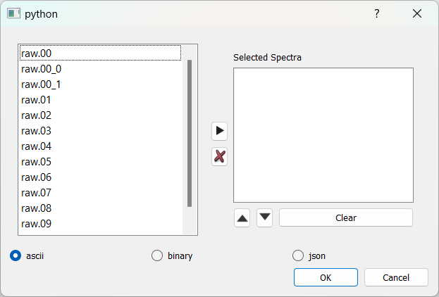
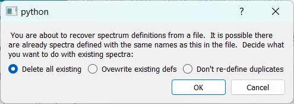
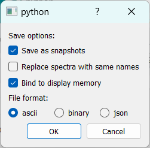

Provide site root to javascript 

 Work around some values being stored in localStorage wrapped in quotes 

 Set the theme before any content is loaded, prevents flash 

 Hide / unhide sidebar before it is displayed 

1. [[**1.** Chapter 1 - Introduction|chapter_1]]
2. 1. [[**1.1.** How to use this book|chap1_1]]
3. [[**2.** Chapter 2 - Preparing data for Rustogramer|chapter_2]]
4. 1. [[**2.1.** The FRIB analysis pipeline|chap2_1]]
   2. [[**2.2.** Format of data Rustogramer accepts|chap2_2]]
5. [[**3.** Chapter 3 - Running Rustogramer|chapter_3]]
6. [[**4.** Chapter 4 - Using the Rustogramer GUI|chapter_4]]
7. 1. [[**4.1.** The Spectra Tab|chap4_1]]
   2. [[**4.2.** The Parameters Tab|chap4_2]]
   3. [[**4.3.** The Variables Tab|chap4_3]]
   4. [[**4.4.** The Gate Tab|chap4_4]]
   5. [[**4.5.** The BindSets Tab|chap4_bindsets]]
   6. [[**4.6.** The File Menu|chap4_5]]
   7. [[**4.7.** The Data Source Menu|chap4_6]]
   8. [[**4.8.** The Filters Menu|chap4_filters]]
   9. [[**4.9.** The Spectra Menu|chap4_7]]
   10. [[**4.10.** The Gate Menu|chap4_8]]
8. [[**5.** Chapter 5 - Using CutiePie to display histograms|chapter_5]]
9. [[**6.** Chapter 6 - the REST interface|chapter_6]]
10. 1. [[**6.1.** Tcl REST interface|chap6_1]]
   2. [[**6.2.** Python REST interface|chap6_2]]
11. [[**7.** Chapter 7 - Reference material|chapter7]]
12. 1. [[**7.1.** Command Line Options|chap7_1]]
   2. [[**7.2.** REST requests and responses|chap7_2]]
   3. 1. [[**7.2.1.** Response format|chap7_2_responses]]
      2. [[**7.2.2.** /spectcl/parameter requests|chap7_2_parameter]]
      3. [[**7.2.3.** /spectcl/rawparameter requests|chap7_2_rawparameter]]
      4. [[**7.2.4.** /spectcl/gate requests|chap7_2_gates]]
      5. [[**7.2.5.** /spectcl/spectrum requests|chap7_2_spectrum]]
      6. [[**7.2.6.** /spectcl/attach requests|chap7_2_attach]]
      7. [[**7.2.7.** /spectcl/analyze requests|chap7_2_analyze]]
      8. [[**7.2.8.** /spectcl/apply requests|chap7_2_apply]]
      9. [[**7.2.9.** /spectcl/ungate requests|chap7_2_ungate]]
      10. [[**7.2.10.** /spectcl/channel requests|chap7_2_channel]]
      11. [[**7.2.11.** /spectcl/evbunpack requests|chap7_2_evbunpack]]
      12. [[**7.2.12.** /spectcl/filter requests|chap7_2_filter]]
      13. [[**7.2.13.** /spectcl/fit requests|chap7_2_fit]]
      14. [[**7.2.14.** /spectcl/fold requests|chap7_2_fold]]
      15. [[**7.2.15.** /spectcl/integrate requests|chap7_2_integrate]]
      16. [[**7.2.16.** /spectcl/shmem requests|chap7_2_shmem]]
      17. [[**7.2.17.** /spectcl/sbind requests|chap7_2_sbind]]
      18. [[**7.2.18.** /spectcl/unbind requests|chap7_2_ubind]]
      19. [[**7.2.19.** /spectcl/mirror requests|chap7_2_mirror]]
      20. [[**7.2.20.** /spectcl/pman requests|chap7_2_pman]]
      21. [[**7.2.21.** /spectcl/project requests|chap7_2_project]]
      22. [[**7.2.22.** /spectcl/psuedo requests|chap7_2_pseudo]]
      23. [[**7.2.23.** /spectcl/rootree requests|chap7_2_roottree]]
      24. [[**7.2.24.** /spectcl/script requests|chap7_2_script]]
      25. [[**7.2.25.** /spectcl/treevariable requests|chap7_2_treevariable]]
      26. [[**7.2.26.** /spectcl/version requests|chap7_2_version]]
      27. [[**7.2.27.** /spectcl/exit requests|chap7_2_exit]]
      28. [[**7.2.28.** /spectcl/ringformat requests|chap7_2_ringformat]]
      29. [[**7.2.29.** /spectcl/specstats requests|chap7_2_specstats]]
      30. [[**7.2.30.** /spectcl/swrite requests|chap7_2_swrite]]
      31. [[**7.2.31.** /spectcl/sread requests|chap7_2_sread]]
      32. [[**7.2.32.** /spectcl/trace requests|chap7_2_trace]]
   4. [[**7.3.** Shared memory Mirror service|chap7_mirror]]
   5. [[**7.4.** Tcl REST reference|chap7_3]]
   6. [[**7.5.** Python REST reference|chap7_4]]
   7. [[**7.6.** Looking at the Rustogramer internals documentation|chap7_5]]
   8. [[**7.7.** Schema of configuration files|chap7_6]]
   9. [[**7.8.** Format of JSON Spectrum contents files|chap7_7]]
13. [[**8.** Appendix I - Installing Rustogramer|apppendix_1]]

 Track and set sidebar scroll position 

**

**

- Light
- Rust
- Coal
- Navy
- Ayu

**

# Rustogramer User Guide

[[**|print]]

 Apply ARIA attributes after the sidebar and the sidebar toggle button are added to the DOM 

# [The File Menu](#the-file-menu)

The file menu provides access to various file related operations.  The available commands differ depending on whether  the Gui is attached to SpecTcl or Rustogramer.

Here's the exhaustive list of operations the File menu can perform.  IF a menu item is only available in SpecTcl or Rustogramer that is noted:

- [Save...](#file-save)
- [Save Treevariables...](#file-save-treevariables) (SpecTcl only)
- [Save Spectrum contents...](#file-save-spectrum-contents)
- [Load...](#file-load)
- [Read spectrum contents...](#file-read-spectrum-contents)
- [Source Tcl Script...](#file-source-tcl-script) (SpecTcl only)
- [Exit](#file-exit)
- [Stop Histogramer](#file-stop-histogramer) (Rustogramer only)

## [File->Save...](#file-save)

This menu item saves the cofiguration in an SQLite3 database file.  The schema for these files closely follows the SpecTcl database storage schema and is described in [[Schema of configuration files|./chap7_6]].  You will be prompted for a filename and the following will be saved:

- Parameter definitions and their metadata.
- Spectrum definitions.
- Condition definitions.
- Which conditions are applied to which spectra.
- For SpecTcl, the treevariable definitions (names values and units.)

## [File->Save Treevariables...](#file-save-treevariables)

SpecTcl only can save tree variable definitions to an Sqlite3 data base file.  The schema for that file is the same as for the file saved by the [Save configuration](#file-save) operation, however only the tables germane to tree parameter definitions are populated.

## [File->Save spectrum contents...](#file-save-spectrum-contents)

Provides the capability to save the contents of one or more spectra to file.  Before being prompted for the output file you'll be prompted for the spectrum and file format as follows:

In the top part, select the spectra to save.  The right arrow button adds the spectra selected on the lef to the listbox on the right.  The list box on the right is editable; you can remove and reorder its spectra or just remove them all from the box.

The radio buttons on the bottom select the file format.  The following file formats are supported:

- ASCII this is SpecTcl ASCII format.
- Binary (SpecTcl only) this is legacy Smaug format.
- [[JSON is Java Object Script Notation|./chap7_7]] (click the link for format details).

Note that spectra are actually saved *by the server* not by the GUI.  This means that this operation will only work properly if the GUI is run on a system that shares the same file system as the server.

For example, a client running on a desktop system communicating with a SpecTcl or Rustogramer running on an FRIB linux system in general, will not be able to successfully save files as the file paths requested for the server won't exist in the server.

A more subtle case is if, on a desktop, you are running the GUI natively but rustogramer or SpecTcl in Windows Subsystem for Linux or a virtual machine, the save will, in general fail.

## [File->Load...](#file-load)

Loads a configuration file from an [[SQlite3 databas file|./chap7_6]] into the server.   It is the GUI that interprets the database file contents.   After being prompted for the name a file, parameter definitions will be loaded from that file. You'll be prompted for what to do with duplicate spectrum definitions:

You have the following choices:

- `Delete all existing` all existing spectra will be deleted before restoring the spectrum definitions from file.
- `Overwrite existing defs` any spectra defined in the server with the same name as one in the file get ovewritten by  the definition in the file.
- `Don't re-define duplicates`  any spectra defined in the server with the same name as one in the file don't get restored from file, retaining the old definition.

Conditions will unconditionally overwrite existing conditions with the same name.  All spectra will be bound to the display memory.

## [File->Read spectrum contents...](#file-read-spectrum-contents)

Reads the contents of a spectrum file.  First you will be presented with the following dialog:

This dialog allows you to describe how spectra read from file will be loaded by the server and in what format the file is.

- Save Options:
  - `Save as snapshots` - spectra will be created as snapshots which means they will never increment as  new data are processed.
  - `Replace Spectra` with same names - If unchecked new unique names will be used to avoid collisions with existing spectra.  If checked, any exising spectrum with the same name as one in file will be deleted.
  - `Bind to display memory` - IF checked, the spectra are bound into display memory. If not, they are held local to the histogram server and can't be visualized until they are bound later.
- File format; as described in [File->Save spectrum contents...](#file-save-spectrum-contents), the format of the file that is being read.

## [File->Source Tcl Script...](#file-source-tcl-script)

This option is only available  to SpecTcl servers.  As with spectrum contents files, since the file is opened in the server, the GUI must have a shared file system with the server.  Select a file and SpecTcl will run it as a Tcl script.

## [File->Exit](#file-exit)

After prompting if you are sure, exits the GUI.  Note that in general the server continues to run and you can connect to it again later with a new GUI instance.  For Rustogramer, see, however [File->Stop Histogramer](#file-stop-histogramer) below.

## [File->Stop Histogramer](#file-stop-histogramer)

This is only available if the server is Rustogramer. After prompting if you are sure, requests the histogramer to exit.  Once the histogram responds that it is exiting, the GUI exits as well.

 Mobile navigation buttons 
[[**|chap4_bindsets]]
[[**|chap4_6]]

[[**|chap4_bindsets]]
[[**|chap4_6]]

 Custom JS scripts
