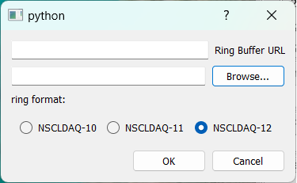
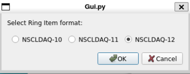
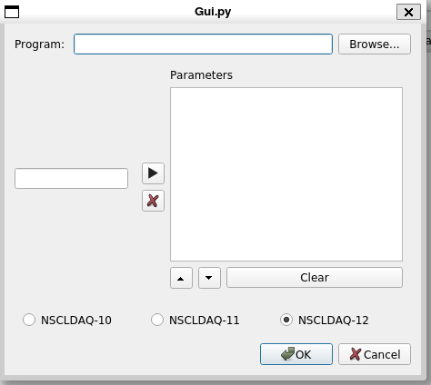

Provide site root to javascript 

 Work around some values being stored in localStorage wrapped in quotes 

 Set the theme before any content is loaded, prevents flash 


 Hide / unhide sidebar before it is displayed 


1. [[chapter_1]]
2. 1. [[chap1_1]]
3. [[chapter_2]]
4. 1. [[chap2_1]]
   2. [[chap2_2]]
5. [[chapter_3]]
6. [[chapter_4]]
7. 1. [[chap4_1]]
   2. [[chap4_2]]
   3. [[chap4_3]]
   4. [[chap4_4]]
   5. [[chap4_bindsets]]
   6. [[chap4_5]]
   7. [[chap4_6]]
   8. [[chap4_filters]]
   9. [[chap4_7]]
   10. [[chap4_8]]
8. [[chapter_5]]
9. [[chapter_6]]
10. 1. [[chap6_1]]
   2. [[chap6_2]]
11. [[chapter7]]
12. 1. [[chap7_1]]
   2. [[chap7_2]]
   3. 1. [[chap7_2_responses]]
      2. [[chap7_2_parameter]]
      3. [[chap7_2_rawparameter]]
      4. [[chap7_2_gates]]
      5. [[chap7_2_spectrum]]
      6. [[chap7_2_attach]]
      7. [[chap7_2_analyze]]
      8. [[chap7_2_apply]]
      9. [[chap7_2_ungate]]
      10. [[chap7_2_channel]]
      11. [[chap7_2_evbunpack]]
      12. [[chap7_2_filter]]
      13. [[chap7_2_fit]]
      14. [[chap7_2_fold]]
      15. [[chap7_2_integrate]]
      16. [[chap7_2_shmem]]
      17. [[chap7_2_sbind]]
      18. [[chap7_2_ubind]]
      19. [[chap7_2_mirror]]
      20. [[chap7_2_pman]]
      21. [[chap7_2_project]]
      22. [[chap7_2_pseudo]]
      23. [[chap7_2_roottree]]
      24. [[chap7_2_script]]
      25. [[chap7_2_treevariable]]
      26. [[chap7_2_version]]
      27. [[chap7_2_exit]]
      28. [[chap7_2_ringformat]]
      29. [[chap7_2_specstats]]
      30. [[chap7_2_swrite]]
      31. [[chap7_2_sread]]
      32. [[chap7_2_trace]]
   4. [[chap7_mirror]]
   5. [[chap7_3]]
   6. [[chap7_4]]
   7. [[chap7_5]]
   8. [[chap7_6]]
   9. [[chap7_7]]
13. [[apppendix_1]]


 Track and set sidebar scroll position 

**


**

- Light
- Rust
- Coal
- Navy
- Ayu


**


# Rustogramer User Guide


[[print]]


 Apply ARIA attributes after the sidebar and the sidebar toggle button are added to the DOM 

# [The Data Source Menu](#the-data-source-menu)


The data source menu allows you to attach data sources of various sorts to the histogram server.  Some source types are not (yet?) available to Rustogramer.


- [Online](#data-source-online)  (SpecTcl only) Select an NSCLDAQ helper (e.g. rinselector) and take data from an online system.
- [File](#data-source-file)  Take data from a file.  Note that as of SpecTcl version 5.13-002,  SpecTcl can analyze data from a parameter file prepared for Rustogramer as well as from raw event files.
- [Pipe](#data-source-pipe) (SpecTcl only) Read data from an arbitrary helper program.
- [Cluster File](#data-source-cluster-file) (SpecTcl 5.14 and later only) Use a file to drive analysis from several event files.
- [Filter file](#data-source-filter-file) (SpecTcl only) take data from a filter file.
- [Detach](#data-source-detach) Stop analyzing data from the current data source.
- [Abort Cluster File](#data-source-abort-cluster-file) (SpecTcl only) abort an in progress cluster file.


Notes on cluster file processing.  The SpecTcl REST handlers to support cluster files (added in SpecTcl 5.14) depend on software that is part of the Tree GUI to function.  cluster file processing may fail in the server if the tree GUi is not being used.


## [Data Source->Online (SpecTcl Only)](#data-source-online-spectcl-only)


The `Data Source->Online` menu command allows you to get data from an online data source.  Really this is just the same as a Pipe data source (see [Data Source->Pipe](#data-source-pipe) below), however additional options  are automatically added to the *helper program* by the GUI.  These options make the attachment suitable for online data taking by ensuring the server does not limit the data flow if its analysis cannot keep up with the data rates.


WHen you select this option, you will see the following dialog:





In the input edit line labeled `Ring Buffer URL` enter the URL of the ring buffer from which the server's helper should get data.   This is of the form `tcp://`*hostname*`/`*ringname*  where


- *hostname* is the DNS name or IP address of the system from which you wish to get data.
- *ringname* is the name of the ringbuffer in that system.


In the input edit line with the `Browse...` button to the right of it, find the name of the helper progam.   For NSCLDAQ, this is the `ringselector` program in the `bin` director of the version of NSCLDAQ you are using.   When starting the pipe data source, the GUI will automatically add appropriate options and values.  For example, suppose you selected `/usr/opt/daq/12.1-000/bin/ringselector` as the helper program.  The full command line that the GUI will specify for the helper for the ring `tcp:///spdaq49/e1400x` is:


```bash
/usr/opt/daq/12.1-000/bin/ringselector ---source=tcp://spdaq49/e1400x \\
    --sample=PHYSICS_EVENT \
    --non-blocking```

```


Finally, select the radio button that corresponds to he format of the data you are analyzing.  This is the format of the NSCLDAQ program that generates data in the ringbuffer.  Normally, this will be the version of NSCLDAQ that the readout programs were built under.


## [Data Source->File](#data-source-file)


Initiates analysis of data from either a raw event file or a parameter file.  Note that rustogramer can only analyze data from parameter files.  SpecTcl, with an appropriate analysis pipeline can analyze data from either.


You will first be prompted for an event or parameter file.  Once that has been selected, you'll be asked to provide the version of NSCLDAQ the data are in via this prompter:





Once that is selected the server will start analyzing data from that file.


## [Data Source->Pipe (SpecTcl Only)](#data-source-pipe-spectcl-only)


Pipe data sources allow the server to take data from the stdout of any program.  This is actually how
`Data Source->Online` works.   One example of how you can use this;  After performing your experiment, you could use e.g. `gzip` to compress all of your event files.  If you then analyze event files by using `gzcat` as a pipe data source, you could analyze data without actually every having the uncompressed event files on disk.  Since, in general, I/O is quite a bit slower than Disk I/O doing this *might* very well be faster than analyzing the raw event data, once you've paid the computational price of compressing the data in the first place.


When you select `Data Source->Pipe` you will be greeted with the following dialog:





The `Program` line edit and its accompanying `Browse...` button allow you to enter the program to use as the pipe data source.


The Entry and editable list box below it allow you to provide an ordered set of parameters to the pipe program.  Finally the radio buttons at the bottom of the dialog allow you to select thd format of the NSCLDAQ data you are analyzing.   Clicking the `Ok` button commences analysis from that pipe data source.


## [Data Source->Cluster File (SpecTcl Only)](#data-source-cluster-file-spectcl-only)


Cluster file processing is not yet implemented in the GUI see issue [#168](https://github.com/FRIBDAQ/rustogrammer/issues/168)


## [Data Source->Filter file... (SpecTcl Only)](#data-source-filter-file-spectcl-only)


A filter file is a file written by SpecTcl that is very much like a parameter file.  Filter files contain a subset of the parameters for a subset of events that have made a condition true.  Filter files and how to make them are described in [The SpecTcl User guide](https://docs.nscl.msu.edu/daq/newsite/spectcl-5.0/UserGuide/index.html).  See the chapters named:


- Using event filters
- Analyzing filter files


Before attempting to analyze a filter file, be sure your SpecTcl analysis pipeline is properly configured to do so.  Filter files have the following advantages over parameter files


- They can be written from SpecTcl without any additional code.
- They can be used as the first stage of the analysis pipeline allowing additional stages to follow.


Because you must take special care to ensure the version of SpecTcl you are running has been prepared to analyze filter data, the first time you select `Data Source->Filter file` you'll be prompted with a reminder that you must have the correctly tailored version of SpecTcl running.


The GUI simply prompts for a filter file and, when one is selected from a standard file chooser dialog, analysis from that file begins.


## [Data Source->Detach](#data-source-detach)


Stops analysis of the current data source and detaches from it.


## [Data Source->Abort Cluster File (SpecTcl Only)](#data-source-abort-cluster-file-spectcl-only)


Cluster file processing is not yet implemented in the GUI see [#168](https://github.com/FRIBDAQ/rustogrammer/issues/168)


 Mobile navigation buttons 
[[chap4_5]]
[[chap4_filters]]


[[chap4_5]]
[[chap4_filters]]


 Custom JS scripts
